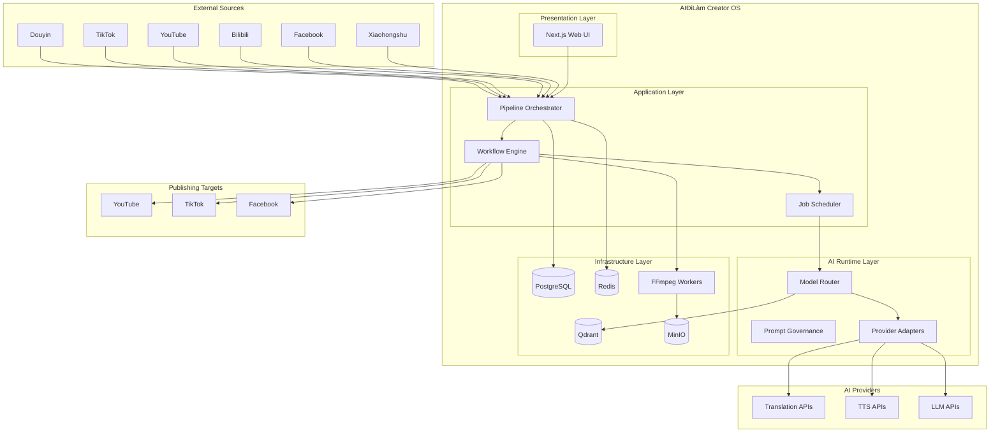
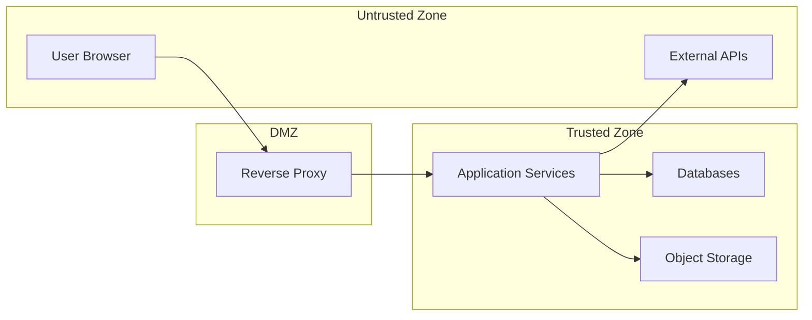

# 00 - Tóm Tắt Tổng Quan (Executive Summary)

| Metadata | Giá trị |
|----------|---------|
| Document ID | VOL01-00 |
| Version | 1.0.0 |
| Ngày tạo | 2026-07-23 |
| Trạng thái | DRAFT |
| Tác giả | AIĐiLàm Architecture Team |

---

## 1. Mục Đích Dự Án

**AIĐiLàm** là một hệ điều hành sáng tạo nội dung (Creator Operating System) đặt quyền riêng tư lên hàng đầu (private-first), được thiết kế chuyên biệt cho việc tái sử dụng (repurpose) nội dung video từ các nền tảng Trung Quốc sang tiếng Việt.

### Vấn đề cần giải quyết

Content creator Việt Nam đang đối mặt với:

- Nguồn nội dung video Trung Quốc phong phú nhưng rào cản ngôn ngữ lớn
- Quy trình thủ công tốn thời gian: tải video → phiên âm → dịch → tạo phụ đề → render → đăng tải
- Thiếu công cụ tích hợp end-to-end cho workflow này
- Chi phí thuê dịch vụ bên ngoài cao, không kiểm soát được chất lượng

### Giải pháp

AIĐiLàm tự động hóa toàn bộ pipeline từ thu thập nguồn đến xuất bản, sử dụng AI cho các bước:
- Transcription (phiên âm tiếng Trung)
- Translation (dịch Trung → Việt)
- Subtitle generation (tạo phụ đề)
- OCR (nhận dạng text trong video)
- TTS - Text-to-Speech (chuyển văn bản thành giọng nói tiếng Việt)
- Video rendering (dựng lại video với nội dung Việt)

---

## 2. Sơ Đồ Hệ Thống Tổng Quan



---

## 3. Quyết Định Kiến Trúc Chủ Chốt

### 3.1 Private-First Architecture

| Quyết định | Lý do |
|-----------|-------|
| Self-hosted trên infrastructure riêng | Kiểm soát hoàn toàn dữ liệu, không phụ thuộc cloud vendor |
| Database-backed configuration | Thay đổi cấu hình không cần redeploy |
| No hardcoded AI providers | Linh hoạt chuyển đổi provider khi cần |
| Immutable asset storage | Đảm bảo tính toàn vẹn và truy vết nguồn gốc |

### 3.2 Containerized Deployment

- Toàn bộ services chạy trong Docker containers
- Non-root containers cho security
- Workspace isolation giữa các project/creator

### 3.3 Event-Driven Processing

- Redis-backed job queue cho async processing
- Pipeline stages độc lập, có thể retry riêng lẻ
- Fail-closed routing: khi không chắc chắn → reject

---

## 4. Lựa Chọn Công Nghệ

| Thành phần | Công nghệ | Lý do chọn |
|-----------|-----------|-------------|
| Frontend | Next.js + TypeScript | SSR, type safety, ecosystem phong phú |
| Backend API | Node.js + TypeScript | Cùng ngôn ngữ với frontend, async I/O tốt |
| AI Workers | Python | Ecosystem ML/AI tốt nhất, thư viện phong phú |
| Database | PostgreSQL | ACID, JSON support, mature |
| Cache/Queue | Redis | Fast, pub/sub, job queue (BullMQ) |
| Vector DB | Qdrant | Semantic search cho prompt/content |
| Object Storage | MinIO | S3-compatible, self-hosted |
| Video Processing | FFmpeg | Industry standard, CPU-based rendering |
| Container Runtime | Docker | [REQUIRES_HOST_VALIDATION] Docker socket availability |

---

## 5. Mô Hình Triển Khai (Deployment Model)

### Host Environment

| Thuộc tính | Giá trị | Trạng thái |
|-----------|---------|------------|
| OS | SUSE Linux (kernel 4.4.73) | **VERIFIED** |
| CPU | 64 cores (Xeon E7-4850 v4) | **VERIFIED** |
| RAM | 252GB | **VERIFIED** |
| Root LV | 90GB (62GB free) | **VERIFIED** |
| SAN Storage | 13.6TB visible, not mounted | **VERIFIED** |
| GPU | Không có | **VERIFIED** |
| Docker socket trong container hiện tại | Không khả dụng | **VERIFIED** |
| Coexisting services | Underspan (Astro static site, không có running services) | **VERIFIED** |

### Deployment Strategy

```
[PROPOSED] Deployment sẽ sử dụng Docker Compose orchestration
trên host machine, KHÔNG phải trong container hiện tại.
Cần host-level access để:
1. Mount SAN storage (13.6TB) cho video/asset storage
2. Chạy Docker daemon
3. Quản lý container lifecycle
```

### Resource Allocation (PROPOSED)

| Service | CPU Cores | RAM | Storage |
|---------|-----------|-----|---------|
| PostgreSQL | 4 | 16GB | Root LV |
| Redis | 2 | 8GB | Root LV |
| Qdrant | 4 | 16GB | Root LV |
| MinIO | 4 | 8GB | SAN (mounted) |
| Next.js App | 4 | 8GB | Root LV |
| Node.js API | 8 | 16GB | Root LV |
| Python Workers (pool) | 32 | 128GB | SAN (mounted) |
| FFmpeg Workers | 6 | 32GB | SAN (mounted) |
| **Tổng** | **64** | **232GB** | - |

> **Lưu ý**: Còn ~20GB RAM headroom cho OS và overhead. Allocation là PROPOSED và cần benchmark.

---

## 6. Tư Thế Bảo Mật (Security Posture)

### Nguyên tắc cốt lõi

1. **Non-root containers**: Mọi container chạy với user không phải root
2. **Workspace isolation**: Mỗi creator/project có workspace riêng biệt
3. **Audit everything**: Mọi hành động được ghi log với đầy đủ context
4. **Fail-closed**: Khi routing không xác định được destination → reject request
5. **Secret management**: Credentials quản lý qua environment variables hoặc secret store
6. **Network segmentation**: Internal services không expose ra public network

### Trust Boundaries



---

## 7. Phương Pháp Triển Khai (Implementation Approach)

### Phase 1: Foundation (Tuần 1-4)
- Infrastructure setup: PostgreSQL, Redis, MinIO
- Core data models và migrations
- Authentication/Authorization
- Basic UI shell

### Phase 2: Core Pipeline (Tuần 5-10)
- Source collection (download từ platforms)
- Transcription integration
- Translation pipeline
- Subtitle generation

### Phase 3: Rendering & Publishing (Tuần 11-16)
- FFmpeg-based video rendering
- TTS integration
- Publishing workflows
- Queue management UI

### Phase 4: Intelligence (Tuần 17-20)
- Prompt governance system
- Model routing optimization
- Content quality scoring
- Analytics dashboard

---

## 8. Ràng Buộc và Giới Hạn

### Ràng buộc cứng (Hard Constraints)

| Ràng buộc | Tác động |
|-----------|----------|
| Không có GPU | Mọi AI inference phải qua external API hoặc CPU-only models |
| Docker socket không khả dụng trong container hiện tại | Cần host-level access cho deployment |
| SAN chưa mount | Cần admin action để mount 13.6TB storage |
| Kernel 4.4.73 | Có thể giới hạn một số Docker features mới |
| Coexist với Underspan | Không được modify hoặc interfere với Underspan |

### Giới hạn mềm (Soft Constraints)

- Root LV chỉ còn 62GB free → phải dùng SAN cho video storage
- Single host → không có HA/failover tự động
- CPU-only processing → video rendering chậm hơn GPU

---

## 9. Metrics Thành Công

| Metric | Target |
|--------|--------|
| Pipeline end-to-end time (5min video) | < 30 phút |
| Transcription accuracy (CER) | < 15% |
| Translation quality (BLEU score) | > 30 |
| System uptime | > 99% (single host) |
| Concurrent pipelines | >= 4 |
| Storage utilization | < 80% SAN capacity |

---

## 10. Tài Liệu Liên Quan

| Document | Mô tả |
|----------|--------|
| [01_project_scope_and_principles.md](./01_project_scope_and_principles.md) | Phạm vi dự án và nguyên tắc thiết kế |
| [02_system_context.md](./02_system_context.md) | C4 System Context diagram |
| [03_layered_architecture.md](./03_layered_architecture.md) | Kiến trúc phân tầng |

---

## Trạng Thái Xác Minh Tài Liệu

| Claim | Status |
|-------|--------|
| Host specs (CPU, RAM, disk) | **VERIFIED** |
| SAN 13.6TB visible but not mounted | **VERIFIED** |
| Docker socket not available in current container | **VERIFIED** |
| Underspan coexistence | **VERIFIED** |
| No GPU available | **VERIFIED** |
| Resource allocation numbers | **PROPOSED** - cần benchmark |
| Deployment via Docker Compose | **PROPOSED** - cần host access |
| SAN mount point | **REQUIRES_HOST_VALIDATION** |
| Network topology | **INFERRED** - cần verify actual network config |
| Timeline estimates | **PROPOSED** - tùy thuộc team size và velocity |

---

*Document này là phần mở đầu của Volume 01 - Architecture Foundation. Đọc tiếp các tài liệu chi tiết trong cùng volume để hiểu đầy đủ kiến trúc hệ thống.*
