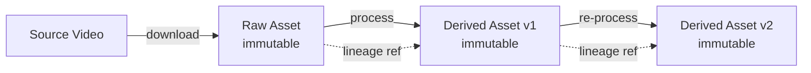
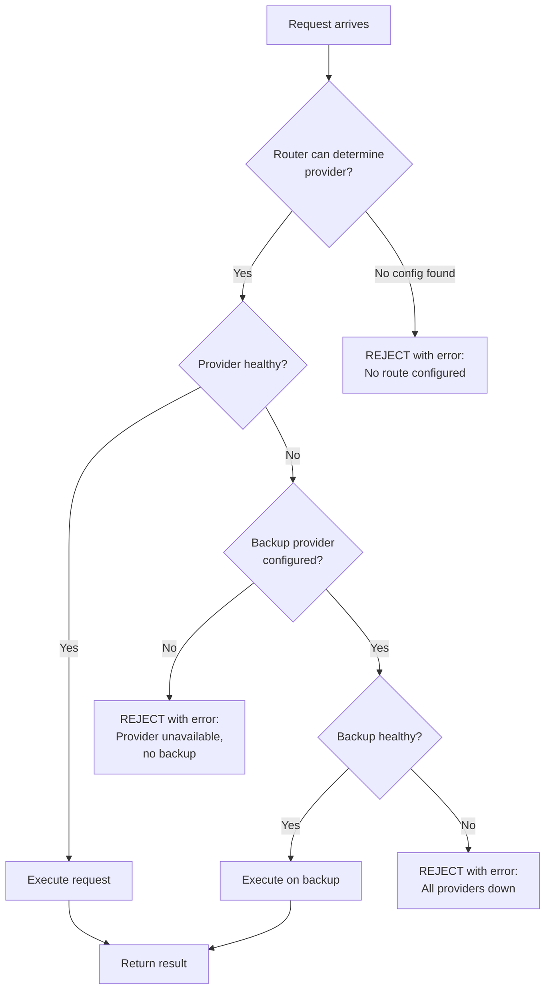
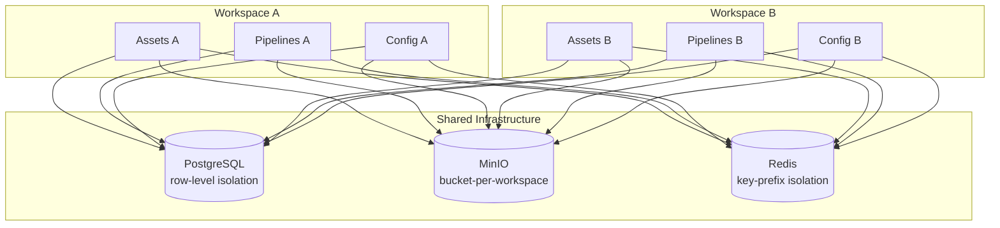

# 01 - Phạm Vi Dự Án và Nguyên Tắc Thiết Kế (Project Scope & Principles)

| Metadata | Giá trị |
|----------|---------|
| Document ID | VOL01-01 |
| Version | 1.0.0 |
| Ngày tạo | 2026-07-23 |
| Trạng thái | DRAFT |
| Tác giả | AIĐiLàm Architecture Team |

---

## 1. Định Nghĩa Dự Án

### 1.1 AIĐiLàm LÀ GÌ (What It IS)

AIĐiLàm **LÀ**:

1. **Hệ điều hành sáng tạo nội dung (Creator Operating System)** - một nền tảng tích hợp quản lý toàn bộ lifecycle của content repurposing
2. **Private-first platform** - mọi dữ liệu, assets, và processing đều nằm trên infrastructure riêng
3. **AI-powered automation pipeline** - tự động hóa các bước từ source collection đến publishing
4. **Multi-source aggregator** - thu thập nội dung từ nhiều nền tảng Trung Quốc và quốc tế
5. **Translation & localization engine** - chuyển đổi nội dung Trung → Việt với chất lượng cao
6. **Video processing system** - xử lý video bằng CPU (FFmpeg) không phụ thuộc GPU
7. **Extensible platform** - thiết kế để dễ dàng thêm provider, model, và platform mới
8. **Self-hosted solution** - chạy hoàn toàn trên hardware riêng, kiểm soát 100%
9. **Audit-complete system** - mọi hành động đều có trace và có thể reproduce

### 1.2 AIĐiLàm KHÔNG LÀ GÌ (What It IS NOT)

AIĐiLàm **KHÔNG LÀ**:

1. **KHÔNG phải SaaS/cloud service** - không có multi-tenant public offering
2. **KHÔNG phải real-time streaming platform** - chỉ xử lý batch/async
3. **KHÔNG phải video editor** - không cung cấp timeline editing UI
4. **KHÔNG phải AI training platform** - không train model, chỉ inference qua API
5. **KHÔNG phải content hosting/CDN** - không serve video trực tiếp đến end viewers
6. **KHÔNG phải replacement cho Underspan** - hoàn toàn independent, không modify Underspan
7. **KHÔNG phải GPU-dependent system** - mọi feature phải hoạt động trên CPU-only
8. **KHÔNG phải social media management tool** - focus vào creation, không phải engagement
9. **KHÔNG phải copyright circumvention tool** - user chịu trách nhiệm về IP/copyright

---

## 2. Nguyên Tắc Thiết Kế Cốt Lõi (Core Design Principles)

### 2.1 Immutable Assets



**Quy tắc:**
- Mỗi asset khi được tạo ra sẽ KHÔNG BAO GIỜ bị modify
- Mọi thay đổi tạo ra version mới (new asset với lineage reference)
- Asset ID là content-addressable hash (SHA-256)
- Deletion chỉ là soft-delete (mark as deleted, không xóa physical file)
- Retention policy quản lý physical cleanup theo schedule

**Lý do:**
- Đảm bảo reproducibility: luôn có thể trace lại từ output → source
- Tránh data corruption do concurrent modification
- Hỗ trợ rollback bất kỳ lúc nào
- Audit trail hoàn chỉnh

### 2.2 Lineage Tracking

**Quy tắc:**
- Mỗi derived asset PHẢI có reference đến parent asset(s)
- Mỗi processing step ghi lại: input, output, parameters, provider, model, timestamp
- Lineage graph có thể query để trace bất kỳ output nào về source gốc
- Pipeline execution ID liên kết tất cả steps trong một run

**Data model:**
```
Asset {
  id: UUID
  content_hash: SHA-256
  lineage_parent_ids: UUID[]
  created_by_pipeline_step: UUID
  created_at: timestamp
  metadata: JSONB
}

PipelineStep {
  id: UUID
  pipeline_execution_id: UUID
  step_type: enum
  input_asset_ids: UUID[]
  output_asset_ids: UUID[]
  parameters: JSONB
  provider: string
  model: string
  started_at: timestamp
  completed_at: timestamp
  status: enum
}
```

### 2.3 No Hardcoded Models/Providers

**Quy tắc:**
- KHÔNG BAO GIỜ hardcode tên model hoặc provider trong application code
- Mọi model/provider selection đều thông qua database-backed configuration
- Code chỉ tương tác với abstract interfaces (adapters)
- Provider switching không cần code change hoặc redeploy

**Ví dụ vi phạm (PROHIBITED):**
```typescript
// ❌ WRONG - hardcoded provider
const result = await openai.chat.completions.create({
  model: "gpt-4",
  messages: [...]
});
```

**Ví dụ đúng (REQUIRED):**
```typescript
// ✅ CORRECT - abstract routing
const result = await aiRuntime.complete({
  capability: "translation",
  input: { text, sourceLang: "zh", targetLang: "vi" },
  qualityTier: "high"
});
// Model/provider selected by router based on DB config
```

### 2.4 Database-Backed Configuration

**Quy tắc:**
- Mọi configuration có thể thay đổi runtime đều lưu trong database
- Environment variables chỉ dùng cho: connection strings, secrets, bootstrap config
- Configuration changes có audit trail (who, when, what, previous value)
- Configuration có version history và rollback capability

**Phạm vi configuration trong DB:**
- AI provider settings (endpoints, models, rate limits, costs)
- Pipeline templates và step definitions
- Quality thresholds và routing rules
- Feature flags
- Platform-specific settings (API endpoints, auth config)
- Retry policies và timeout values

### 2.5 Fail-Closed Routing

**Quy tắc:**
- Khi AI Runtime router KHÔNG THỂ xác định được provider/model phù hợp → REJECT request
- Khi configuration bị missing hoặc invalid → FAIL, không dùng default ẩn
- Khi provider health check fail → route sang backup HOẶC reject (không silent failure)
- Mọi failure đều có explicit error response với actionable message

**Flow:**


### 2.6 Non-Root Containers

**Quy tắc:**
- Mọi container PHẢI chạy với non-root user (UID >= 1000)
- Dockerfile PHẢI có `USER` instruction
- Container filesystems PHẢI read-only where possible
- Writable volumes được mount riêng với restricted permissions
- No `--privileged` flag, no `SYS_ADMIN` capability

**Standard Dockerfile pattern:**
```dockerfile
FROM node:20-slim AS runtime
RUN groupadd -r appuser && useradd -r -g appuser -u 1001 appuser
WORKDIR /app
COPY --chown=appuser:appuser . .
USER appuser
EXPOSE 3000
CMD ["node", "server.js"]
```

### 2.7 Workspace Isolation

**Quy tắc:**
- Mỗi creator/project có workspace riêng
- Workspace có dedicated storage namespace trong MinIO
- Database rows được scoped bằng workspace_id
- Cross-workspace access bị prohibit ở application layer
- Admin có thể access mọi workspace (with audit log)

**Isolation boundaries:**


### 2.8 Audit Everything

**Quy tắc:**
- Mọi state change PHẢI được log
- Mọi external API call PHẢI được log (request metadata, không log sensitive content)
- Mọi user action PHẢI được log với actor identity
- Audit logs là immutable (append-only)
- Audit logs có retention policy riêng (dài hơn operational data)

**Audit record structure:**
```
AuditEntry {
  id: UUID
  timestamp: ISO-8601
  actor_id: UUID | "system"
  actor_type: "user" | "service" | "scheduler"
  action: string (verb.noun format)
  resource_type: string
  resource_id: UUID
  workspace_id: UUID
  changes: { before: JSONB, after: JSONB }
  metadata: JSONB (IP, user-agent, request-id)
}
```

---

## 3. Nền Tảng Hỗ Trợ (Supported Platforms)

### 3.1 Source Platforms (Thu thập nội dung)

| Platform | Loại | Phương thức thu thập | Trạng thái |
|----------|------|---------------------|------------|
| Douyin (抖音) | Short video | URL-based download | **PROPOSED** |
| TikTok | Short video | URL-based download | **PROPOSED** |
| YouTube | Long/short video | yt-dlp integration | **PROPOSED** |
| Bilibili (哔哩哔哩) | Long video | URL-based download | **PROPOSED** |
| Facebook | Video/Reels | URL-based download | **PROPOSED** |
| Xiaohongshu (小红书) | Short video + images | URL-based download | **PROPOSED** |

### 3.2 Publishing Platforms (Xuất bản)

| Platform | Loại content | Phương thức | Trạng thái |
|----------|-------------|-------------|------------|
| YouTube | Video | API upload | **PROPOSED** |
| TikTok | Short video | API upload | **PROPOSED** |
| Facebook | Video/Reels | API upload | **PROPOSED** |

> **Lưu ý**: Douyin, Bilibili, Xiaohongshu publishing cần research thêm về API availability cho tài khoản Việt Nam.

---

## 4. Năng Lực Hệ Thống (System Capabilities)

### 4.1 Source Collection & Download

- Parse URL từ supported platforms
- Extract video metadata (title, description, tags, duration)
- Download video ở highest available quality
- Download subtitles/captions nếu có sẵn
- Store raw assets trong MinIO với immutable policy
- Rate limiting per platform để tránh ban

### 4.2 Transcription (Phiên âm)

- Chinese speech → Chinese text
- Support multiple AI providers (qua abstract adapter)
- Timestamp alignment (word-level hoặc sentence-level)
- Output format: SRT, VTT, JSON with timestamps
- Quality scoring và confidence metrics

### 4.3 Translation (Dịch thuật)

- Chinese text → Vietnamese text
- Context-aware translation (giữ nguyên nghĩa, tự nhiên trong tiếng Việt)
- Terminology management (glossary per workspace)
- Multiple translation styles: literal, natural, creative
- Human-in-the-loop review option

### 4.4 Subtitle Generation

- Tạo subtitle files từ translated text
- Time synchronization với video
- Style customization (font, size, position, color)
- Burn-in subtitles hoặc soft subtitles
- Dual-language subtitle support (Chinese + Vietnamese)

### 4.5 OCR (Optical Character Recognition)

- Nhận dạng text xuất hiện trong video frames
- Chinese character recognition
- Position tracking (để biết text ở đâu trong frame)
- Text removal/replacement trong video (inpainting)
- Translate on-screen text

### 4.6 TTS (Text-to-Speech)

- Vietnamese voice synthesis từ translated text
- Multiple voice options
- Speed/tone control
- Audio synchronization với video timing
- Background audio preservation (tách voice, giữ BGM)

### 4.7 Video Rendering

- Composite final video: original video + new audio + new subtitles
- Resolution/format conversion
- Watermark management
- Thumbnail generation
- Output format optimization per target platform
- **CPU-only processing** (FFmpeg, không dùng GPU acceleration)

### 4.8 Publishing

- Upload video đến target platforms
- Set metadata (title, description, tags) in Vietnamese
- Schedule publishing
- Track publishing status
- Cross-platform publishing từ single source

---

## 5. Phạm Vi Loại Trừ (Explicitly Excluded)

### 5.1 Underspan Modification

```
⛔ TUYỆT ĐỐI KHÔNG:
- Modify bất kỳ file nào thuộc Underspan
- Share database hoặc storage với Underspan
- Interfere với network ports của Underspan
- Restart hoặc affect Underspan services
- Use Underspan domain/subdomain cho AIĐiLàm

Underspan là một static Astro marketing site, không có running services.
AIĐiLàm và Underspan hoàn toàn independent trên cùng host.
```

### 5.2 GPU-Dependent Features

```
⛔ KHÔNG IMPLEMENT các feature yêu cầu GPU:
- Local AI model inference (LLM, Stable Diffusion, etc.)
- GPU-accelerated video encoding (NVENC, VAAPI)
- Local Whisper inference (dùng API thay thế)
- Real-time video processing
- AI training hoặc fine-tuning

Lý do: Host không có GPU. Mọi AI inference phải qua external API providers.
Video processing sử dụng CPU-only FFmpeg.
```

### 5.3 Real-Time Streaming

```
⛔ KHÔNG HỖ TRỢ:
- Live streaming translation
- Real-time subtitle overlay
- WebRTC/HLS streaming
- Live broadcast monitoring

AIĐiLàm chỉ xử lý batch processing:
- Input: recorded/uploaded video files
- Processing: async pipeline (minutes to hours)
- Output: rendered video files ready for upload
```

### 5.4 Các exclusion khác

- **Multi-tenant SaaS**: Chỉ single-tenant, self-hosted
- **Mobile app**: Chỉ web interface (responsive)
- **Payment processing**: Không có billing/subscription
- **User-generated content hosting**: Không serve video đến public
- **Copyright enforcement**: User tự chịu trách nhiệm IP

---

## 6. Ràng Buộc Kỹ Thuật Từ Host

| Constraint | Impact | Mitigation | Status |
|-----------|--------|-----------|--------|
| No GPU | Không thể local inference | Dùng external AI APIs | **VERIFIED** |
| 62GB free on root LV | Giới hạn DB/app storage | Dùng SAN cho media | **VERIFIED** |
| SAN not mounted | Chưa có large storage | Cần host admin mount | **REQUIRES_HOST_VALIDATION** |
| Docker socket unavailable | Không deploy từ container này | Deploy từ host level | **VERIFIED** |
| Kernel 4.4.73 | Older Docker features only | Test compatibility | **VERIFIED** |
| 252GB RAM | Đủ cho tất cả services | Careful allocation | **VERIFIED** |
| 64 CPU cores | Đủ cho parallel processing | Pool-based workers | **VERIFIED** |

---

## 7. Decision Records

### DR-001: Immutable Assets Over Mutable Files

- **Context**: Video processing tạo nhiều intermediate files
- **Decision**: Mọi file là immutable, mọi change tạo version mới
- **Consequence**: Tốn storage hơn, nhưng có full lineage và rollback
- **Trade-off**: Storage cost (mitigated bởi 13.6TB SAN) vs data integrity

### DR-002: External AI APIs Over Local Models

- **Context**: Host không có GPU
- **Decision**: Tất cả AI inference qua external provider APIs
- **Consequence**: Phụ thuộc network và provider availability
- **Trade-off**: Latency + cost vs no GPU requirement
- **Mitigation**: Multi-provider routing, caching, retry logic

### DR-003: CPU-Only Video Processing

- **Context**: Không có GPU cho hardware-accelerated encoding
- **Decision**: FFmpeg với CPU-only presets (libx264, libx265)
- **Consequence**: Rendering chậm hơn 5-10x so với GPU
- **Trade-off**: Speed vs hardware availability
- **Mitigation**: 64 cores cho parallel processing, queue-based batching

---

## Trạng Thái Xác Minh

| Claim | Status |
|-------|--------|
| Platform list (Douyin, TikTok, etc.) | **PROPOSED** - cần verify API access |
| Download methods per platform | **PROPOSED** - cần research legal/technical feasibility |
| Publishing API availability | **PROPOSED** - cần verify per platform |
| CPU-only FFmpeg performance | **INFERRED** - cần benchmark trên actual hardware |
| Workspace isolation model | **PROPOSED** - design decision |
| All core principles | **PROPOSED** - architecture decisions |
| Host constraints | **VERIFIED** - confirmed from system info |

---

*Tiếp theo: [02_system_context.md](./02_system_context.md) - C4 System Context Diagram*
