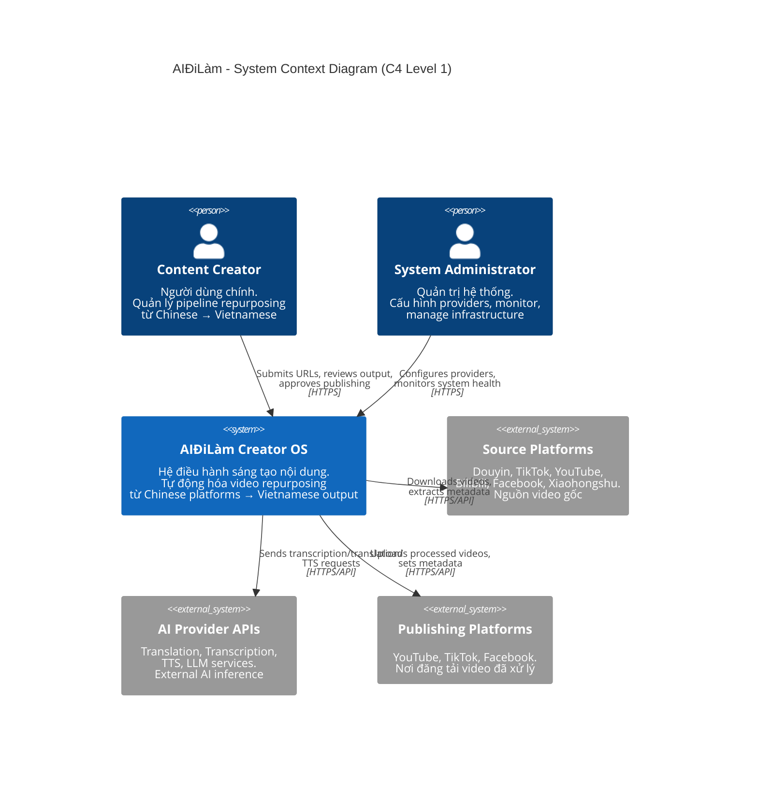
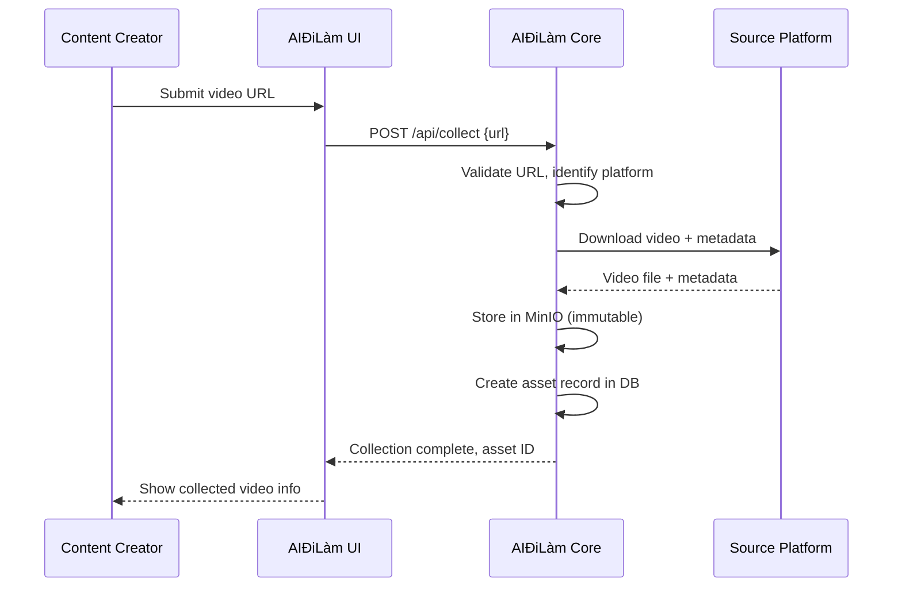
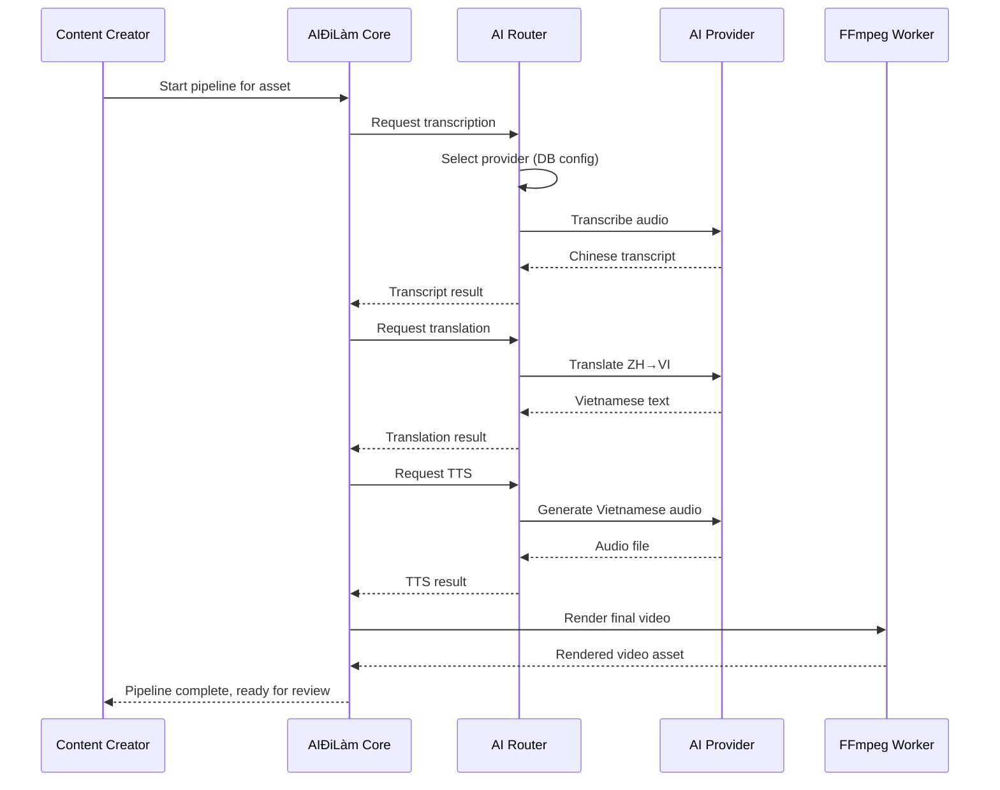
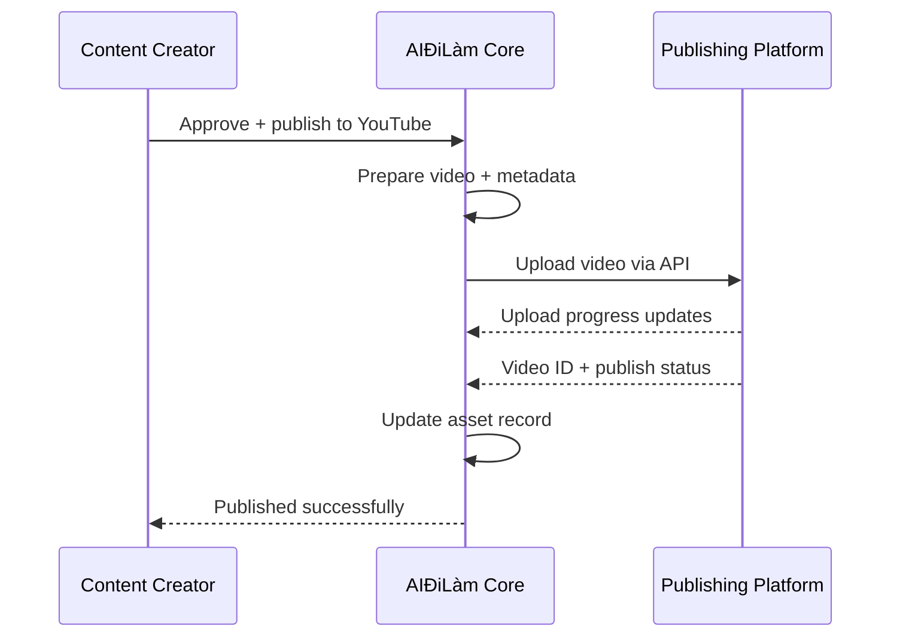
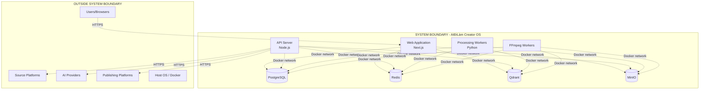
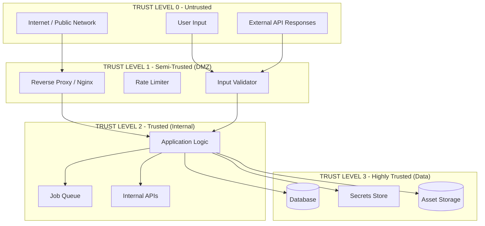
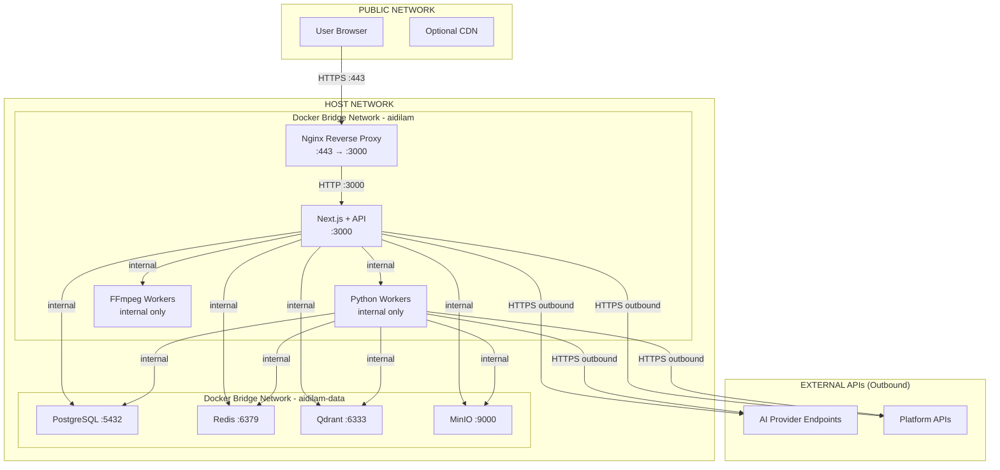

# 02 - System Context (C4 Level 1)

| Metadata | Giá trị |
|----------|---------|
| Document ID | VOL01-02 |
| Version | 1.0.0 |
| Ngày tạo | 2026-07-23 |
| Trạng thái | DRAFT |
| Tác giả | AIĐiLàm Architecture Team |
| C4 Level | 1 - System Context |

---

## 1. Giới Thiệu

Tài liệu này mô tả System Context của AIĐiLàm theo mô hình C4 (Level 1). Level này cho thấy:
- Hệ thống AIĐiLàm như một "black box"
- Các actor bên ngoài tương tác với hệ thống
- Các hệ thống bên ngoài mà AIĐiLàm phụ thuộc
- Luồng dữ liệu chính giữa các thành phần

---

## 2. System Context Diagram

---

## 3. Mô Tả Chi Tiết Các Actor

### 3.1 Content Creator (Người Sáng Tạo Nội Dung)

| Thuộc tính | Chi tiết |
|-----------|----------|
| Loại | Human Actor (Primary User) |
| Mô tả | Người dùng chính của hệ thống, content creator Việt Nam |
| Kênh tương tác | Web browser → Next.js UI |
| Authentication | Username/password + optional 2FA |
| Authorization | Workspace-scoped access |

**Hành động chính:**
1. Submit video URLs từ source platforms
2. Cấu hình pipeline parameters (style dịch, voice, subtitle style)
3. Review kết quả transcription/translation
4. Approve hoặc reject intermediate outputs
5. Trigger publishing đến target platforms
6. Quản lý workspace assets và history
7. Xem analytics và pipeline status

**Không được phép:**
- Access workspace của creator khác
- Modify system-level configuration
- Direct database access
- Bypass pipeline steps

### 3.2 System Administrator

| Thuộc tính | Chi tiết |
|-----------|----------|
| Loại | Human Actor (Admin) |
| Mô tả | Quản trị viên hệ thống, quản lý infrastructure và configuration |
| Kênh tương tác | Web browser → Admin UI + CLI tools |
| Authentication | Username/password + mandatory 2FA |
| Authorization | System-wide access |

**Hành động chính:**
1. Cấu hình AI providers (API keys, endpoints, rate limits)
2. Quản lý model routing rules
3. Monitor system health và resource usage
4. Manage user accounts và workspaces
5. View audit logs
6. Configure retention policies
7. Manage platform integrations
8. Troubleshoot failed pipelines

**Đặc quyền:**
- Cross-workspace access (with audit trail)
- System configuration changes
- Provider management
- User management

### 3.3 Source Platform APIs

| Thuộc tính | Chi tiết |
|-----------|----------|
| Loại | External System |
| Mô tả | APIs/endpoints của các nền tảng video nguồn |
| Giao thức | HTTPS |
| Direction | AIĐiLàm → Platforms (outbound only) |

**Platforms chi tiết:**

| Platform | URL Pattern | Download Method | Rate Limit | Status |
|----------|------------|-----------------|-----------|--------|
| Douyin | douyin.com/video/* | yt-dlp + custom extractor | **INFERRED** - cần test | **PROPOSED** |
| TikTok | tiktok.com/@*/video/* | yt-dlp | Known | **PROPOSED** |
| YouTube | youtube.com/watch?v=* | yt-dlp (mature) | Well-documented | **PROPOSED** |
| Bilibili | bilibili.com/video/* | yt-dlp + custom | **INFERRED** | **PROPOSED** |
| Facebook | facebook.com/*/videos/* | yt-dlp | **INFERRED** | **PROPOSED** |
| Xiaohongshu | xiaohongshu.com/explore/* | Custom scraper | **INFERRED** - cần research | **PROPOSED** |

**Data flows từ Source Platforms:**
- Video file (MP4, WebM, etc.)
- Metadata (title, description, tags, duration, resolution)
- Available subtitles/captions (nếu có)
- Thumbnail images
- Author information

### 3.4 AI Provider APIs

| Thuộc tính | Chi tiết |
|-----------|----------|
| Loại | External System |
| Mô tả | Các dịch vụ AI bên ngoài cung cấp inference capabilities |
| Giao thức | HTTPS (REST/gRPC) |
| Direction | AIĐiLàm → Providers (outbound only) |
| Authentication | API Key per provider |

**Capabilities cần từ AI Providers:**

| Capability | Mô tả | Ví dụ Providers | Status |
|-----------|--------|-----------------|--------|
| Transcription | Chinese speech → text | OpenAI Whisper API, Azure Speech | **PROPOSED** |
| Translation | Chinese text → Vietnamese text | DeepL, Google Translate, GPT-4 | **PROPOSED** |
| TTS | Vietnamese text → speech | Azure TTS, ElevenLabs, FPT.AI | **PROPOSED** |
| LLM | Content optimization, summarization | OpenAI, Anthropic, local APIs | **PROPOSED** |
| OCR | Text recognition in video frames | Google Vision, Azure CV | **PROPOSED** |

**Quan trọng:** Provider cụ thể KHÔNG được hardcode. Hệ thống design để swap provider qua configuration. Xem nguyên tắc "No Hardcoded Models/Providers" trong [01_project_scope_and_principles.md](./01_project_scope_and_principles.md).

### 3.5 Publishing Platform APIs

| Thuộc tính | Chi tiết |
|-----------|----------|
| Loại | External System |
| Mô tả | APIs để upload video đã xử lý lên các nền tảng đích |
| Giao thức | HTTPS (REST/OAuth2) |
| Direction | AIĐiLàm → Platforms (outbound) |
| Authentication | OAuth2 per platform per creator |

| Platform | API | Auth Method | Upload Limit | Status |
|----------|-----|-------------|-------------|--------|
| YouTube | YouTube Data API v3 | OAuth2 | 128GB/video | **PROPOSED** |
| TikTok | TikTok Content Posting API | OAuth2 | 4GB/video | **PROPOSED** |
| Facebook | Graph API (Video) | OAuth2 | 10GB/video | **PROPOSED** |

---

## 4. Data Flows Chi Tiết

### 4.1 Luồng Thu Thập (Collection Flow)

### 4.2 Luồng Xử Lý (Processing Flow)

### 4.3 Luồng Xuất Bản (Publishing Flow)

---

## 5. Boundary Definitions

### 5.1 System Boundary

**Bên trong System Boundary:**
- Toàn bộ application code (Next.js, Node.js, Python)
- Toàn bộ data stores (PostgreSQL, Redis, Qdrant, MinIO)
- Internal networking giữa các services
- Configuration và secrets management
- Job scheduling và queue management

**Bên ngoài System Boundary:**
- User browsers
- Source platform servers
- AI provider infrastructure
- Publishing platform servers
- Host operating system
- Docker runtime
- Network infrastructure

### 5.2 Trust Boundaries

**Trust Level 0 - Untrusted:**
- Mọi input từ internet
- Mọi response từ external APIs (có thể bị tampered)
- User-supplied URLs và content

**Trust Level 1 - Semi-Trusted (DMZ):**
- Reverse proxy (validates basic HTTP compliance)
- Rate limiter (prevents abuse)
- Input validator (sanitizes input trước khi vào application)

**Trust Level 2 - Trusted (Internal):**
- Application business logic
- Internal service-to-service communication
- Job queue messages (đã được validated khi enqueue)

**Trust Level 3 - Highly Trusted (Data):**
- Database (source of truth)
- Secrets/credentials store
- Asset storage (MinIO)
- Audit logs

### 5.3 Network Boundaries

**Network Rules:**

| Source | Destination | Protocol | Port | Allowed |
|--------|------------|----------|------|---------|
| Internet | Nginx | HTTPS | 443 | ✅ |
| Internet | Any other service | * | * | ❌ |
| Nginx | Next.js App | HTTP | 3000 | ✅ |
| App | PostgreSQL | TCP | 5432 | ✅ |
| App | Redis | TCP | 6379 | ✅ |
| App | Qdrant | HTTP | 6333 | ✅ |
| App | MinIO | HTTP | 9000 | ✅ |
| App/Workers | External APIs | HTTPS | 443 | ✅ (outbound only) |
| Data services | Internet | * | * | ❌ |
| Any | Underspan | * | * | ❌ (complete isolation) |

> **[INFERRED]** Network topology chính xác phụ thuộc vào Docker network configuration thực tế trên host. Cần validate khi deploy.

---

## 6. External Dependencies & Risks

### 6.1 Dependency Matrix

| External System | Criticality | Failure Impact | Mitigation |
|----------------|-------------|---------------|-----------|
| Source Platforms | Medium | Cannot collect new content | Queue & retry, cached content |
| AI Providers | High | Pipeline stalls at AI steps | Multi-provider routing, queue backpressure |
| Publishing Platforms | Low | Cannot publish (can retry) | Queue with retry, manual fallback |
| Internet connectivity | High | All external comms fail | Local cache, graceful degradation |
| DNS | High | Cannot resolve external hosts | Local DNS cache |

### 6.2 Availability Requirements

| Component | Target Availability | Rationale |
|-----------|-------------------|-----------|
| Web UI | 99% | Single host, acceptable brief downtime |
| Pipeline processing | 99% | Queue-based, can tolerate brief outages |
| Data stores | 99.5% | Critical for all operations |
| External AI APIs | N/A (external) | Mitigated by multi-provider |

> **[INFERRED]** Availability targets dựa trên single-host deployment. Không có HA/failover.

---

## 7. Assumptions & Constraints

### 7.1 Assumptions

| # | Assumption | Risk nếu sai |
|---|-----------|--------------|
| A1 | Internet outbound luôn available | Không thể dùng AI APIs, không download/publish |
| A2 | Source platform URLs ổn định | Download logic cần update thường xuyên |
| A3 | AI provider APIs có SLA tốt | Pipeline delays, cần robust retry |
| A4 | Single user concurrent (hoặc ít users) | Không cần horizontal scaling |
| A5 | SAN sẽ được mount thành công | Nếu không → storage crisis |

### 7.2 Constraints (từ host environment)

| # | Constraint | Source | Status |
|---|-----------|--------|--------|
| C1 | No GPU | Hardware | **VERIFIED** |
| C2 | Docker socket unavailable in current container | Runtime env | **VERIFIED** |
| C3 | Must coexist with Underspan | Operational requirement | **VERIFIED** |
| C4 | Single physical host | Infrastructure | **VERIFIED** |
| C5 | SUSE Linux kernel 4.4.73 | Host OS | **VERIFIED** |
| C6 | 62GB free on root LV | Storage | **VERIFIED** |
| C7 | 13.6TB SAN not yet mounted | Storage | **REQUIRES_HOST_VALIDATION** |

---

## 8. Trạng Thái Xác Minh Tài Liệu

| Claim | Status |
|-------|--------|
| C4 diagram actors and relationships | **PROPOSED** - architecture design |
| Network boundary layout | **INFERRED** - based on Docker best practices |
| Trust level definitions | **PROPOSED** - security design decision |
| Source platform download methods | **PROPOSED** - cần verify feasibility |
| AI provider list | **PROPOSED** - cần evaluate actual providers |
| Publishing platform APIs | **PROPOSED** - cần verify API access |
| Port assignments | **PROPOSED** - standard defaults |
| Docker network topology | **INFERRED** - cần validate on actual host |
| Availability targets | **PROPOSED** - single-host limitations |
| Host constraints | **VERIFIED** - from system information |

---

*Tiếp theo: [03_layered_architecture.md](./03_layered_architecture.md) - Kiến Trúc Phân Tầng*
