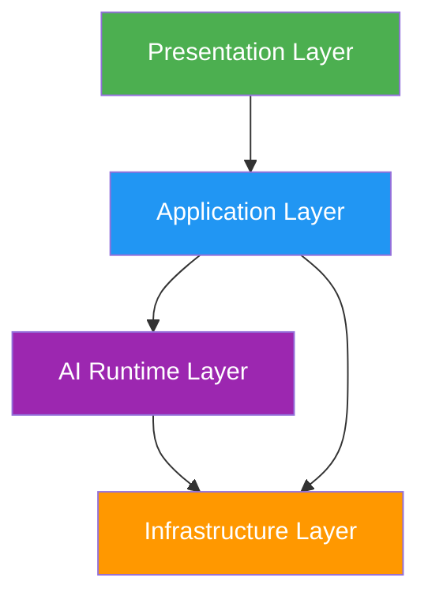
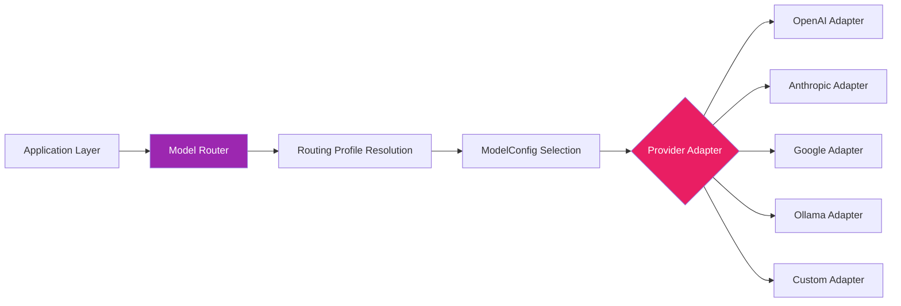
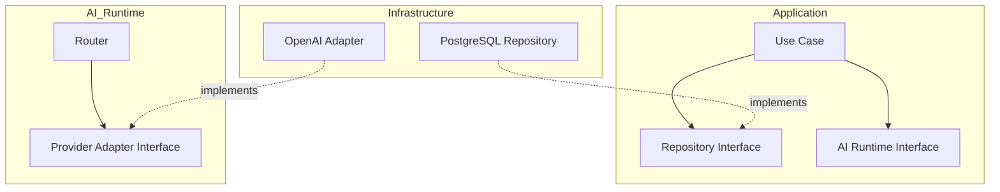

# 03 — Kiến Trúc Phân Tầng (Layered Architecture)

## Tổng Quan

AIĐiLàm áp dụng kiến trúc bốn tầng với dependency direction nghiêm ngặt từ trên xuống dưới.



## Quy Tắc Dependency

| Từ | Được phép gọi | CẤM gọi |
|----|---------------|----------|
| Presentation | Application | AI Runtime trực tiếp, Infrastructure trực tiếp |
| Application | AI Runtime abstractions, Infrastructure adapters | Provider SDKs trực tiếp |
| AI Runtime | Infrastructure adapters | Presentation, Business logic |
| Infrastructure | Không gọi tầng khác | Presentation, Application, AI Runtime |

**Nguyên tắc bất biến:** Business logic KHÔNG ĐƯỢC phụ thuộc trực tiếp vào provider-specific SDKs.

---

## Tầng 1: Presentation

### Trách Nhiệm

- Render giao diện người dùng (Next.js pages/components)
- Thu thập input từ user
- Gọi Application Layer APIs (Server Actions, API routes)
- Hiển thị kết quả, trạng thái, lỗi
- Client-side state management
- Form validation (client-side, non-authoritative)
- Real-time updates (WebSocket/SSE)

### Công Nghệ

- Next.js App Router
- React Server Components
- TypeScript strict mode
- Tailwind CSS / Design system

### Quy Tắc

| Quy tắc | Chi tiết |
|---------|---------|
| Không chứa business logic | Validation chỉ là UX, server là authoritative |
| Không gọi database trực tiếp | Phải thông qua Application Layer |
| Không chứa AI provider code | Không import OpenAI/Anthropic SDK |
| Không authoritative cho routing | Browser KHÔNG quyết định model/provider |
| Không lưu credentials | Token chỉ trong httpOnly cookies |

### Cấu Trúc Thư Mục

```
apps/web/
├── app/           # Next.js App Router pages
├── components/    # React components
├── hooks/         # Custom React hooks
├── lib/           # Client utilities
└── styles/        # Design tokens, global styles
```

---

## Tầng 2: Application

### Trách Nhiệm

- Business logic và domain rules
- Authentication và authorization (RBAC)
- Workspace management
- Job orchestration
- Workflow coordination
- API validation (authoritative)
- Transaction management
- Event publishing
- Audit context creation

### Ownership

Node.js/TypeScript sở hữu toàn bộ business logic:

- Auth, RBAC, workspace management
- Application APIs, Admin APIs
- Prompt Library management
- Model Governance administration
- Routing configuration
- Audit APIs
- Job orchestration (tạo, theo dõi, cancel)
- Review workflow
- Publishing workflow

### Quy Tắc

| Quy tắc | Chi tiết |
|---------|---------|
| Không phụ thuộc UI framework | Không import React/Next.js |
| Không gọi provider SDK trực tiếp | Phải qua AI Runtime abstractions |
| Sở hữu domain entities | Định nghĩa types, validation, state machines |
| Sở hữu authorization decisions | Mọi permission check ở đây |
| Orchestrate, không execute media | Tạo jobs, không chạy FFmpeg |

### Cấu Trúc Thư Mục

```
packages/
├── domain/        # Domain entities, value objects, events
├── application/   # Use cases, services, commands, queries
├── contracts/     # Job contracts, API contracts, shared types
└── security/      # Auth, RBAC, encryption utilities
```

---

## Tầng 3: AI Runtime

### Trách Nhiệm

- Model Router: giải quyết operation → RoutingProfile → ModelConfig → Provider
- Prompt Engine: render templates, validate I/O
- Provider Adapters: abstract interface cho mỗi AI provider
- Routing Analytics: ghi nhận execution metrics
- Health monitoring: kiểm tra provider availability
- Cache management: ModelConfig và RoutingProfile cache

### Thiết Kế Adapter



### Interface Trừu Tượng

```typescript
// packages/ai-runtime/src/interfaces.ts
interface AIProviderAdapter {
  readonly providerId: string;
  readonly capabilities: ProviderCapability[];
  
  generateCompletion(request: CompletionRequest): Promise<CompletionResponse>;
  generateEmbedding(request: EmbeddingRequest): Promise<EmbeddingResponse>;
  checkHealth(): Promise<HealthStatus>;
}

interface ModelRouter {
  route(operation: RoutingOperation, context: RoutingContext): Promise<RoutingResult>;
}

interface RoutingProfileResolver {
  resolve(operation: RoutingOperation, profileId?: string): Promise<ResolvedProfile>;
  getDefault(operation: RoutingOperation): Promise<ResolvedProfile>;
}
```

### Quy Tắc

| Quy tắc | Chi tiết |
|---------|---------|
| Provider-neutral interfaces | Application KHÔNG biết provider nào được dùng |
| Database-backed config | ModelConfig và RoutingProfile từ DB |
| Fail-closed | Missing config = error, KHÔNG silent fallback |
| Immutable analytics | RoutingExecution records không được sửa |
| No hardcoded defaults | Không có model/provider name trong source |
| Cache invalidation | Version-aware, DB-driven |

### Cấu Trúc Thư Mục

```
packages/ai-runtime/
├── src/
│   ├── interfaces/      # Abstract interfaces
│   ├── router/          # Model Router implementation
│   ├── adapters/        # Provider-specific adapters
│   ├── cache/           # Config cache with invalidation
│   ├── health/          # Provider health monitoring
│   └── analytics/       # Routing analytics recording
```

---

## Tầng 4: Infrastructure

### Trách Nhiệm

- Database access (PostgreSQL repositories)
- Cache operations (Redis)
- Queue operations (Redis-based job queue)
- Object storage (MinIO)
- Vector database (Qdrant)
- External API clients
- File system operations
- Logging infrastructure
- Metrics collection

### Adapters

| Service | Adapter | Quy tắc |
|---------|---------|---------|
| PostgreSQL | Repository pattern | Transactions managed by Application Layer |
| Redis | Cache/Queue adapter | Namespace isolation per concern |
| MinIO | Storage adapter | Signed URLs, no direct client exposure |
| Qdrant | Vector store adapter | Embedding storage/retrieval only |
| External APIs | HTTP client adapters | Timeout, retry, circuit breaker |

### Quy Tắc

| Quy tắc | Chi tiết |
|---------|---------|
| Implement interfaces from upper layers | Không định nghĩa business rules |
| Không chứa domain logic | Chỉ persistence và communication |
| Configuration-driven | Connection strings, timeouts từ config |
| Secret isolation | Credentials qua env/vault references |
| Error translation | Infra errors → domain errors |

### Cấu Trúc Thư Mục

```
packages/
├── database/         # PostgreSQL repositories, migrations
├── observability/    # Logging, metrics, tracing
└── shared/           # Shared utilities, config loading
```

---

## Dependency Injection

Mỗi tầng định nghĩa interfaces; tầng dưới implement:



## Cross-Cutting Concerns

| Concern | Cách xử lý |
|---------|------------|
| Logging | Structured JSON, correlation IDs, mọi tầng |
| Authentication | Middleware ở Presentation, verified ở Application |
| Authorization | Application Layer quyết định, Presentation enforce UI |
| Audit | Application Layer tạo events, Infrastructure persist |
| Error handling | Domain errors ở Application, translated ở boundaries |
| Configuration | Infrastructure loads, Application consumes |

---

## Validation Status

| Thành phần | Trạng thái |
|-----------|-----------|
| Layer separation design | PROPOSED |
| Dependency direction | PROPOSED |
| Technology mapping | PROPOSED |
| Directory structure | PROPOSED |
| Runtime verification | REQUIRES_HOST_VALIDATION |
