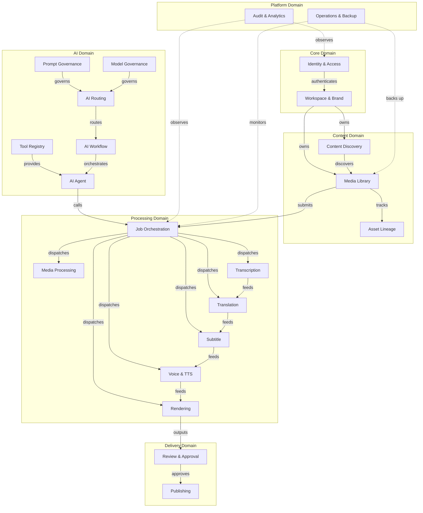

# Chương 4: Bounded Contexts

> Tài liệu định nghĩa đầy đủ 22 bounded contexts của hệ thống AiDiLam, bao gồm ownership, entities, commands, queries, domain events và các ràng buộc.

---

## Context Map

---

## 1. Identity and Access

| Thuộc tính | Chi tiết |
|---|---|
| **Mục đích** | Quản lý authentication, authorization, user profiles, roles và permissions cho toàn hệ thống |
| **Ownership** | 🟢 Node |
| **Primary Entities** | User, Role, Permission, Session, APIKey, Organization, MFADevice |
| **Commands** | RegisterUser, AuthenticateUser, AssignRole, RevokePermission, EnableMFA, RotateAPIKey, DeactivateUser |
| **Queries** | GetUserProfile, ListRoles, CheckPermission, ListActiveSessions, GetAuditTrail |
| **Domain Events** | UserRegistered, UserAuthenticated, RoleAssigned, PermissionRevoked, SessionExpired, MFAEnabled |
| **External Dependencies** | OAuth2 providers (Google, GitHub), SMS gateway, Email service |
| **Prohibited Responsibilities** | Không lưu trữ business data, không xử lý media, không quản lý billing |
| **Data Ownership** | User credentials, sessions, roles, permissions, API keys |
| **Security Classification** | 🔴 Critical — chứa credentials và access tokens |
| **Audit Requirements** | Log tất cả authentication attempts, permission changes, role assignments; retention 2 năm |

---

## 2. Workspace and Brand

| Thuộc tính | Chi tiết |
|---|---|
| **Mục đích** | Quản lý workspaces, brand guidelines, team collaboration settings và resource quotas |
| **Ownership** | 🟢 Node |
| **Primary Entities** | Workspace, Brand, BrandGuideline, Team, Invitation, Quota, BillingPlan |
| **Commands** | CreateWorkspace, UpdateBrandGuideline, InviteMember, SetQuota, ArchiveWorkspace, ConfigureBrand |
| **Queries** | GetWorkspace, ListBrands, GetBrandGuideline, GetQuotaUsage, ListTeamMembers |
| **Domain Events** | WorkspaceCreated, BrandUpdated, MemberInvited, QuotaExceeded, WorkspaceArchived |
| **External Dependencies** | Identity and Access (user resolution), Payment gateway |
| **Prohibited Responsibilities** | Không xử lý media, không quản lý AI models, không thực hiện rendering |
| **Data Ownership** | Workspace configs, brand assets, team membership, quotas |
| **Security Classification** | 🟡 High — chứa brand IP và business configurations |
| **Audit Requirements** | Log membership changes, quota modifications, brand guideline updates; retention 1 năm |

---

## 3. Content Discovery

| Thuộc tính | Chi tiết |
|---|---|
| **Mục đích** | Tìm kiếm, phân loại, gợi ý nội dung từ nhiều nguồn; quản lý content metadata và taxonomy |
| **Ownership** | 🟢 Node |
| **Primary Entities** | ContentItem, Category, Tag, SearchIndex, Recommendation, Source, Playlist |
| **Commands** | IndexContent, CategorizeContent, CreatePlaylist, ImportFromSource, RefreshIndex, TagContent |
| **Queries** | SearchContent, GetRecommendations, ListCategories, GetTrendingContent, FilterByTag |
| **Domain Events** | ContentIndexed, ContentCategorized, SourceImported, RecommendationGenerated, PlaylistCreated |
| **External Dependencies** | Elasticsearch/OpenSearch, Media Library, external RSS/API sources |
| **Prohibited Responsibilities** | Không lưu trữ media files, không xử lý transcoding, không quản lý user accounts |
| **Data Ownership** | Search indexes, categories, tags, recommendations, playlists |
| **Security Classification** | 🟢 Standard — metadata công khai hoặc workspace-scoped |
| **Audit Requirements** | Log search queries (anonymized), index rebuilds, source imports; retention 6 tháng |

---

## 4. Media Library

| Thuộc tính | Chi tiết |
|---|---|
| **Mục đích** | Quản lý vòng đời media assets: upload, storage, versioning, metadata và access control |
| **Ownership** | 🟢 Node |
| **Primary Entities** | MediaAsset, MediaVersion, Folder, Collection, MediaMetadata, AccessPolicy, Thumbnail |
| **Commands** | UploadMedia, CreateVersion, MoveToFolder, SetAccessPolicy, DeleteMedia, GenerateThumbnail |
| **Queries** | GetMediaAsset, ListVersions, ListByFolder, GetStorageUsage, SearchMedia |
| **Domain Events** | MediaUploaded, VersionCreated, MediaDeleted, AccessPolicyChanged, StorageLimitReached |
| **External Dependencies** | S3/Object Storage, CDN, Asset Lineage, Content Discovery |
| **Prohibited Responsibilities** | Không transcoding, không rendering, không quản lý AI models |
| **Data Ownership** | Media files, versions, metadata, folder structure, access policies |
| **Security Classification** | 🟡 High — chứa IP content của khách hàng |
| **Audit Requirements** | Log tất cả uploads, deletes, access policy changes, downloads; retention 2 năm |

---

## 5. Asset Lineage

| Thuộc tính | Chi tiết |
|---|---|
| **Mục đích** | Theo dõi nguồn gốc, biến đổi và quan hệ giữa các assets qua toàn bộ pipeline xử lý |
| **Ownership** | 🟢 Node |
| **Primary Entities** | LineageNode, Transformation, Derivation, LineageGraph, Provenance, SourceReference |
| **Commands** | RecordTransformation, LinkDerivation, CreateLineageNode, AnnotateProvenance, MergeLineage |
| **Queries** | GetLineageGraph, TraceOrigin, ListDerivations, GetTransformationHistory, FindRelatedAssets |
| **Domain Events** | TransformationRecorded, DerivationLinked, LineageGraphUpdated, ProvenanceAnnotated |
| **External Dependencies** | Media Library, Job Orchestration, Graph database (Neo4j/Neptune) |
| **Prohibited Responsibilities** | Không lưu trữ actual media, không thực hiện transformations, không quản lý permissions |
| **Data Ownership** | Lineage graphs, transformation records, provenance metadata |
| **Security Classification** | 🟢 Standard — metadata về relationships |
| **Audit Requirements** | Log lineage modifications, provenance annotations; retention 3 năm (compliance) |

---

## 6. Job Orchestration

| Thuộc tính | Chi tiết |
|---|---|
| **Mục đích** | Điều phối, scheduling và monitoring các processing jobs; quản lý pipelines, retries và dependencies |
| **Ownership** | 🟢 Node |
| **Primary Entities** | Job, Pipeline, Stage, TaskQueue, Schedule, RetryPolicy, JobDependency, WorkerPool |
| **Commands** | SubmitJob, CancelJob, RetryJob, CreatePipeline, PauseStage, ScaleWorkerPool, SetPriority |
| **Queries** | GetJobStatus, ListPipelineJobs, GetQueueDepth, GetWorkerHealth, EstimateCompletion |
| **Domain Events** | JobSubmitted, JobCompleted, JobFailed, PipelineFinished, StageTransitioned, RetryScheduled |
| **External Dependencies** | Message Queue (SQS/RabbitMQ), Media Processing, Transcription, Translation, all worker contexts |
| **Prohibited Responsibilities** | Không thực hiện actual processing, không lưu trữ media, không quyết định AI model selection |
| **Data Ownership** | Job records, pipeline definitions, schedules, queue state, execution logs |
| **Security Classification** | 🟡 High — orchestrates toàn bộ processing pipeline |
| **Audit Requirements** | Log tất cả job lifecycle events, retries, failures, cancellations; retention 1 năm |

---

## 7. Media Processing

| Thuộc tính | Chi tiết |
|---|---|
| **Mục đích** | Thực hiện transcoding, format conversion, compression, và media normalization |
| **Ownership** | 🟡 Python Worker |
| **Primary Entities** | ProcessingTask, MediaProfile, Codec, OutputFormat, QualityPreset, ProcessingResult |
| **Commands** | TranscodeMedia, ConvertFormat, CompressMedia, NormalizeAudio, ExtractFrames, ApplyWatermark |
| **Queries** | GetTaskProgress, ListSupportedFormats, GetProcessingResult, EstimateProcessingTime |
| **Domain Events** | ProcessingStarted, ProcessingCompleted, ProcessingFailed, QualityCheckPassed, FormatConverted |
| **External Dependencies** | FFmpeg, S3/Object Storage, Job Orchestration, Media Library |
| **Prohibited Responsibilities** | Không quản lý job scheduling, không quyết định content strategy, không handle user auth |
| **Data Ownership** | Processing configs, codec profiles, quality presets, temporary processing files |
| **Security Classification** | 🟢 Standard — xử lý media theo instructions |
| **Audit Requirements** | Log processing durations, resource usage, failures; retention 6 tháng |

---

## 8. Transcription

| Thuộc tính | Chi tiết |
|---|---|
| **Mục đích** | Chuyển đổi audio/video thành text; speaker diarization, punctuation, và timestamp alignment |
| **Ownership** | 🟡 Python Worker |
| **Primary Entities** | Transcript, Segment, Speaker, Word, ConfidenceScore, Language, TranscriptionConfig |
| **Commands** | TranscribeMedia, IdentifySpeakers, AlignTimestamps, CorrectTranscript, MergeSegments |
| **Queries** | GetTranscript, ListSegments, GetSpeakerMap, GetConfidenceReport, SearchInTranscript |
| **Domain Events** | TranscriptionStarted, TranscriptionCompleted, SpeakersIdentified, TranscriptCorrected |
| **External Dependencies** | Whisper/ASR models, AI Routing, Job Orchestration, Media Library |
| **Prohibited Responsibilities** | Không dịch thuật, không tạo subtitles, không quản lý media storage |
| **Data Ownership** | Transcripts, speaker profiles, confidence scores, language detection results |
| **Security Classification** | 🟡 High — transcript chứa nội dung nhạy cảm của khách hàng |
| **Audit Requirements** | Log model versions used, accuracy metrics, processing times; retention 1 năm |

---

## 9. Translation

| Thuộc tính | Chi tiết |
|---|---|
| **Mục đích** | Dịch thuật nội dung đa ngôn ngữ; quản lý translation memory, glossary và quality assurance |
| **Ownership** | 🟡 Python Worker |
| **Primary Entities** | TranslationJob, TranslationMemory, Glossary, LanguagePair, QualityScore, TranslationSegment |
| **Commands** | TranslateContent, UpdateGlossary, ImportTranslationMemory, ReviewTranslation, BatchTranslate |
| **Queries** | GetTranslation, SearchTranslationMemory, ListGlossaryTerms, GetQualityScore, ListLanguagePairs |
| **Domain Events** | TranslationCompleted, GlossaryUpdated, QualityThresholdFailed, MemoryUpdated, BatchFinished |
| **External Dependencies** | AI Routing, LLM providers, Transcription, Job Orchestration |
| **Prohibited Responsibilities** | Không tạo subtitles, không xử lý audio, không quản lý AI model lifecycle |
| **Data Ownership** | Translation memories, glossaries, translated content, quality metrics |
| **Security Classification** | 🟡 High — nội dung dịch thuật là IP của khách hàng |
| **Audit Requirements** | Log language pairs, model usage, quality scores, human corrections; retention 1 năm |

---

## 10. Subtitle

| Thuộc tính | Chi tiết |
|---|---|
| **Mục đích** | Tạo, đồng bộ và format subtitles; quản lý timing, styling và multi-language subtitle tracks |
| **Ownership** | 🟡 Python Worker |
| **Primary Entities** | SubtitleTrack, SubtitleCue, TimingProfile, SubtitleStyle, BurnInConfig, SubtitleFormat |
| **Commands** | GenerateSubtitles, SyncTiming, ApplyStyle, BurnInSubtitles, ExportFormat, MergeTrack |
| **Queries** | GetSubtitleTrack, ListCues, PreviewTiming, GetSupportedFormats, ValidateSubtitles |
| **Domain Events** | SubtitlesGenerated, TimingSynced, StyleApplied, SubtitlesBurnedIn, FormatExported |
| **External Dependencies** | Transcription, Translation, Job Orchestration, Rendering |
| **Prohibited Responsibilities** | Không dịch thuật, không transcribe audio, không quản lý media storage |
| **Data Ownership** | Subtitle tracks, timing data, style templates, format configs |
| **Security Classification** | 🟢 Standard — derivative content từ transcription/translation |
| **Audit Requirements** | Log generation events, timing corrections, format exports; retention 6 tháng |

---

## 11. Voice and TTS

| Thuộc tính | Chi tiết |
|---|---|
| **Mục đích** | Text-to-Speech synthesis, voice cloning, prosody control và multi-voice narration |
| **Ownership** | 🟡 Python Worker |
| **Primary Entities** | VoiceProfile, TTSJob, Narration, ProsodyConfig, VoiceClone, AudioSegment, EmotionTag |
| **Commands** | SynthesizeSpeech, CloneVoice, AdjustProsody, GenerateNarration, MixVoices, SetEmotion |
| **Queries** | ListVoiceProfiles, PreviewVoice, GetSynthesisResult, GetProsodySettings, EstimateDuration |
| **Domain Events** | SpeechSynthesized, VoiceCloned, NarrationGenerated, ProsodyAdjusted, VoiceProfileCreated |
| **External Dependencies** | TTS models (ElevenLabs, Azure TTS), AI Routing, Job Orchestration, Media Library |
| **Prohibited Responsibilities** | Không transcribe, không dịch thuật, không quản lý video rendering |
| **Data Ownership** | Voice profiles, clone samples, synthesis configs, generated audio |
| **Security Classification** | 🟡 High — voice clones là biometric data |
| **Audit Requirements** | Log voice clone consent, model usage, synthesis requests; retention 2 năm (biometric compliance) |

---

## 12. Rendering

| Thuộc tính | Chi tiết |
|---|---|
| **Mục đích** | Compositing final output: kết hợp video, audio, subtitles, effects thành deliverable cuối cùng |
| **Ownership** | 🟡 Python Worker |
| **Primary Entities** | RenderJob, Composition, Timeline, Layer, Effect, OutputProfile, RenderPreset |
| **Commands** | StartRender, ComposeTimeline, AddLayer, ApplyEffect, SetOutputProfile, PreviewRender |
| **Queries** | GetRenderStatus, PreviewFrame, ListPresets, EstimateRenderTime, GetOutputDetails |
| **Domain Events** | RenderStarted, RenderCompleted, RenderFailed, CompositionUpdated, PreviewGenerated |
| **External Dependencies** | FFmpeg, GPU cluster, Job Orchestration, Media Library, Subtitle, Voice and TTS |
| **Prohibited Responsibilities** | Không quyết định content, không quản lý approvals, không handle distribution |
| **Data Ownership** | Render configs, compositions, timelines, output profiles, temporary render files |
| **Security Classification** | 🟡 High — final output chứa toàn bộ IP content |
| **Audit Requirements** | Log render parameters, resource consumption, output checksums; retention 1 năm |

---

## 13. Prompt Governance

| Thuộc tính | Chi tiết |
|---|---|
| **Mục đích** | Quản lý prompt templates, versioning, safety guardrails, và prompt performance tracking |
| **Ownership** | 🟢 Node |
| **Primary Entities** | PromptTemplate, PromptVersion, SafetyRule, PromptMetric, GuardrailPolicy, PromptLibrary |
| **Commands** | CreatePrompt, PublishVersion, SetGuardrail, TestPrompt, ArchivePrompt, CloneTemplate |
| **Queries** | GetPromptTemplate, ListVersions, GetPerformanceMetrics, ValidatePrompt, SearchPromptLibrary |
| **Domain Events** | PromptPublished, GuardrailTriggered, PromptDeprecated, PerformanceDegraded, VersionRolledBack |
| **External Dependencies** | AI Routing, Model Governance, Audit and Analytics |
| **Prohibited Responsibilities** | Không gọi LLM trực tiếp, không quản lý model deployment, không xử lý media |
| **Data Ownership** | Prompt templates, versions, guardrail rules, performance metrics |
| **Security Classification** | 🟡 High — prompts chứa business logic và IP |
| **Audit Requirements** | Log tất cả prompt changes, guardrail triggers, version deployments; retention 2 năm |

---

## 14. Model Governance

| Thuộc tính | Chi tiết |
|---|---|
| **Mục đích** | Quản lý AI model registry, versioning, performance benchmarks, cost tracking và compliance |
| **Ownership** | 🟢 Node |
| **Primary Entities** | ModelRecord, ModelVersion, Benchmark, CostProfile, ComplianceCheck, ModelLicense, Endpoint |
| **Commands** | RegisterModel, DeployVersion, RunBenchmark, SetCostLimit, DeprecateModel, UpdateLicense |
| **Queries** | GetModelInfo, ListAvailableModels, GetBenchmarkResults, GetCostReport, CheckCompliance |
| **Domain Events** | ModelRegistered, ModelDeployed, BenchmarkCompleted, CostLimitExceeded, ModelDeprecated |
| **External Dependencies** | AI provider APIs (OpenAI, Anthropic, local models), Audit and Analytics |
| **Prohibited Responsibilities** | Không gọi models trực tiếp, không quản lý prompts, không xử lý business logic |
| **Data Ownership** | Model registry, benchmarks, cost data, compliance records, license info |
| **Security Classification** | 🟡 High — chứa API keys và model access configs |
| **Audit Requirements** | Log model deployments, cost overages, compliance checks, license changes; retention 2 năm |

---

## 15. AI Routing

| Thuộc tính | Chi tiết |
|---|---|
| **Mục đích** | Intelligent routing của AI requests đến optimal model/provider dựa trên cost, latency, quality và availability |
| **Ownership** | 🟢 Node |
| **Primary Entities** | RoutingRule, ProviderEndpoint, LoadBalancer, FallbackChain, RoutingMetric, CircuitBreaker |
| **Commands** | RouteRequest, UpdateRoutingRule, ConfigureFallback, OpenCircuitBreaker, SetProviderWeight |
| **Queries** | GetOptimalRoute, GetProviderHealth, GetRoutingMetrics, ListActiveProviders, EstimateCost |
| **Domain Events** | RequestRouted, ProviderFailed, FallbackActivated, CircuitBreakerOpened, RoutingRuleUpdated |
| **External Dependencies** | Model Governance, Prompt Governance, AI provider endpoints, monitoring systems |
| **Prohibited Responsibilities** | Không xử lý actual AI inference, không lưu trữ responses dài hạn, không quản lý prompts |
| **Data Ownership** | Routing rules, provider health data, load metrics, fallback configurations |
| **Security Classification** | 🟡 High — controls access to AI providers |
| **Audit Requirements** | Log routing decisions, provider failures, fallback events, cost per request; retention 6 tháng |

---

## 16. Tool Registry

| Thuộc tính | Chi tiết |
|---|---|
| **Mục đích** | Registry quản lý tools/functions available cho AI agents; schema validation, versioning và access control |
| **Ownership** | 🟢 Node |
| **Primary Entities** | Tool, ToolVersion, ToolSchema, ToolPermission, ToolCategory, ExecutionPolicy |
| **Commands** | RegisterTool, PublishVersion, SetPermission, ValidateSchema, DeprecateTool, TestTool |
| **Queries** | GetTool, ListTools, GetToolSchema, CheckToolPermission, SearchByCategory |
| **Domain Events** | ToolRegistered, ToolPublished, ToolDeprecated, SchemaValidationFailed, PermissionChanged |
| **External Dependencies** | Identity and Access, AI Agent, AI Workflow |
| **Prohibited Responsibilities** | Không execute tools, không quản lý AI conversations, không xử lý business data |
| **Data Ownership** | Tool definitions, schemas, versions, permissions, categories |
| **Security Classification** | 🟡 High — tool definitions xác định capabilities của AI agents |
| **Audit Requirements** | Log tool registrations, permission changes, deprecations; retention 1 năm |

---

## 17. AI Workflow

| Thuộc tính | Chi tiết |
|---|---|
| **Mục đích** | Định nghĩa và thực thi multi-step AI workflows; chaining, branching, conditional logic và human-in-the-loop |
| **Ownership** | 🟢 Node |
| **Primary Entities** | Workflow, WorkflowStep, Condition, Branch, WorkflowExecution, HumanTask, WorkflowTemplate |
| **Commands** | CreateWorkflow, ExecuteWorkflow, PauseAtStep, ResumeWorkflow, BranchWorkflow, RollbackStep |
| **Queries** | GetWorkflowStatus, ListExecutions, GetStepResult, PreviewWorkflow, GetExecutionHistory |
| **Domain Events** | WorkflowStarted, StepCompleted, WorkflowPaused, HumanInputRequired, WorkflowCompleted, WorkflowFailed |
| **External Dependencies** | AI Agent, AI Routing, Job Orchestration, Tool Registry |
| **Prohibited Responsibilities** | Không gọi AI models trực tiếp, không lưu trữ media, không quản lý user permissions |
| **Data Ownership** | Workflow definitions, execution states, step results, templates |
| **Security Classification** | 🟡 High — workflows chứa business process logic |
| **Audit Requirements** | Log workflow executions, step transitions, human interventions, failures; retention 1 năm |

---

## 18. AI Agent

| Thuộc tính | Chi tiết |
|---|---|
| **Mục đích** | Quản lý autonomous AI agents: memory, conversation state, tool execution và goal tracking |
| **Ownership** | 🟡 Python Worker |
| **Primary Entities** | Agent, Conversation, Memory, Goal, ToolCall, AgentConfig, ReasoningTrace |
| **Commands** | CreateAgent, SendMessage, ExecuteTool, UpdateMemory, SetGoal, ResetConversation, ConfigureAgent |
| **Queries** | GetConversation, ListAgents, GetMemoryContext, GetGoalProgress, GetReasoningTrace |
| **Domain Events** | AgentCreated, MessageProcessed, ToolExecuted, GoalAchieved, MemoryUpdated, AgentError |
| **External Dependencies** | AI Routing, Tool Registry, AI Workflow, Prompt Governance |
| **Prohibited Responsibilities** | Không quản lý model deployment, không xử lý media trực tiếp, không handle billing |
| **Data Ownership** | Agent states, conversations, memories, reasoning traces, tool call logs |
| **Security Classification** | 🔴 Critical — agents có thể execute actions và access sensitive data |
| **Audit Requirements** | Log tất cả tool calls, reasoning traces, memory updates, goal changes; retention 2 năm |

---

## 19. Review and Approval

| Thuộc tính | Chi tiết |
|---|---|
| **Mục đích** | Quản lý quy trình review, approval workflows, feedback loops và quality gates cho content |
| **Ownership** | 🟢 Node |
| **Primary Entities** | ReviewRequest, ApprovalWorkflow, Reviewer, Feedback, QualityGate, Decision, RevisionRound |
| **Commands** | SubmitForReview, Approve, Reject, RequestRevision, AddFeedback, EscalateReview, SetDeadline |
| **Queries** | GetReviewStatus, ListPendingReviews, GetFeedback, GetApprovalHistory, GetReviewerWorkload |
| **Domain Events** | ReviewSubmitted, ContentApproved, ContentRejected, RevisionRequested, DeadlineExceeded, ReviewEscalated |
| **External Dependencies** | Identity and Access, Rendering, Publishing, Workspace and Brand |
| **Prohibited Responsibilities** | Không xử lý media, không rendering, không quyết định publishing targets |
| **Data Ownership** | Review records, feedback, approval decisions, workflow configs |
| **Security Classification** | 🟡 High — approval decisions ảnh hưởng content publication |
| **Audit Requirements** | Log tất cả approval decisions, reviewer actions, escalations, deadline changes; retention 2 năm |

---

## 20. Publishing

| Thuộc tính | Chi tiết |
|---|---|
| **Mục đích** | Phân phối content đến các platforms; quản lý publishing schedules, channel configs và delivery tracking |
| **Ownership** | 🟢 Node |
| **Primary Entities** | PublishJob, Channel, Schedule, DeliveryRecord, ChannelConfig, PublishTemplate, Distribution |
| **Commands** | PublishContent, SchedulePublish, ConfigureChannel, CancelPublish, RetryDelivery, UnpublishContent |
| **Queries** | GetPublishStatus, ListChannels, GetSchedule, GetDeliveryReport, ListPublishedContent |
| **Domain Events** | ContentPublished, PublishFailed, ScheduleTriggered, ChannelConfigured, ContentUnpublished |
| **External Dependencies** | YouTube API, Social media APIs, CDN, Review and Approval, Media Library |
| **Prohibited Responsibilities** | Không rendering, không approval decisions, không quản lý media storage |
| **Data Ownership** | Publishing schedules, channel configs, delivery records, distribution logs |
| **Security Classification** | 🟡 High — controls public content distribution |
| **Audit Requirements** | Log publish events, channel changes, failures, unpublish actions; retention 1 năm |

---

## 21. Audit and Analytics

| Thuộc tính | Chi tiết |
|---|---|
| **Mục đích** | Thu thập, lưu trữ và phân tích audit logs, usage metrics, performance data và business analytics |
| **Ownership** | 🟢 Node |
| **Primary Entities** | AuditEntry, Metric, Dashboard, Report, Alert, EventStream, AggregatedMetric |
| **Commands** | RecordEvent, CreateDashboard, ConfigureAlert, GenerateReport, ExportData, SetRetentionPolicy |
| **Queries** | SearchAuditLog, GetMetrics, GetDashboard, GetReport, ListAlerts, GetUsageAnalytics |
| **Domain Events** | AlertTriggered, ReportGenerated, RetentionPolicyApplied, AnomalyDetected, ThresholdBreached |
| **External Dependencies** | Tất cả bounded contexts (event consumers), Time-series DB, Data warehouse |
| **Prohibited Responsibilities** | Không modify source data, không enforce policies, không block operations |
| **Data Ownership** | Audit logs, metrics, dashboards, reports, alert configs |
| **Security Classification** | 🔴 Critical — chứa comprehensive activity logs của toàn hệ thống |
| **Audit Requirements** | Self-auditing; immutable log storage; tamper-evident; retention theo regulatory requirements (tối thiểu 3 năm) |

---

## 22. Operations and Backup

| Thuộc tính | Chi tiết |
|---|---|
| **Mục đích** | Quản lý infrastructure operations: backup/restore, disaster recovery, health monitoring và capacity planning |
| **Ownership** | 🟢 Node |
| **Primary Entities** | BackupJob, RestorePoint, HealthCheck, IncidentRecord, CapacityPlan, MaintenanceWindow, SLA |
| **Commands** | CreateBackup, RestoreFromBackup, RunHealthCheck, DeclareIncident, ScheduleMaintenance, ScaleResource |
| **Queries** | GetBackupStatus, ListRestorePoints, GetSystemHealth, GetIncidentHistory, GetCapacityReport |
| **Domain Events** | BackupCompleted, BackupFailed, RestoreInitiated, IncidentDeclared, MaintenanceStarted, HealthDegraded |
| **External Dependencies** | AWS services (S3, RDS, EBS), monitoring tools (CloudWatch, Prometheus), all bounded contexts |
| **Prohibited Responsibilities** | Không xử lý business logic, không modify application data, không quản lý user-facing features |
| **Data Ownership** | Backup manifests, restore points, health metrics, incident records, SLA configs |
| **Security Classification** | 🔴 Critical — full system access cho backup/restore operations |
| **Audit Requirements** | Log tất cả backup/restore events, access to backup data, incident declarations; retention 3 năm |

---

## Tổng kết Ownership

| Domain | 🟢 Node | 🟡 Python Worker |
|--------|---------|-----------------|
| Core | Identity and Access, Workspace and Brand | — |
| Content | Content Discovery, Media Library, Asset Lineage | — |
| Processing | Job Orchestration | Media Processing, Transcription, Translation, Subtitle, Voice and TTS, Rendering |
| AI | Prompt Governance, Model Governance, AI Routing, Tool Registry, AI Workflow | AI Agent |
| Delivery | Review and Approval, Publishing | — |
| Platform | Audit and Analytics, Operations and Backup | — |

---

## Nguyên tắc tương tác giữa các Bounded Contexts

1. **Asynchronous by default**: Giao tiếp qua domain events; synchronous calls chỉ khi cần response ngay
2. **Anti-corruption layers**: Mỗi context có adapter layer để translate external models
3. **Data sovereignty**: Mỗi context owns database riêng; không shared databases
4. **Event-driven integration**: Domain events là integration contract chính
5. **Idempotent consumers**: Tất cả event handlers phải idempotent
