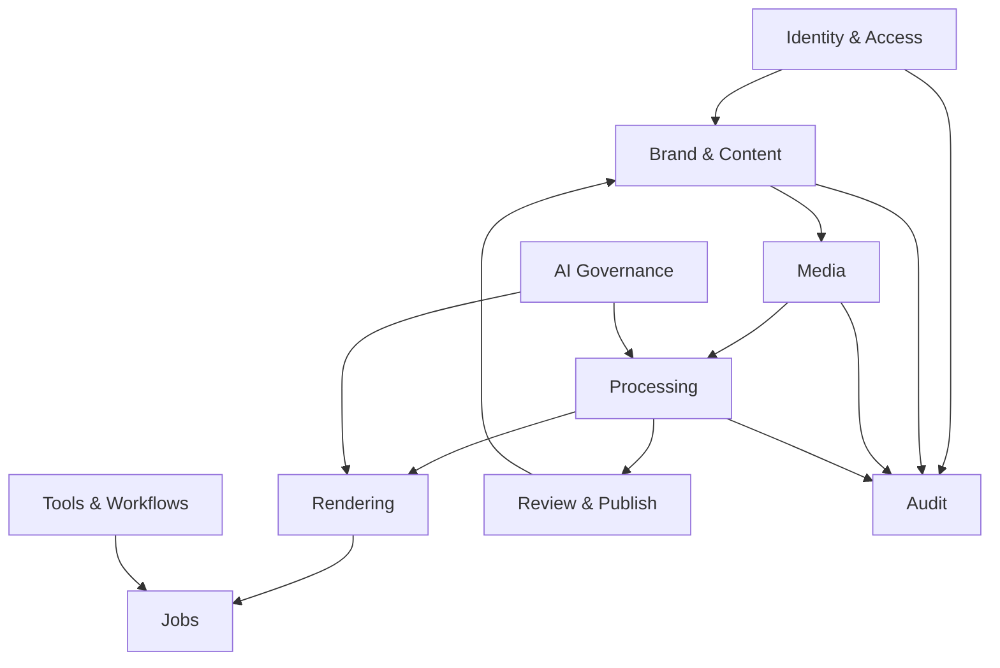
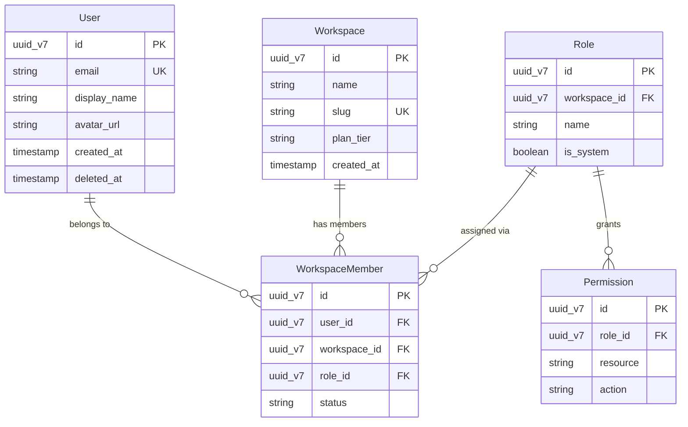
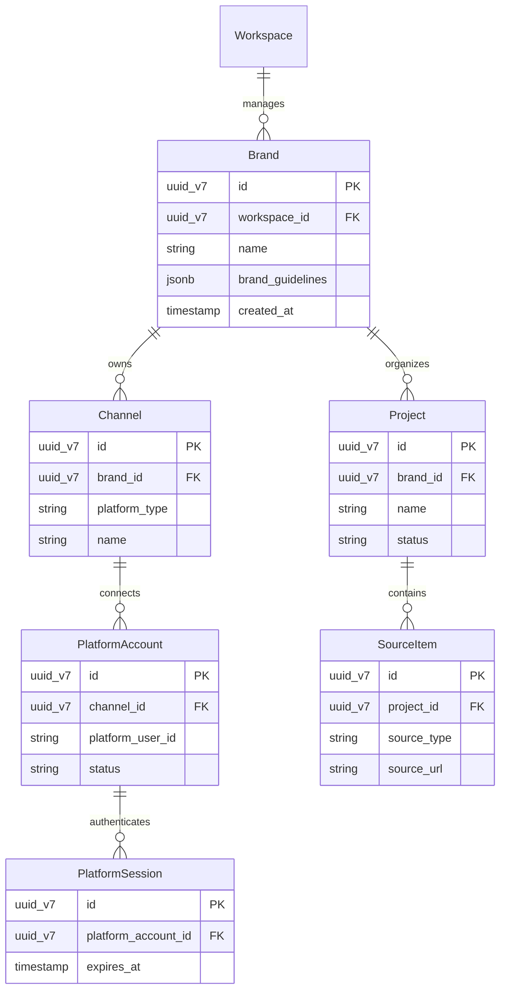
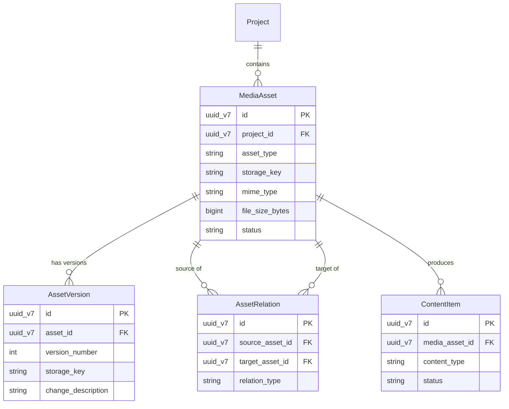
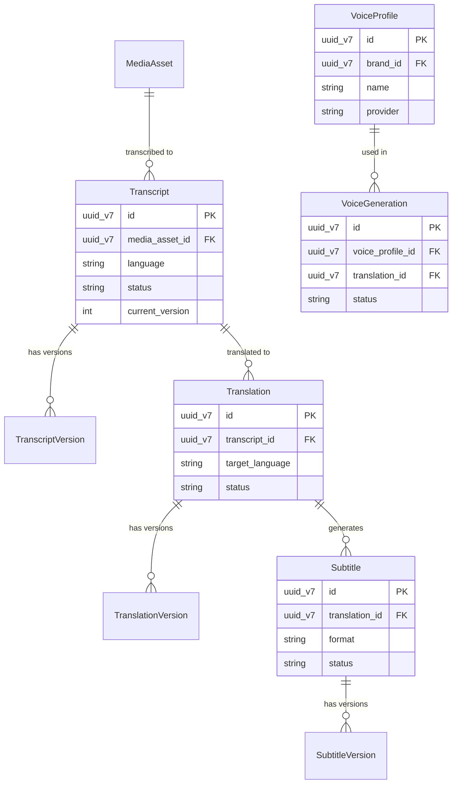
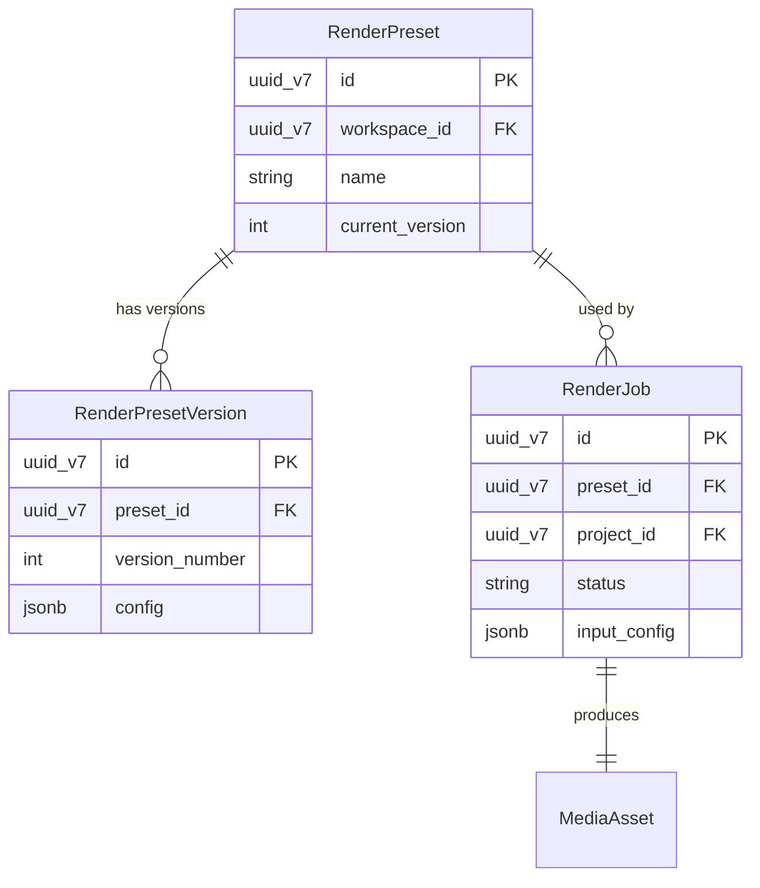
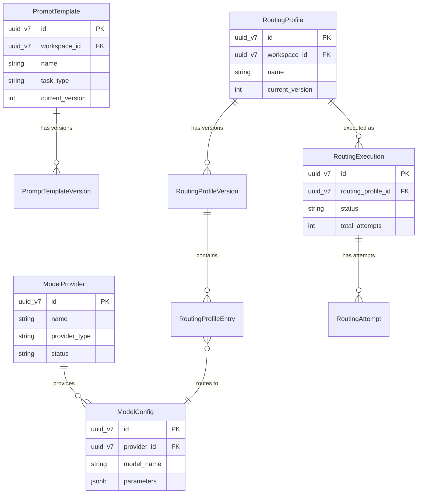
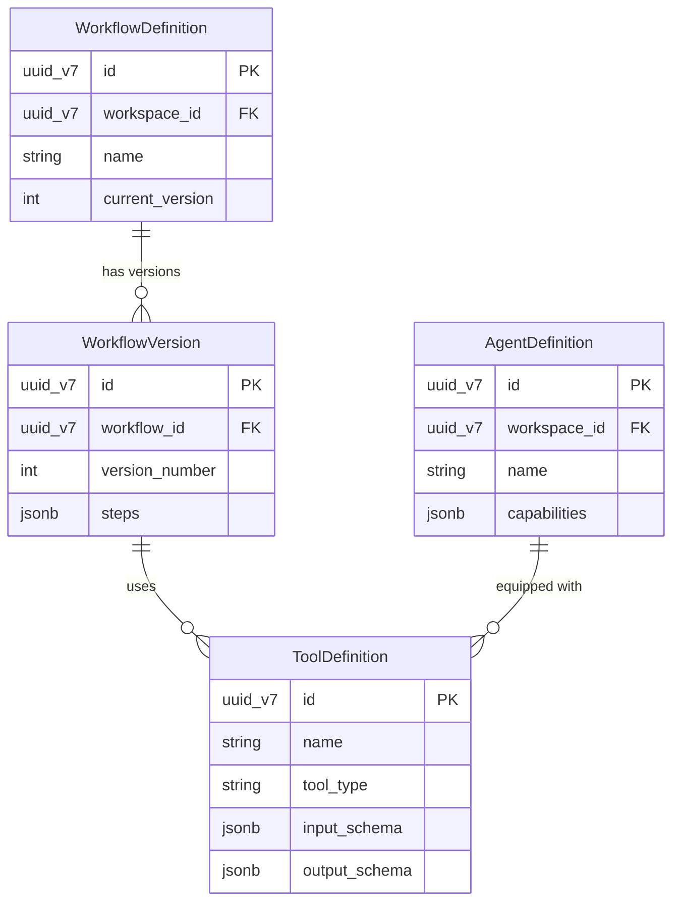
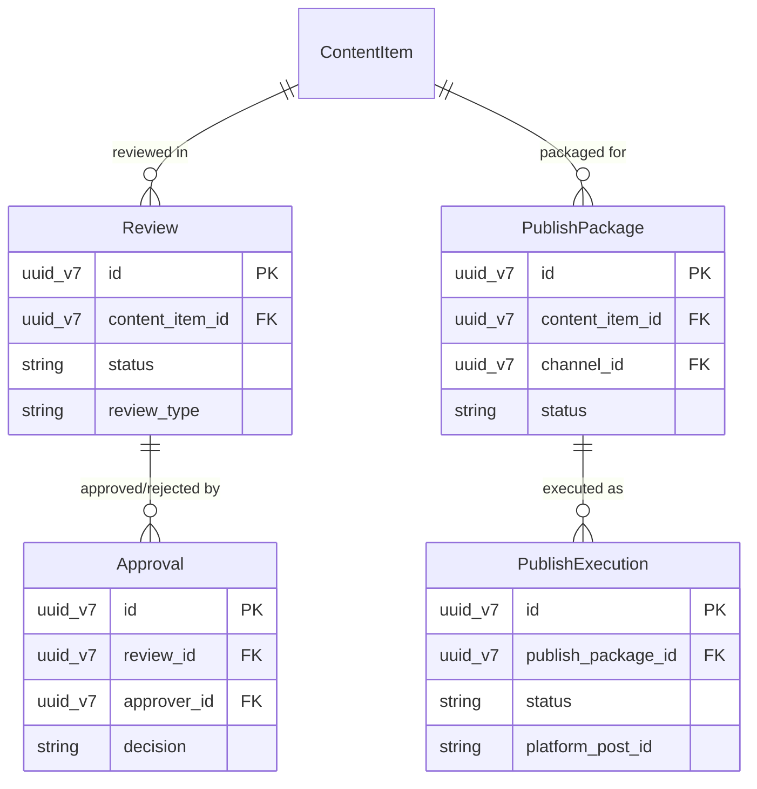

# Chương 5: Domain Model

> **Phiên bản:** 1.0.0  
> **Cập nhật:** 2026-07-23  
> **Tác giả:** Architecture Team  
> **Trạng thái:** Living Document

## 5.1 Tổng quan

Tài liệu này mô tả toàn bộ **Domain Model** của hệ thống AiDiLam, được tổ chức theo các **Bounded Context** riêng biệt. Mỗi entity được phân tích chi tiết về trách nhiệm, thuộc tính, chiến lược định danh, vòng đời, quan hệ, và hành vi xóa.

### Quy ước chung

| Quy ước | Mô tả |
|---------|-------|
| **Identity Strategy** | UUID v7 (time-ordered) cho hầu hết các entity |
| **Timestamp** | ISO 8601 với timezone UTC |
| **Soft Delete** | Mặc định sử dụng `deleted_at` timestamp |
| **Versioning** | Append-only version records với `version_number` tăng dần |
| **Audit Trail** | Mọi mutation đều phát sinh `AuditEvent` |

### Bounded Context Map



---

## 5.2 Identity & Access Context

Bounded context quản lý người dùng, phân quyền và workspace. Đây là context nền tảng mà tất cả context khác phụ thuộc.



### 5.2.1 User

| Khía cạnh | Chi tiết |
|-----------|----------|
| **Responsibility** | Đại diện cho một người dùng đã xác thực trong hệ thống |
| **Key Attributes** | `id`, `email`, `display_name`, `avatar_url`, `auth_provider`, `auth_provider_id`, `email_verified_at`, `last_login_at`, `created_at`, `updated_at`, `deleted_at` |
| **Identity Strategy** | UUID v7 — sinh tại thời điểm đăng ký |
| **Lifecycle** | `pending_verification` → `active` → `suspended` → `deleted` |
| **Relationships** | Has many `WorkspaceMember`, has many `AuditEvent` (as actor) |
| **Immutable Fields** | `id`, `email`, `auth_provider`, `auth_provider_id`, `created_at` |
| **Versioned Fields** | Không — thay đổi ghi đè trực tiếp |
| **Sensitive Fields** | `email`, `auth_provider_id`, `last_login_at` (PII) |
| **Deletion Behavior** | Soft delete — set `deleted_at`, anonymize PII sau 30 ngày |

**State Machine:**
```
[pending_verification] --verify_email--> [active]
[active] --suspend--> [suspended]
[suspended] --reactivate--> [active]
[active] --delete--> [deleted]
[suspended] --delete--> [deleted]
```

### 5.2.2 Role

| Khía cạnh | Chi tiết |
|-----------|----------|
| **Responsibility** | Định nghĩa một tập hợp quyền hạn có thể gán cho member trong workspace |
| **Key Attributes** | `id`, `workspace_id`, `name`, `description`, `is_system`, `created_at`, `updated_at` |
| **Identity Strategy** | UUID v7 |
| **Lifecycle** | `active` → `archived` |
| **Relationships** | Belongs to `Workspace`, has many `Permission`, has many `WorkspaceMember` |
| **Immutable Fields** | `id`, `workspace_id`, `is_system`, `created_at` |
| **Versioned Fields** | Không |
| **Sensitive Fields** | Không |
| **Deletion Behavior** | Soft delete — chỉ cho phép nếu không còn member nào sử dụng |

### 5.2.3 Permission

| Khía cạnh | Chi tiết |
|-----------|----------|
| **Responsibility** | Biểu diễn một quyền cụ thể (resource + action) được gán cho Role |
| **Key Attributes** | `id`, `role_id`, `resource`, `action`, `conditions` (JSON), `created_at` |
| **Identity Strategy** | UUID v7 |
| **Lifecycle** | Stateless — tồn tại hoặc bị xóa |
| **Relationships** | Belongs to `Role` |
| **Immutable Fields** | `id`, `role_id`, `resource`, `action`, `created_at` |
| **Versioned Fields** | Không |
| **Sensitive Fields** | Không |
| **Deletion Behavior** | Hard delete — cascade khi Role bị xóa |

### 5.2.4 Workspace

| Khía cạnh | Chi tiết |
|-----------|----------|
| **Responsibility** | Đơn vị tổ chức cao nhất — tenant isolation boundary |
| **Key Attributes** | `id`, `name`, `slug`, `plan_tier`, `settings` (JSON), `owner_user_id`, `created_at`, `updated_at`, `deleted_at` |
| **Identity Strategy** | UUID v7 + unique `slug` cho URL routing |
| **Lifecycle** | `trial` → `active` → `suspended` → `deleted` |
| **Relationships** | Has many `WorkspaceMember`, `Brand`, `Role`, `Project` |
| **Immutable Fields** | `id`, `slug`, `owner_user_id`, `created_at` |
| **Versioned Fields** | Không |
| **Sensitive Fields** | `settings` (có thể chứa billing info) |
| **Deletion Behavior** | Soft delete — cascade soft-delete tất cả resources con sau grace period 90 ngày |

### 5.2.5 WorkspaceMember

| Khía cạnh | Chi tiết |
|-----------|----------|
| **Responsibility** | Liên kết User với Workspace và Role — biểu diễn membership |
| **Key Attributes** | `id`, `user_id`, `workspace_id`, `role_id`, `status`, `invited_by`, `invited_at`, `joined_at`, `created_at`, `updated_at` |
| **Identity Strategy** | UUID v7, unique constraint trên `(user_id, workspace_id)` |
| **Lifecycle** | `invited` → `active` → `deactivated` |
| **Relationships** | Belongs to `User`, `Workspace`, `Role` |
| **Immutable Fields** | `id`, `user_id`, `workspace_id`, `invited_by`, `created_at` |
| **Versioned Fields** | Không |
| **Sensitive Fields** | Không |
| **Deletion Behavior** | Soft delete qua status `deactivated` — giữ lại cho audit trail |

---


## 5.3 Brand & Content Context

Context quản lý thương hiệu, kênh phân phối, kết nối platform và dự án nội dung.



### 5.3.1 Brand

| Khía cạnh | Chi tiết |
|-----------|----------|
| **Responsibility** | Đại diện cho một thương hiệu/đơn vị nội dung trong workspace |
| **Key Attributes** | `id`, `workspace_id`, `name`, `description`, `logo_url`, `brand_guidelines` (JSON), `default_language`, `created_at`, `updated_at`, `deleted_at` |
| **Identity Strategy** | UUID v7 |
| **Lifecycle** | `active` → `archived` → `deleted` |
| **Relationships** | Belongs to `Workspace`, has many `Channel`, `Project` |
| **Immutable Fields** | `id`, `workspace_id`, `created_at` |
| **Versioned Fields** | `brand_guidelines` — lưu history thay đổi |
| **Sensitive Fields** | Không |
| **Deletion Behavior** | Soft delete — cascade archive tất cả Channel và Project |

### 5.3.2 Channel

| Khía cạnh | Chi tiết |
|-----------|----------|
| **Responsibility** | Biểu diễn một kênh phân phối nội dung (YouTube, TikTok, Facebook...) |
| **Key Attributes** | `id`, `brand_id`, `platform_type`, `name`, `description`, `channel_metadata` (JSON), `status`, `created_at`, `updated_at` |
| **Identity Strategy** | UUID v7 |
| **Lifecycle** | `active` → `paused` → `disconnected` → `archived` |
| **Relationships** | Belongs to `Brand`, has many `PlatformAccount` |
| **Immutable Fields** | `id`, `brand_id`, `platform_type`, `created_at` |
| **Versioned Fields** | Không |
| **Sensitive Fields** | Không |
| **Deletion Behavior** | Soft delete — revoke tất cả PlatformSession trước khi archive |

### 5.3.3 PlatformAccount

| Khía cạnh | Chi tiết |
|-----------|----------|
| **Responsibility** | Lưu trữ thông tin tài khoản trên platform bên ngoài |
| **Key Attributes** | `id`, `channel_id`, `platform_type`, `platform_user_id`, `platform_username`, `status`, `scopes`, `connected_at`, `created_at`, `updated_at` |
| **Identity Strategy** | UUID v7, unique constraint `(channel_id, platform_type, platform_user_id)` |
| **Lifecycle** | `connected` → `expired` → `revoked` |
| **Relationships** | Belongs to `Channel`, has many `PlatformSession` |
| **Immutable Fields** | `id`, `channel_id`, `platform_type`, `platform_user_id`, `created_at` |
| **Versioned Fields** | Không |
| **Sensitive Fields** | `platform_user_id`, `scopes` |
| **Deletion Behavior** | Hard delete sau khi revoke — không giữ credential cũ |

### 5.3.4 PlatformSession

| Khía cạnh | Chi tiết |
|-----------|----------|
| **Responsibility** | Quản lý OAuth token/session cho platform account |
| **Key Attributes** | `id`, `platform_account_id`, `access_token_enc`, `refresh_token_enc`, `token_type`, `scopes`, `expires_at`, `refreshed_at`, `created_at` |
| **Identity Strategy** | UUID v7 |
| **Lifecycle** | `active` → `expired` → `refreshed` → `revoked` |
| **Relationships** | Belongs to `PlatformAccount` |
| **Immutable Fields** | `id`, `platform_account_id`, `created_at` |
| **Versioned Fields** | Không — mỗi refresh tạo record mới |
| **Sensitive Fields** | `access_token_enc`, `refresh_token_enc` (encrypted at rest) |
| **Deletion Behavior** | Hard delete — crypto-shred tokens khi revoke |

### 5.3.5 Project

| Khía cạnh | Chi tiết |
|-----------|----------|
| **Responsibility** | Đơn vị tổ chức công việc — chứa source materials và output artifacts |
| **Key Attributes** | `id`, `brand_id`, `name`, `description`, `status`, `settings` (JSON), `due_date`, `created_by`, `created_at`, `updated_at`, `deleted_at` |
| **Identity Strategy** | UUID v7 |
| **Lifecycle** | `draft` → `in_progress` → `review` → `completed` → `archived` |
| **Relationships** | Belongs to `Brand`, has many `SourceItem`, `MediaAsset`, `ContentItem` |
| **Immutable Fields** | `id`, `brand_id`, `created_by`, `created_at` |
| **Versioned Fields** | Không |
| **Sensitive Fields** | Không |
| **Deletion Behavior** | Soft delete — giữ tất cả artifacts cho audit, xóa vĩnh viễn sau 90 ngày |

**State Machine:**
```
[draft] --start--> [in_progress]
[in_progress] --submit--> [review]
[review] --approve--> [completed]
[review] --reject--> [in_progress]
[completed] --archive--> [archived]
[in_progress] --archive--> [archived]
```

### 5.3.6 SourceItem

| Khía cạnh | Chi tiết |
|-----------|----------|
| **Responsibility** | Biểu diễn nguồn nội dung gốc (URL, file upload, text input) |
| **Key Attributes** | `id`, `project_id`, `source_type` (url/upload/text), `source_url`, `title`, `description`, `metadata` (JSON), `status`, `created_at`, `updated_at` |
| **Identity Strategy** | UUID v7 |
| **Lifecycle** | `pending` → `processing` → `ready` → `failed` |
| **Relationships** | Belongs to `Project`, has many `MediaAsset` |
| **Immutable Fields** | `id`, `project_id`, `source_type`, `source_url`, `created_at` |
| **Versioned Fields** | Không |
| **Sensitive Fields** | `source_url` (có thể chứa private URLs) |
| **Deletion Behavior** | Cascade delete với Project — xóa associated media files từ storage |

---


## 5.4 Media Context

Context quản lý tài nguyên media, phiên bản, và quan hệ giữa các asset.



### 5.4.1 MediaAsset

| Khía cạnh | Chi tiết |
|-----------|----------|
| **Responsibility** | Entity trung tâm biểu diễn một tài nguyên media (video, audio, image, document) |
| **Key Attributes** | `id`, `project_id`, `source_item_id`, `asset_type` (video/audio/image/document), `storage_key`, `storage_bucket`, `mime_type`, `file_size_bytes`, `duration_ms`, `dimensions` (JSON), `metadata` (JSON), `status`, `created_at`, `updated_at`, `deleted_at` |
| **Identity Strategy** | UUID v7 |
| **Lifecycle** | `uploading` → `processing` → `ready` → `archived` → `deleted` |
| **Relationships** | Belongs to `Project`, optionally belongs to `SourceItem`, has many `AssetVersion`, `AssetRelation`, `ContentItem`, `Transcript` |
| **Immutable Fields** | `id`, `project_id`, `source_item_id`, `asset_type`, `created_at` |
| **Versioned Fields** | `storage_key`, `metadata` — mỗi thay đổi tạo `AssetVersion` mới |
| **Sensitive Fields** | `storage_key` (nội bộ, không expose ra client) |
| **Deletion Behavior** | Soft delete — schedule storage cleanup sau 30 ngày, cascade soft-delete AssetVersion |

**State Machine:**
```
[uploading] --upload_complete--> [processing]
[uploading] --upload_failed--> [failed]
[processing] --process_complete--> [ready]
[processing] --process_failed--> [failed]
[failed] --retry--> [processing]
[ready] --archive--> [archived]
[archived] --restore--> [ready]
[archived] --permanent_delete--> [deleted]
```

### 5.4.2 AssetRelation

| Khía cạnh | Chi tiết |
|-----------|----------|
| **Responsibility** | Mô tả quan hệ giữa hai MediaAsset (derived_from, thumbnail_of, audio_track_of, etc.) |
| **Key Attributes** | `id`, `source_asset_id`, `target_asset_id`, `relation_type`, `metadata` (JSON), `created_at` |
| **Identity Strategy** | UUID v7, unique constraint `(source_asset_id, target_asset_id, relation_type)` |
| **Lifecycle** | Stateless — tồn tại hoặc bị xóa |
| **Relationships** | References two `MediaAsset` (source, target) |
| **Immutable Fields** | Tất cả — relation không thay đổi sau khi tạo |
| **Versioned Fields** | Không |
| **Sensitive Fields** | Không |
| **Deletion Behavior** | Hard delete — cascade khi source hoặc target bị xóa |

### 5.4.3 AssetVersion

| Khía cạnh | Chi tiết |
|-----------|----------|
| **Responsibility** | Lưu trữ lịch sử phiên bản của MediaAsset (append-only) |
| **Key Attributes** | `id`, `asset_id`, `version_number`, `storage_key`, `storage_bucket`, `file_size_bytes`, `change_description`, `created_by`, `created_at` |
| **Identity Strategy** | UUID v7, unique constraint `(asset_id, version_number)` |
| **Lifecycle** | Immutable — chỉ tạo mới, không sửa |
| **Relationships** | Belongs to `MediaAsset` |
| **Immutable Fields** | Tất cả — append-only record |
| **Versioned Fields** | N/A — bản thân entity là version record |
| **Sensitive Fields** | `storage_key` |
| **Deletion Behavior** | Soft delete theo MediaAsset — cleanup storage async |

### 5.4.4 ContentItem

| Khía cạnh | Chi tiết |
|-----------|----------|
| **Responsibility** | Biểu diễn một đơn vị nội dung đã hoàn chỉnh sẵn sàng phân phối |
| **Key Attributes** | `id`, `media_asset_id`, `project_id`, `content_type` (short_video/long_video/podcast/post), `title`, `description`, `tags` (array), `language`, `status`, `published_at`, `created_at`, `updated_at` |
| **Identity Strategy** | UUID v7 |
| **Lifecycle** | `draft` → `ready` → `in_review` → `approved` → `published` → `archived` |
| **Relationships** | Belongs to `MediaAsset`, `Project`, has many `Review`, `PublishPackage` |
| **Immutable Fields** | `id`, `media_asset_id`, `project_id`, `content_type`, `created_at` |
| **Versioned Fields** | `title`, `description`, `tags` — tracked via audit |
| **Sensitive Fields** | Không |
| **Deletion Behavior** | Soft delete — giữ publishing history |

---


## 5.5 Processing Context

Context xử lý nội dung: transcript, translation, subtitle, và voice generation.



### 5.5.1 Transcript

| Khía cạnh | Chi tiết |
|-----------|----------|
| **Responsibility** | Bản phiên âm text từ media asset — là nguồn cho translation pipeline |
| **Key Attributes** | `id`, `media_asset_id`, `language`, `engine` (whisper/deepgram/manual), `current_version`, `word_count`, `confidence_score`, `status`, `created_at`, `updated_at` |
| **Identity Strategy** | UUID v7 |
| **Lifecycle** | `pending` → `processing` → `completed` → `edited` |
| **Relationships** | Belongs to `MediaAsset`, has many `TranscriptVersion`, `Translation` |
| **Immutable Fields** | `id`, `media_asset_id`, `language`, `engine`, `created_at` |
| **Versioned Fields** | Nội dung transcript — stored trong `TranscriptVersion` |
| **Sensitive Fields** | Không (nội dung có thể chứa PII tùy nội dung gốc) |
| **Deletion Behavior** | Soft delete — cascade soft-delete Translation, Subtitle |

### 5.5.2 TranscriptVersion

| Khía cạnh | Chi tiết |
|-----------|----------|
| **Responsibility** | Append-only version record cho nội dung transcript |
| **Key Attributes** | `id`, `transcript_id`, `version_number`, `content` (JSON — segments with timestamps), `word_count`, `edit_source` (auto/manual/ai), `edited_by`, `created_at` |
| **Identity Strategy** | UUID v7, unique `(transcript_id, version_number)` |
| **Lifecycle** | Immutable |
| **Relationships** | Belongs to `Transcript` |
| **Immutable Fields** | Tất cả |
| **Versioned Fields** | N/A |
| **Sensitive Fields** | `content` (tùy nội dung gốc) |
| **Deletion Behavior** | Cascade với Transcript |

### 5.5.3 Translation

| Khía cạnh | Chi tiết |
|-----------|----------|
| **Responsibility** | Bản dịch của Transcript sang ngôn ngữ khác |
| **Key Attributes** | `id`, `transcript_id`, `target_language`, `engine` (gpt4/deepl/manual), `current_version`, `status`, `quality_score`, `created_at`, `updated_at` |
| **Identity Strategy** | UUID v7, unique constraint `(transcript_id, target_language)` |
| **Lifecycle** | `pending` → `processing` → `completed` → `reviewed` → `approved` |
| **Relationships** | Belongs to `Transcript`, has many `TranslationVersion`, `Subtitle`, `VoiceGeneration` |
| **Immutable Fields** | `id`, `transcript_id`, `target_language`, `created_at` |
| **Versioned Fields** | Nội dung dịch — stored trong `TranslationVersion` |
| **Sensitive Fields** | Không |
| **Deletion Behavior** | Soft delete — cascade soft-delete Subtitle, VoiceGeneration |

### 5.5.4 TranslationVersion

| Khía cạnh | Chi tiết |
|-----------|----------|
| **Responsibility** | Append-only version record cho nội dung translation |
| **Key Attributes** | `id`, `translation_id`, `version_number`, `content` (JSON — translated segments), `edit_source`, `edited_by`, `created_at` |
| **Identity Strategy** | UUID v7, unique `(translation_id, version_number)` |
| **Lifecycle** | Immutable |
| **Relationships** | Belongs to `Translation` |
| **Immutable Fields** | Tất cả |
| **Versioned Fields** | N/A |
| **Sensitive Fields** | Không |
| **Deletion Behavior** | Cascade với Translation |

### 5.5.5 Subtitle

| Khía cạnh | Chi tiết |
|-----------|----------|
| **Responsibility** | Bản phụ đề với timing được đồng bộ — sinh từ Translation |
| **Key Attributes** | `id`, `translation_id`, `media_asset_id`, `format` (srt/vtt/ass), `current_version`, `style_config` (JSON), `status`, `created_at`, `updated_at` |
| **Identity Strategy** | UUID v7 |
| **Lifecycle** | `generating` → `completed` → `edited` → `approved` |
| **Relationships** | Belongs to `Translation`, `MediaAsset`, has many `SubtitleVersion` |
| **Immutable Fields** | `id`, `translation_id`, `media_asset_id`, `format`, `created_at` |
| **Versioned Fields** | Nội dung subtitle — stored trong `SubtitleVersion` |
| **Sensitive Fields** | Không |
| **Deletion Behavior** | Soft delete |

### 5.5.6 SubtitleVersion

| Khía cạnh | Chi tiết |
|-----------|----------|
| **Responsibility** | Append-only version record cho subtitle content |
| **Key Attributes** | `id`, `subtitle_id`, `version_number`, `content` (text — SRT/VTT format), `storage_key`, `edit_source`, `created_at` |
| **Identity Strategy** | UUID v7, unique `(subtitle_id, version_number)` |
| **Lifecycle** | Immutable |
| **Relationships** | Belongs to `Subtitle` |
| **Immutable Fields** | Tất cả |
| **Versioned Fields** | N/A |
| **Sensitive Fields** | Không |
| **Deletion Behavior** | Cascade với Subtitle |

### 5.5.7 VoiceProfile

| Khía cạnh | Chi tiết |
|-----------|----------|
| **Responsibility** | Cấu hình giọng nói cho text-to-speech — đại diện voice identity của brand |
| **Key Attributes** | `id`, `brand_id`, `name`, `provider` (elevenlabs/azure/google), `provider_voice_id`, `language`, `gender`, `style_config` (JSON), `sample_audio_url`, `status`, `created_at`, `updated_at` |
| **Identity Strategy** | UUID v7 |
| **Lifecycle** | `active` → `deprecated` → `archived` |
| **Relationships** | Belongs to `Brand`, has many `VoiceGeneration` |
| **Immutable Fields** | `id`, `brand_id`, `provider`, `created_at` |
| **Versioned Fields** | `style_config` |
| **Sensitive Fields** | `provider_voice_id` (API key territory) |
| **Deletion Behavior** | Soft delete — giữ cho reference từ VoiceGeneration history |

### 5.5.8 VoiceGeneration

| Khía cạnh | Chi tiết |
|-----------|----------|
| **Responsibility** | Biểu diễn một lần sinh voice từ text — output audio |
| **Key Attributes** | `id`, `voice_profile_id`, `translation_id`, `media_asset_id` (output), `status`, `duration_ms`, `cost_credits`, `error_message`, `started_at`, `completed_at`, `created_at` |
| **Identity Strategy** | UUID v7 |
| **Lifecycle** | `queued` → `processing` → `completed` / `failed` |
| **Relationships** | Belongs to `VoiceProfile`, `Translation`, produces `MediaAsset` |
| **Immutable Fields** | `id`, `voice_profile_id`, `translation_id`, `created_at` |
| **Versioned Fields** | Không |
| **Sensitive Fields** | Không |
| **Deletion Behavior** | Soft delete — giữ cost/usage records |

---


## 5.6 Rendering Context

Context quản lý render presets và render jobs — biến đổi media thành output cuối cùng.



### 5.6.1 RenderPreset

| Khía cạnh | Chi tiết |
|-----------|----------|
| **Responsibility** | Template cấu hình render — định nghĩa output format, resolution, codec, overlay settings |
| **Key Attributes** | `id`, `workspace_id`, `name`, `description`, `category` (social/broadcast/archive), `current_version`, `is_system`, `status`, `created_at`, `updated_at` |
| **Identity Strategy** | UUID v7 |
| **Lifecycle** | `draft` → `active` → `deprecated` → `archived` |
| **Relationships** | Belongs to `Workspace`, has many `RenderPresetVersion`, `RenderJob` |
| **Immutable Fields** | `id`, `workspace_id`, `is_system`, `created_at` |
| **Versioned Fields** | Config — stored trong `RenderPresetVersion` |
| **Sensitive Fields** | Không |
| **Deletion Behavior** | Soft delete — không xóa nếu có RenderJob đang chạy |

### 5.6.2 RenderPresetVersion

| Khía cạnh | Chi tiết |
|-----------|----------|
| **Responsibility** | Append-only version record cho RenderPreset config |
| **Key Attributes** | `id`, `preset_id`, `version_number`, `config` (JSON — resolution, codec, bitrate, overlays, transitions), `changelog`, `created_by`, `created_at` |
| **Identity Strategy** | UUID v7, unique `(preset_id, version_number)` |
| **Lifecycle** | Immutable |
| **Relationships** | Belongs to `RenderPreset` |
| **Immutable Fields** | Tất cả |
| **Versioned Fields** | N/A |
| **Sensitive Fields** | Không |
| **Deletion Behavior** | Cascade với RenderPreset |

### 5.6.3 RenderJob

| Khía cạnh | Chi tiết |
|-----------|----------|
| **Responsibility** | Một lần thực thi render cụ thể — biến input media thành output |
| **Key Attributes** | `id`, `preset_id`, `preset_version_number`, `project_id`, `input_config` (JSON — source assets, subtitle, audio tracks), `output_asset_id`, `status`, `progress_pct`, `duration_ms`, `cost_credits`, `error_message`, `queued_at`, `started_at`, `completed_at`, `created_at` |
| **Identity Strategy** | UUID v7 |
| **Lifecycle** | `queued` → `processing` → `completed` / `failed` / `cancelled` |
| **Relationships** | Belongs to `RenderPreset`, `Project`, produces `MediaAsset`, linked to `Job` |
| **Immutable Fields** | `id`, `preset_id`, `preset_version_number`, `project_id`, `input_config`, `created_at` |
| **Versioned Fields** | Không |
| **Sensitive Fields** | Không |
| **Deletion Behavior** | Soft delete — giữ cost records |

**State Machine:**
```
[queued] --pick_up--> [processing]
[queued] --cancel--> [cancelled]
[processing] --complete--> [completed]
[processing] --fail--> [failed]
[processing] --cancel--> [cancelled]
[failed] --retry--> [queued]
```

---

## 5.7 Jobs Context

Context quản lý generic job execution — orchestration layer cho mọi async work.

### 5.7.1 Job

| Khía cạnh | Chi tiết |
|-----------|----------|
| **Responsibility** | Generic async job — wraps bất kỳ long-running operation nào |
| **Key Attributes** | `id`, `workspace_id`, `job_type`, `reference_type`, `reference_id`, `priority`, `max_attempts`, `status`, `payload` (JSON), `result` (JSON), `scheduled_at`, `started_at`, `completed_at`, `created_at` |
| **Identity Strategy** | UUID v7 |
| **Lifecycle** | `scheduled` → `queued` → `running` → `completed` / `failed` / `cancelled` |
| **Relationships** | Belongs to `Workspace`, has many `JobAttempt`, polymorphic reference to source entity |
| **Immutable Fields** | `id`, `workspace_id`, `job_type`, `reference_type`, `reference_id`, `payload`, `created_at` |
| **Versioned Fields** | Không |
| **Sensitive Fields** | `payload` (có thể chứa input data) |
| **Deletion Behavior** | Soft delete — archive sau 90 ngày hoàn thành |

**State Machine:**
```
[scheduled] --trigger--> [queued]
[queued] --pick_up--> [running]
[queued] --cancel--> [cancelled]
[running] --complete--> [completed]
[running] --fail--> [failed]
[running] --cancel--> [cancelled]
[failed] --retry--> [queued] (if attempts < max_attempts)
[failed] --exhaust--> [permanently_failed]
```

### 5.7.2 JobAttempt

| Khía cạnh | Chi tiết |
|-----------|----------|
| **Responsibility** | Record mỗi lần thử thực thi của Job — observability |
| **Key Attributes** | `id`, `job_id`, `attempt_number`, `worker_id`, `status`, `error_message`, `error_code`, `stack_trace`, `duration_ms`, `started_at`, `completed_at`, `created_at` |
| **Identity Strategy** | UUID v7, unique `(job_id, attempt_number)` |
| **Lifecycle** | `running` → `succeeded` / `failed` |
| **Relationships** | Belongs to `Job` |
| **Immutable Fields** | Tất cả (ngoại trừ `status`, `completed_at` khi kết thúc) |
| **Versioned Fields** | Không |
| **Sensitive Fields** | `stack_trace` (internal implementation details) |
| **Deletion Behavior** | Cascade với Job |

---


## 5.8 AI Governance Context

Context quản lý prompt templates, model configurations, và routing logic cho AI operations.



### 5.8.1 PromptTemplate

| Khía cạnh | Chi tiết |
|-----------|----------|
| **Responsibility** | Template cho AI prompts — quản lý system/user prompt patterns |
| **Key Attributes** | `id`, `workspace_id`, `name`, `task_type` (transcription/translation/summarization/generation), `description`, `current_version`, `is_system`, `status`, `created_at`, `updated_at` |
| **Identity Strategy** | UUID v7 |
| **Lifecycle** | `draft` → `active` → `deprecated` → `archived` |
| **Relationships** | Belongs to `Workspace`, has many `PromptTemplateVersion` |
| **Immutable Fields** | `id`, `workspace_id`, `task_type`, `is_system`, `created_at` |
| **Versioned Fields** | Prompt content — stored trong `PromptTemplateVersion` |
| **Sensitive Fields** | Không |
| **Deletion Behavior** | Soft delete — giữ history cho audit |

### 5.8.2 PromptTemplateVersion

| Khía cạnh | Chi tiết |
|-----------|----------|
| **Responsibility** | Append-only version cho prompt template content |
| **Key Attributes** | `id`, `template_id`, `version_number`, `system_prompt`, `user_prompt_template`, `variables` (JSON schema), `output_schema` (JSON), `changelog`, `created_by`, `created_at` |
| **Identity Strategy** | UUID v7, unique `(template_id, version_number)` |
| **Lifecycle** | Immutable |
| **Relationships** | Belongs to `PromptTemplate` |
| **Immutable Fields** | Tất cả |
| **Versioned Fields** | N/A |
| **Sensitive Fields** | `system_prompt` (intellectual property) |
| **Deletion Behavior** | Cascade với PromptTemplate |

### 5.8.3 ModelProvider

| Khía cạnh | Chi tiết |
|-----------|----------|
| **Responsibility** | Biểu diễn một AI model provider (OpenAI, Anthropic, Google, local) |
| **Key Attributes** | `id`, `name`, `provider_type` (openai/anthropic/google/azure/local), `base_url`, `api_key_enc`, `rate_limits` (JSON), `status`, `health_check_url`, `created_at`, `updated_at` |
| **Identity Strategy** | UUID v7 |
| **Lifecycle** | `active` → `degraded` → `disabled` |
| **Relationships** | Has many `ModelConfig` |
| **Immutable Fields** | `id`, `provider_type`, `created_at` |
| **Versioned Fields** | Không |
| **Sensitive Fields** | `api_key_enc` (encrypted), `base_url` |
| **Deletion Behavior** | Soft delete — chỉ disable, không xóa để giữ execution history |

### 5.8.4 ModelConfig

| Khía cạnh | Chi tiết |
|-----------|----------|
| **Responsibility** | Cấu hình cụ thể cho một model trong provider (model name, parameters, limits) |
| **Key Attributes** | `id`, `provider_id`, `model_name`, `model_version`, `parameters` (JSON — temperature, max_tokens, top_p), `input_token_limit`, `output_token_limit`, `cost_per_input_token`, `cost_per_output_token`, `capabilities` (array), `status`, `created_at`, `updated_at` |
| **Identity Strategy** | UUID v7 |
| **Lifecycle** | `active` → `deprecated` → `disabled` |
| **Relationships** | Belongs to `ModelProvider`, referenced by `RoutingProfileEntry` |
| **Immutable Fields** | `id`, `provider_id`, `model_name`, `created_at` |
| **Versioned Fields** | `parameters`, `cost_per_*_token` |
| **Sensitive Fields** | Không |
| **Deletion Behavior** | Soft delete |

### 5.8.5 RoutingProfile

| Khía cạnh | Chi tiết |
|-----------|----------|
| **Responsibility** | Chiến lược routing AI requests — định nghĩa fallback chain và load balancing |
| **Key Attributes** | `id`, `workspace_id`, `name`, `description`, `task_type`, `strategy` (priority/round_robin/cost_optimized), `current_version`, `status`, `created_at`, `updated_at` |
| **Identity Strategy** | UUID v7 |
| **Lifecycle** | `draft` → `active` → `deprecated` |
| **Relationships** | Belongs to `Workspace`, has many `RoutingProfileVersion`, `RoutingExecution` |
| **Immutable Fields** | `id`, `workspace_id`, `task_type`, `created_at` |
| **Versioned Fields** | Entries — stored trong `RoutingProfileVersion` |
| **Sensitive Fields** | Không |
| **Deletion Behavior** | Soft delete |

### 5.8.6 RoutingProfileVersion

| Khía cạnh | Chi tiết |
|-----------|----------|
| **Responsibility** | Snapshot version của routing profile configuration |
| **Key Attributes** | `id`, `routing_profile_id`, `version_number`, `strategy`, `max_retries`, `timeout_ms`, `changelog`, `created_by`, `created_at` |
| **Identity Strategy** | UUID v7, unique `(routing_profile_id, version_number)` |
| **Lifecycle** | Immutable |
| **Relationships** | Belongs to `RoutingProfile`, has many `RoutingProfileEntry` |
| **Immutable Fields** | Tất cả |
| **Versioned Fields** | N/A |
| **Sensitive Fields** | Không |
| **Deletion Behavior** | Cascade với RoutingProfile |

### 5.8.7 RoutingProfileEntry

| Khía cạnh | Chi tiết |
|-----------|----------|
| **Responsibility** | Một entry trong routing profile — map tới model config cụ thể |
| **Key Attributes** | `id`, `routing_profile_version_id`, `model_config_id`, `priority`, `weight`, `conditions` (JSON — language, content_type filters), `max_tokens_override`, `created_at` |
| **Identity Strategy** | UUID v7 |
| **Lifecycle** | Immutable (thuộc version) |
| **Relationships** | Belongs to `RoutingProfileVersion`, references `ModelConfig` |
| **Immutable Fields** | Tất cả |
| **Versioned Fields** | N/A |
| **Sensitive Fields** | Không |
| **Deletion Behavior** | Cascade với RoutingProfileVersion |

### 5.8.8 RoutingExecution

| Khía cạnh | Chi tiết |
|-----------|----------|
| **Responsibility** | Record một lần thực thi routing decision — observability và cost tracking |
| **Key Attributes** | `id`, `routing_profile_id`, `routing_profile_version_number`, `prompt_template_id`, `task_type`, `input_metadata` (JSON), `final_model_config_id`, `status`, `total_attempts`, `total_input_tokens`, `total_output_tokens`, `total_cost`, `total_duration_ms`, `created_at`, `completed_at` |
| **Identity Strategy** | UUID v7 |
| **Lifecycle** | `started` → `completed` / `failed` / `exhausted` |
| **Relationships** | Belongs to `RoutingProfile`, has many `RoutingAttempt` |
| **Immutable Fields** | `id`, `routing_profile_id`, `prompt_template_id`, `created_at` |
| **Versioned Fields** | Không |
| **Sensitive Fields** | `input_metadata` (có thể chứa content snippets) |
| **Deletion Behavior** | Retention policy — archive sau 90 ngày, delete sau 1 năm |

### 5.8.9 RoutingAttempt

| Khía cạnh | Chi tiết |
|-----------|----------|
| **Responsibility** | Record một lần gọi model cụ thể trong routing execution |
| **Key Attributes** | `id`, `routing_execution_id`, `attempt_number`, `model_config_id`, `status`, `input_tokens`, `output_tokens`, `cost`, `duration_ms`, `error_code`, `error_message`, `response_metadata` (JSON), `started_at`, `completed_at` |
| **Identity Strategy** | UUID v7, unique `(routing_execution_id, attempt_number)` |
| **Lifecycle** | `started` → `succeeded` / `failed` / `timeout` |
| **Relationships** | Belongs to `RoutingExecution`, references `ModelConfig` |
| **Immutable Fields** | Tất cả (ngoại trừ status update khi hoàn thành) |
| **Versioned Fields** | Không |
| **Sensitive Fields** | `response_metadata` |
| **Deletion Behavior** | Cascade với RoutingExecution |

---


## 5.9 Tools & Workflows Context

Context định nghĩa tools, workflows, và AI agents có thể thực thi.



### 5.9.1 ToolDefinition

| Khía cạnh | Chi tiết |
|-----------|----------|
| **Responsibility** | Định nghĩa một tool mà AI agent hoặc workflow có thể gọi |
| **Key Attributes** | `id`, `workspace_id`, `name`, `description`, `tool_type` (function/api/internal), `input_schema` (JSON Schema), `output_schema` (JSON Schema), `implementation` (JSON — endpoint, handler), `is_system`, `status`, `created_at`, `updated_at` |
| **Identity Strategy** | UUID v7 |
| **Lifecycle** | `draft` → `active` → `deprecated` |
| **Relationships** | Belongs to `Workspace`, referenced by `WorkflowVersion`, `AgentDefinition` |
| **Immutable Fields** | `id`, `workspace_id`, `tool_type`, `is_system`, `created_at` |
| **Versioned Fields** | `input_schema`, `output_schema`, `implementation` |
| **Sensitive Fields** | `implementation` (có thể chứa internal endpoints) |
| **Deletion Behavior** | Soft delete — block nếu có workflow active đang reference |

### 5.9.2 WorkflowDefinition

| Khía cạnh | Chi tiết |
|-----------|----------|
| **Responsibility** | Định nghĩa một workflow automation — DAG of steps |
| **Key Attributes** | `id`, `workspace_id`, `name`, `description`, `trigger_type` (manual/event/scheduled), `current_version`, `is_system`, `status`, `created_at`, `updated_at` |
| **Identity Strategy** | UUID v7 |
| **Lifecycle** | `draft` → `active` → `deprecated` → `archived` |
| **Relationships** | Belongs to `Workspace`, has many `WorkflowVersion` |
| **Immutable Fields** | `id`, `workspace_id`, `is_system`, `created_at` |
| **Versioned Fields** | Steps/config — stored trong `WorkflowVersion` |
| **Sensitive Fields** | Không |
| **Deletion Behavior** | Soft delete |

### 5.9.3 WorkflowVersion

| Khía cạnh | Chi tiết |
|-----------|----------|
| **Responsibility** | Append-only version cho workflow definition — chứa DAG steps |
| **Key Attributes** | `id`, `workflow_id`, `version_number`, `steps` (JSON — array of step definitions with tool refs), `input_schema`, `output_schema`, `error_handling` (JSON), `changelog`, `created_by`, `created_at` |
| **Identity Strategy** | UUID v7, unique `(workflow_id, version_number)` |
| **Lifecycle** | Immutable |
| **Relationships** | Belongs to `WorkflowDefinition`, references `ToolDefinition` |
| **Immutable Fields** | Tất cả |
| **Versioned Fields** | N/A |
| **Sensitive Fields** | Không |
| **Deletion Behavior** | Cascade với WorkflowDefinition |

### 5.9.4 AgentDefinition

| Khía cạnh | Chi tiết |
|-----------|----------|
| **Responsibility** | Định nghĩa một AI agent — kết hợp model config, tools, và system prompt |
| **Key Attributes** | `id`, `workspace_id`, `name`, `description`, `model_config_id`, `routing_profile_id`, `system_prompt_template_id`, `capabilities` (JSON — tool_ids, allowed_actions), `constraints` (JSON — max_steps, timeout), `is_system`, `status`, `created_at`, `updated_at` |
| **Identity Strategy** | UUID v7 |
| **Lifecycle** | `draft` → `active` → `deprecated` |
| **Relationships** | Belongs to `Workspace`, references `ModelConfig`, `RoutingProfile`, `PromptTemplate`, many `ToolDefinition` |
| **Immutable Fields** | `id`, `workspace_id`, `is_system`, `created_at` |
| **Versioned Fields** | `capabilities`, `constraints`, `system_prompt_template_id` |
| **Sensitive Fields** | Không |
| **Deletion Behavior** | Soft delete |

---

## 5.10 Review & Publish Context

Context quản lý quy trình review, approval, và publishing nội dung.



### 5.10.1 Review

| Khía cạnh | Chi tiết |
|-----------|----------|
| **Responsibility** | Quy trình review cho content item — thu thập approvals |
| **Key Attributes** | `id`, `content_item_id`, `project_id`, `review_type` (content/technical/legal), `title`, `description`, `required_approvals`, `current_approvals`, `status`, `deadline`, `created_by`, `created_at`, `updated_at` |
| **Identity Strategy** | UUID v7 |
| **Lifecycle** | `open` → `in_review` → `approved` / `rejected` → `closed` |
| **Relationships** | Belongs to `ContentItem`, `Project`, has many `Approval`, created by `User` |
| **Immutable Fields** | `id`, `content_item_id`, `project_id`, `review_type`, `created_by`, `created_at` |
| **Versioned Fields** | Không |
| **Sensitive Fields** | Không |
| **Deletion Behavior** | Soft delete — giữ cho compliance audit |

**State Machine:**
```
[open] --assign_reviewers--> [in_review]
[in_review] --all_approved--> [approved]
[in_review] --any_rejected--> [rejected]
[rejected] --resubmit--> [open]
[approved] --close--> [closed]
[rejected] --close--> [closed]
```

### 5.10.2 Approval

| Khía cạnh | Chi tiết |
|-----------|----------|
| **Responsibility** | Quyết định của một reviewer cho một review |
| **Key Attributes** | `id`, `review_id`, `approver_id`, `decision` (approved/rejected/needs_changes), `comment`, `decided_at`, `created_at` |
| **Identity Strategy** | UUID v7, unique constraint `(review_id, approver_id)` |
| **Lifecycle** | `pending` → `decided` |
| **Relationships** | Belongs to `Review`, references `User` (approver) |
| **Immutable Fields** | `id`, `review_id`, `approver_id`, `created_at` |
| **Versioned Fields** | Không — mỗi resubmit tạo review mới |
| **Sensitive Fields** | Không |
| **Deletion Behavior** | Cascade với Review |

### 5.10.3 PublishPackage

| Khía cạnh | Chi tiết |
|-----------|----------|
| **Responsibility** | Đóng gói content item để publish lên một channel cụ thể |
| **Key Attributes** | `id`, `content_item_id`, `channel_id`, `platform_account_id`, `publish_config` (JSON — title, description, tags, thumbnail, schedule), `scheduled_at`, `status`, `created_by`, `created_at`, `updated_at` |
| **Identity Strategy** | UUID v7 |
| **Lifecycle** | `draft` → `scheduled` → `publishing` → `published` / `failed` |
| **Relationships** | Belongs to `ContentItem`, `Channel`, has many `PublishExecution` |
| **Immutable Fields** | `id`, `content_item_id`, `channel_id`, `created_by`, `created_at` |
| **Versioned Fields** | `publish_config` — tracked for audit |
| **Sensitive Fields** | Không |
| **Deletion Behavior** | Soft delete — giữ publish history |

**State Machine:**
```
[draft] --schedule--> [scheduled]
[draft] --publish_now--> [publishing]
[scheduled] --trigger--> [publishing]
[scheduled] --cancel--> [cancelled]
[publishing] --success--> [published]
[publishing] --fail--> [failed]
[failed] --retry--> [publishing]
```

### 5.10.4 PublishExecution

| Khía cạnh | Chi tiết |
|-----------|----------|
| **Responsibility** | Record một lần thực thi publish lên platform |
| **Key Attributes** | `id`, `publish_package_id`, `attempt_number`, `platform_post_id`, `platform_url`, `status`, `error_message`, `response_metadata` (JSON), `started_at`, `completed_at`, `created_at` |
| **Identity Strategy** | UUID v7, unique `(publish_package_id, attempt_number)` |
| **Lifecycle** | `started` → `succeeded` / `failed` |
| **Relationships** | Belongs to `PublishPackage` |
| **Immutable Fields** | `id`, `publish_package_id`, `attempt_number`, `created_at` |
| **Versioned Fields** | Không |
| **Sensitive Fields** | `response_metadata` (platform-specific data) |
| **Deletion Behavior** | Cascade với PublishPackage |

---

## 5.11 Audit Context

Context ghi lại mọi hành động trong hệ thống — immutable event log.

### 5.11.1 AuditEvent

| Khía cạnh | Chi tiết |
|-----------|----------|
| **Responsibility** | Immutable event record — ghi lại mọi mutation trong hệ thống |
| **Key Attributes** | `id`, `workspace_id`, `actor_type` (user/system/agent), `actor_id`, `action` (create/update/delete/access), `resource_type`, `resource_id`, `changes` (JSON — before/after diff), `metadata` (JSON — IP, user_agent, request_id), `correlation_id`, `timestamp` |
| **Identity Strategy** | UUID v7 (time-ordered — hỗ trợ range scan hiệu quả) |
| **Lifecycle** | Immutable — chỉ ghi, không sửa, không xóa |
| **Relationships** | References `Workspace`, polymorphic reference tới bất kỳ entity nào |
| **Immutable Fields** | Tất cả — append-only log |
| **Versioned Fields** | N/A |
| **Sensitive Fields** | `changes` (có thể chứa giá trị trước/sau của sensitive fields — cần masking), `metadata` (IP address) |
| **Deletion Behavior** | Không xóa — retention policy 7 năm, archive sang cold storage sau 1 năm |

> **Lưu ý quan trọng:** AuditEvent sử dụng partitioning theo thời gian (monthly) và separate storage tier cho compliance requirements.

---

## 5.12 Cross-Cutting Concerns

### 5.12.1 UUID v7 Strategy

Tất cả entity sử dụng UUID v7 vì:
- **Time-ordered**: Hỗ trợ B-tree index hiệu quả, tránh page splits
- **Globally unique**: Không cần coordination giữa services
- **Sortable**: Có thể dùng làm cursor cho pagination
- **K-sortable**: Giữ locality cho records tạo gần nhau

### 5.12.2 Versioning Pattern

Các entity có nội dung thay đổi thường xuyên sử dụng **append-only version table**:

```
┌─────────────────┐      ┌──────────────────────┐
│  Parent Entity  │      │   Version Record     │
├─────────────────┤      ├──────────────────────┤
│ id              │──1:N─│ id                   │
│ current_version │      │ parent_id (FK)       │
│ ...             │      │ version_number       │
│                 │      │ content              │
│                 │      │ created_by           │
│                 │      │ created_at           │
└─────────────────┘      └──────────────────────┘
```

Entities áp dụng pattern này:
- `Transcript` → `TranscriptVersion`
- `Translation` → `TranslationVersion`
- `Subtitle` → `SubtitleVersion`
- `RenderPreset` → `RenderPresetVersion`
- `PromptTemplate` → `PromptTemplateVersion`
- `RoutingProfile` → `RoutingProfileVersion`
- `WorkflowDefinition` → `WorkflowVersion`

### 5.12.3 Soft Delete Convention

```typescript
interface SoftDeletable {
  deleted_at: timestamp | null;
  deleted_by: uuid | null;
}
```

Quy tắc:
1. Query mặc định **luôn filter** `WHERE deleted_at IS NULL`
2. Admin có thể query bao gồm deleted records
3. Permanent deletion chạy qua **scheduled cleanup job**
4. Grace period mặc định: 30 ngày (configurable per entity)

### 5.12.4 Sensitive Data Handling

| Classification | Handling | Examples |
|---------------|----------|----------|
| **PII** | Encrypt at rest, anonymize on delete | email, IP address |
| **Credentials** | Encrypt + rotate, crypto-shred on revoke | OAuth tokens, API keys |
| **Content** | Encrypt at rest | User-generated content with potential PII |
| **Internal** | Access control only | Storage keys, internal URLs |

---

## 5.13 Tổng kết Entity Count

| Bounded Context | Entities | Versioned Entities |
|----------------|----------|-------------------|
| Identity & Access | 5 | 0 |
| Brand & Content | 6 | 0 |
| Media | 4 | 1 (AssetVersion) |
| Processing | 8 | 4 (TranscriptVersion, TranslationVersion, SubtitleVersion, VoiceProfile) |
| Rendering | 3 | 1 (RenderPresetVersion) |
| Jobs | 2 | 0 |
| AI Governance | 9 | 3 (PromptTemplateVersion, RoutingProfileVersion, RoutingProfileEntry) |
| Tools & Workflows | 4 | 1 (WorkflowVersion) |
| Review & Publish | 4 | 0 |
| Audit | 1 | 0 |
| **Tổng** | **46** | **10** |

---

*Tài liệu này là living document — cập nhật khi domain model evolve. Mọi thay đổi structural phải qua Architecture Review.*
