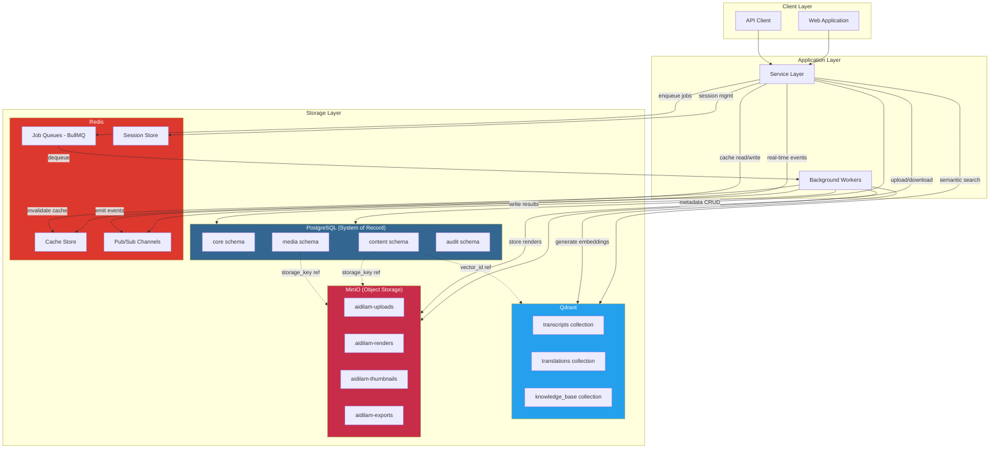
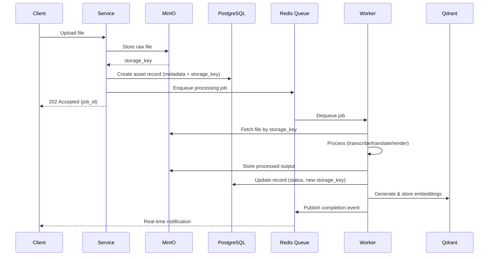

# 06 - Data Architecture

> **Volume 01 - Architecture Foundation**
> Phiên bản: 1.0.0 | Cập nhật: 2026-07-23

## Mục lục

1. [Tổng quan](#tổng-quan)
2. [PostgreSQL - System of Record](#postgresql---system-of-record)
3. [Redis - Cache, Queue & Pub/Sub](#redis---cache-queue--pubsub)
4. [Qdrant - Vector Search Engine](#qdrant---vector-search-engine)
5. [MinIO - Binary Asset Storage](#minio---binary-asset-storage)
6. [Nguyên tắc dữ liệu](#nguyên-tắc-dữ-liệu)
7. [Migration Strategy](#migration-strategy)
8. [Backup & Recovery](#backup--recovery)
9. [Data Retention Policies](#data-retention-policies)
10. [Deletion Cascades & Soft-Delete](#deletion-cascades--soft-delete)
11. [Data Classification](#data-classification)
12. [Data Flow Diagram](#data-flow-diagram)

---

## Tổng quan

Kiến trúc dữ liệu của Aidilam được thiết kế theo nguyên tắc **polyglot persistence** — mỗi storage engine được chọn dựa trên đặc điểm phù hợp nhất với loại dữ liệu cần lưu trữ. Hệ thống bao gồm 4 storage layer chính:

| Storage Engine | Vai trò | Dữ liệu |
|---|---|---|
| PostgreSQL 16 | System of Record | Metadata, relations, audit logs |
| Redis 7 | Cache & Messaging | Sessions, job queues, pub/sub |
| Qdrant | Vector Database | Embeddings cho semantic search |
| MinIO | Object Storage | Binary assets (audio, video, images) |

> ⚠️ **REQUIRES_HOST_VALIDATION**: Tất cả đường dẫn `/data/aidilam/*` yêu cầu xác thực host mount trước khi sử dụng trong production.

---

## PostgreSQL - System of Record

### Schema Strategy

PostgreSQL đóng vai trò là **single source of truth** cho toàn bộ metadata và quan hệ dữ liệu trong hệ thống. Schema được tổ chức theo domain boundaries:

```sql
-- Core schemas
CREATE SCHEMA IF NOT EXISTS core;      -- Users, workspaces, permissions
CREATE SCHEMA IF NOT EXISTS content;   -- Transcripts, translations, prompts
CREATE SCHEMA IF NOT EXISTS media;     -- Media metadata (không chứa binary)
CREATE SCHEMA IF NOT EXISTS audit;     -- Audit logs, change tracking
CREATE SCHEMA IF NOT EXISTS jobs;      -- Job history, scheduling metadata
```

### Multi-Tenant Isolation via workspace_id

Mọi bảng chứa dữ liệu tenant đều bắt buộc có cột `workspace_id`. Đây là cơ chế isolation chính:

```sql
-- Mẫu chuẩn cho mọi tenant-scoped table
CREATE TABLE content.transcripts (
    id UUID PRIMARY KEY DEFAULT gen_random_uuid(),
    workspace_id UUID NOT NULL REFERENCES core.workspaces(id),
    title VARCHAR(500) NOT NULL,
    source_language VARCHAR(10) NOT NULL,
    status VARCHAR(50) DEFAULT 'draft',
    storage_key VARCHAR(1024),  -- Reference tới MinIO object
    created_at TIMESTAMPTZ DEFAULT NOW(),
    updated_at TIMESTAMPTZ DEFAULT NOW(),
    deleted_at TIMESTAMPTZ NULL  -- Soft-delete marker
);

-- Row Level Security (RLS) enforcement
ALTER TABLE content.transcripts ENABLE ROW LEVEL SECURITY;

CREATE POLICY workspace_isolation ON content.transcripts
    USING (workspace_id = current_setting('app.current_workspace_id')::UUID);

-- Composite index cho performance
CREATE INDEX idx_transcripts_workspace_status 
    ON content.transcripts(workspace_id, status) 
    WHERE deleted_at IS NULL;
```

### Quy tắc thiết kế schema

1. **Mọi table phải có**: `id` (UUID), `created_at`, `updated_at`
2. **Tenant tables thêm**: `workspace_id` với RLS policy
3. **Soft-delete tables thêm**: `deleted_at` (nullable TIMESTAMPTZ)
4. **Không lưu binary** trong PostgreSQL — chỉ metadata và storage keys
5. **Foreign keys** luôn có `ON DELETE` clause rõ ràng
6. **Indexes** được tạo cho mọi query pattern thường xuyên

---

## Redis - Cache, Queue & Pub/Sub

Redis phục vụ 4 mục đích chính trong hệ thống, được phân tách bằng key prefix convention:

### 1. Cache Layer

```
Prefix: cache:{service}:{entity}:{id}
TTL: 5 phút (default), 1 giờ (static content), 30 giây (hot data)
```

```redis
-- Ví dụ cache patterns
SET cache:content:transcript:abc123 "{...json...}" EX 300
SET cache:user:profile:user456 "{...json...}" EX 3600
SET cache:workspace:settings:ws789 "{...json...}" EX 60
```

**Cache invalidation strategy**: Write-through cho critical data, TTL-based expiry cho read-heavy data.

### 2. Job Queue (BullMQ-style)

```
Prefix: bull:{queue-name}:{job-id}
Queues: transcription, translation, rendering, embedding, notification
```

Hệ thống sử dụng BullMQ pattern với các đặc điểm:
- **Priority queues**: Mỗi queue hỗ trợ priority levels (1-10)
- **Retry logic**: Exponential backoff, max 3 retries
- **Dead letter queue**: Jobs thất bại sau max retries được chuyển vào DLQ
- **Rate limiting**: Configurable per queue để tránh overload downstream services

```typescript
// Queue configuration pattern
const transcriptionQueue = new Queue('transcription', {
  defaultJobOptions: {
    attempts: 3,
    backoff: { type: 'exponential', delay: 5000 },
    removeOnComplete: { age: 86400 },  // 24h
    removeOnFail: { age: 604800 },     // 7 days
  }
});
```

### 3. Session Store

```
Prefix: session:{session-id}
TTL: 24 giờ (web), 30 ngày (remember-me), 1 giờ (API tokens)
```

Session data được serialize dưới dạng JSON, bao gồm:
- User ID và workspace context
- Permission cache
- CSRF tokens
- Last activity timestamp

### 4. Pub/Sub Channels

```
Channels: events:{workspace_id}:{event-type}
```

Sử dụng cho real-time notifications:
- Job status updates
- Collaboration events
- System announcements

---

## Qdrant - Vector Search Engine

### Mục đích

Qdrant lưu trữ vector embeddings để hỗ trợ **semantic search** trên toàn bộ nội dung text của hệ thống:
- Transcript search (tìm kiếm ngữ nghĩa trong bản ghi)
- Translation memory (tìm đoạn dịch tương tự)
- Content recommendation
- Duplicate detection

### Collection Strategy

```json
{
  "collections": {
    "transcripts": {
      "vector_size": 1536,
      "distance": "Cosine",
      "payload_index": ["workspace_id", "language", "created_at"]
    },
    "translations": {
      "vector_size": 1536,
      "distance": "Cosine",
      "payload_index": ["workspace_id", "source_lang", "target_lang"]
    },
    "knowledge_base": {
      "vector_size": 1536,
      "distance": "Cosine",
      "payload_index": ["workspace_id", "category", "tags"]
    }
  }
}
```

### Tenant Isolation trong Qdrant

Mỗi vector point chứa `workspace_id` trong payload, và mọi query đều filter theo workspace:

```python
# Query pattern với workspace isolation
results = qdrant_client.search(
    collection_name="transcripts",
    query_vector=embedding,
    query_filter=Filter(
        must=[
            FieldCondition(key="workspace_id", match=MatchValue(value=workspace_id))
        ]
    ),
    limit=10
)
```

### Data Path

> ⚠️ **REQUIRES_HOST_VALIDATION**: `/data/aidilam/qdrant/storage` — Qdrant persistent storage path.

---

## MinIO - Binary Asset Storage

### Bucket Strategy

MinIO tổ chức binary assets theo bucket hierarchy:

| Bucket | Nội dung | Access Pattern |
|---|---|---|
| `aidilam-uploads` | Raw uploads từ users | Write-once, read-many |
| `aidilam-transcripts` | Processed transcript files | Read-heavy |
| `aidilam-renders` | Rendered output (video, audio) | Read-heavy, large files |
| `aidilam-thumbnails` | Generated thumbnails | Read-heavy, cacheable |
| `aidilam-exports` | Export packages | Temporary, auto-expire |
| `aidilam-backups` | System backups | Write-once, read-rarely |

### Object Key Convention

```
{bucket}/{workspace_id}/{content_type}/{year}/{month}/{uuid}.{extension}

Ví dụ:
aidilam-uploads/ws-abc123/audio/2026/07/550e8400-e29b-41d4-a716-446655440000.mp3
aidilam-renders/ws-abc123/video/2026/07/660e8400-e29b-41d4-a716-446655440000.mp4
```

### Lifecycle Policies

```json
{
  "Rules": [
    {
      "ID": "expire-exports",
      "Filter": { "Prefix": "aidilam-exports/" },
      "Expiration": { "Days": 7 }
    },
    {
      "ID": "expire-temp-uploads",
      "Filter": { "Prefix": "aidilam-uploads/", "Tag": {"Key": "temp", "Value": "true"} },
      "Expiration": { "Days": 1 }
    }
  ]
}
```

### Data Path

> ⚠️ **REQUIRES_HOST_VALIDATION**: `/data/aidilam/minio/data` — MinIO persistent data path.

---

## Nguyên tắc dữ liệu

### Nguyên tắc 1: No Binary in PostgreSQL

PostgreSQL **KHÔNG BAO GIỜ** lưu trữ binary data (BYTEA). Mọi file binary được lưu trong MinIO, PostgreSQL chỉ giữ:
- **Metadata**: filename, size, mime_type, duration, dimensions
- **Storage key**: đường dẫn object trong MinIO
- **Processing status**: trạng thái xử lý của file

```sql
-- ĐÚNG: Chỉ lưu metadata và reference
CREATE TABLE media.assets (
    id UUID PRIMARY KEY DEFAULT gen_random_uuid(),
    workspace_id UUID NOT NULL,
    filename VARCHAR(500) NOT NULL,
    mime_type VARCHAR(100) NOT NULL,
    file_size BIGINT NOT NULL,
    storage_bucket VARCHAR(100) NOT NULL,
    storage_key VARCHAR(1024) NOT NULL,  -- MinIO object path
    checksum_sha256 VARCHAR(64),
    metadata JSONB DEFAULT '{}',
    created_at TIMESTAMPTZ DEFAULT NOW()
);

-- SAI: Không bao giờ làm điều này
-- CREATE TABLE media.assets (
--     id UUID PRIMARY KEY,
--     file_data BYTEA  -- ❌ KHÔNG LƯU BINARY TRONG PG
-- );
```

### Nguyên tắc 2: Metadata-First Design

Mọi entity trong hệ thống đều có đầy đủ metadata để có thể:
- Query và filter mà không cần truy cập storage
- Rebuild indexes từ metadata
- Audit trail đầy đủ cho compliance

### Nguyên tắc 3: Object References via Storage Keys

Storage keys là **immutable references** — một khi object được tạo, key không thay đổi. Versioning được xử lý bằng cách tạo object mới:

```
Original:  aidilam-renders/ws-001/video/2026/07/{uuid-v1}.mp4
Re-render: aidilam-renders/ws-001/video/2026/07/{uuid-v2}.mp4
```

### Nguyên tắc 4: Eventual Consistency Awareness

- PostgreSQL → MinIO: **Strong consistency** (write PG after MinIO confirm)
- PostgreSQL → Qdrant: **Eventually consistent** (async embedding generation)
- Redis cache → PostgreSQL: **Eventually consistent** (TTL-based refresh)

### Nguyên tắc 5: Data Locality

Dữ liệu liên quan được co-locate trong cùng schema/bucket để tối ưu query performance và backup granularity.

---

## Migration Strategy

### Versioned Migrations

Hệ thống sử dụng **forward-only versioned migrations** với naming convention:

```
migrations/
├── 0001_create_core_schema.sql
├── 0002_create_content_schema.sql
├── 0003_create_media_schema.sql
├── 0004_add_workspace_rls.sql
├── 0005_create_audit_tables.sql
├── 0006_add_transcript_search_index.sql
└── ...
```

### Migration Rules

1. **Forward-only trong production**: Không bao giờ rollback migration trong production
2. **Backward compatible**: Mỗi migration phải tương thích với code version N-1
3. **Idempotent**: Sử dụng `IF NOT EXISTS`, `IF EXISTS` cho safety
4. **Small & focused**: Mỗi migration chỉ làm một việc
5. **Tested**: Mọi migration phải pass trên staging trước production

### Migration Workflow

```bash
# Development
npm run migrate:create -- --name add_translation_status
npm run migrate:up      # Apply pending migrations
npm run migrate:status  # Check current state

# Production (CI/CD only)
npm run migrate:production  # Forward-only, no rollback
```

### Schema Version Tracking

```sql
CREATE TABLE core.schema_migrations (
    version INTEGER PRIMARY KEY,
    name VARCHAR(500) NOT NULL,
    applied_at TIMESTAMPTZ DEFAULT NOW(),
    checksum VARCHAR(64) NOT NULL,
    execution_time_ms INTEGER
);
```

### Breaking Changes Protocol

Khi cần breaking change (rename column, change type):
1. **Phase 1**: Thêm column mới, dual-write
2. **Phase 2**: Migrate data, switch reads sang column mới
3. **Phase 3**: Drop column cũ (sau khi confirm ổn định)

---

## Backup & Recovery

### Backup Classification

| Classification | Dữ liệu | RPO | RTO | Strategy |
|---|---|---|---|---|
| **CRITICAL** | PostgreSQL, Secrets, Audit Logs | 1 giờ | 15 phút | Continuous WAL + Daily full |
| **HIGH** | Transcripts, Translations, Prompts | 4 giờ | 1 giờ | Daily incremental |
| **MEDIUM** | Renders, Qdrant vectors | 24 giờ | 4 giờ | Daily snapshot |
| **REGENERABLE** | Audio thumbnails, Cache, Temp files | N/A | N/A | No backup needed |

### CRITICAL Tier

```yaml
# PostgreSQL backup
postgresql_backup:
  wal_archiving: enabled
  full_backup_schedule: "0 2 * * *"  # Daily 2AM
  retention: 30 days
  destination: "/data/aidilam/backups/pg/"  # REQUIRES_HOST_VALIDATION
  encryption: AES-256-GCM
  verification: daily restore test

# Secrets backup
secrets_backup:
  method: encrypted_export
  schedule: "0 */4 * * *"  # Every 4 hours
  destination: "/data/aidilam/backups/secrets/"  # REQUIRES_HOST_VALIDATION
  encryption: age + hardware key

# Audit logs
audit_backup:
  method: pg_dump --schema=audit
  schedule: "0 */1 * * *"  # Hourly
  retention: 7 years (compliance)
```

### HIGH Tier

```yaml
high_tier_backup:
  includes:
    - content.transcripts (metadata + MinIO objects)
    - content.translations
    - content.prompts
  schedule: "0 3 * * *"  # Daily 3AM
  retention: 90 days
  destination: "/data/aidilam/backups/content/"  # REQUIRES_HOST_VALIDATION
```

### MEDIUM Tier

```yaml
medium_tier_backup:
  includes:
    - aidilam-renders bucket (MinIO snapshot)
    - Qdrant collection snapshots
  schedule: "0 4 * * *"  # Daily 4AM
  retention: 30 days
  destination: "/data/aidilam/backups/media/"  # REQUIRES_HOST_VALIDATION
```

### REGENERABLE Tier

Dữ liệu trong tier này **không cần backup** vì có thể regenerate từ source:
- **Audio thumbnails**: Generate lại từ audio files
- **Redis cache**: Rebuild từ PostgreSQL
- **Temporary renders**: Re-render từ source content
- **Search indexes**: Rebuild từ PostgreSQL data

---

## Data Retention Policies

### Retention Schedule

| Loại dữ liệu | Active Retention | Archive | Purge |
|---|---|---|---|
| User accounts | Lifetime | N/A | 30 ngày sau deletion request |
| Workspace data | Lifetime | 90 ngày sau workspace deactivation | 180 ngày |
| Transcripts | Lifetime | 1 năm sau last access | 2 năm |
| Translations | Lifetime | 1 năm sau last access | 2 năm |
| Rendered outputs | 90 ngày | 180 ngày | 1 năm |
| Audit logs | 1 năm online | 6 năm cold storage | 7 năm total |
| Session data | Session duration | N/A | Immediate expiry |
| Job queue data | 7 ngày (completed) | N/A | Auto-purge |
| Export packages | 7 ngày | N/A | Auto-purge |
| Temporary uploads | 24 giờ | N/A | Auto-purge |

### Retention Enforcement

```typescript
// Scheduled retention job
const retentionJob = {
  name: 'data-retention-enforcement',
  schedule: '0 1 * * *',  // Daily 1AM
  tasks: [
    { action: 'archive', target: 'inactive_transcripts', threshold: '365d' },
    { action: 'purge', target: 'expired_exports', threshold: '7d' },
    { action: 'purge', target: 'orphaned_uploads', threshold: '24h' },
    { action: 'archive', target: 'old_audit_logs', threshold: '365d' },
    { action: 'purge', target: 'deleted_workspaces', threshold: '180d' },
  ]
};
```

### Legal Hold

Khi có yêu cầu legal hold, dữ liệu liên quan được đánh dấu `retention_lock = true` và **không bị purge** bất kể retention policy:

```sql
ALTER TABLE content.transcripts ADD COLUMN retention_lock BOOLEAN DEFAULT FALSE;
ALTER TABLE content.transcripts ADD COLUMN retention_lock_reason VARCHAR(500);
ALTER TABLE content.transcripts ADD COLUMN retention_lock_until TIMESTAMPTZ;
```

---

## Deletion Cascades & Soft-Delete

### Soft-Delete Strategy

Hệ thống sử dụng **soft-delete** cho mọi user-facing data:

```sql
-- Soft-delete pattern
UPDATE content.transcripts 
SET deleted_at = NOW(), 
    updated_at = NOW()
WHERE id = $1 AND workspace_id = $2;

-- Query mặc định luôn exclude soft-deleted records
SELECT * FROM content.transcripts 
WHERE workspace_id = $1 AND deleted_at IS NULL;
```

**Recovery window**: 30 ngày từ khi soft-delete. Sau thời gian này, hard-delete được thực hiện bởi retention job.

### Cascade Rules

```sql
-- Workspace deletion cascade (soft-delete propagation)
-- Khi workspace bị xóa, toàn bộ data liên quan được soft-delete

-- Level 1: Direct children
UPDATE content.transcripts SET deleted_at = NOW() WHERE workspace_id = $1;
UPDATE content.translations SET deleted_at = NOW() WHERE workspace_id = $1;
UPDATE media.assets SET deleted_at = NOW() WHERE workspace_id = $1;

-- Level 2: Dependent data
UPDATE content.transcript_segments SET deleted_at = NOW() 
WHERE transcript_id IN (SELECT id FROM content.transcripts WHERE workspace_id = $1);

-- Level 3: External storage cleanup (async, after grace period)
-- MinIO objects marked for deletion
-- Qdrant vectors queued for removal
```

### Hard-Delete Process

Hard-delete chỉ xảy ra khi:
1. Soft-delete đã quá grace period (30 ngày)
2. Không có legal hold
3. Được thực hiện bởi automated retention job

```typescript
// Hard-delete cascade order (bottom-up)
const hardDeleteOrder = [
  'qdrant_vectors',        // 1. Remove embeddings
  'minio_objects',         // 2. Remove binary files
  'dependent_records',     // 3. Remove child records
  'primary_records',       // 4. Remove parent records
  'audit_log_entry',       // 5. Log the deletion (NEVER deleted)
];
```

### Orphan Detection

Scheduled job phát hiện và xử lý orphaned data:
- MinIO objects không có corresponding PG record
- Qdrant vectors trỏ tới deleted entities
- Redis cache keys cho non-existent records

---

## Data Classification

### Classification Levels

| Level | Label | Mô tả | Ví dụ |
|---|---|---|---|
| **L1** | PUBLIC | Dữ liệu công khai, không nhạy cảm | Published content, public profiles |
| **L2** | INTERNAL | Dữ liệu nội bộ hệ thống | System configs, feature flags, metrics |
| **L3** | CONFIDENTIAL | Dữ liệu người dùng, cần bảo vệ | Transcripts, translations, user data |
| **L4** | RESTRICTED | Dữ liệu cực kỳ nhạy cảm | Credentials, API keys, PII, audit logs |

### Handling Requirements

| Aspect | PUBLIC | INTERNAL | CONFIDENTIAL | RESTRICTED |
|---|---|---|---|---|
| Encryption at rest | Optional | Required | Required (AES-256) | Required (AES-256 + KMS) |
| Encryption in transit | TLS 1.2+ | TLS 1.2+ | TLS 1.3 | TLS 1.3 + mTLS |
| Access control | Public | Role-based | Workspace + Role | Need-to-know + MFA |
| Logging | Basic | Standard | Full audit trail | Full audit + alerts |
| Backup encryption | No | Yes | Yes (separate key) | Yes (hardware key) |
| Retention on delete | Immediate | 7 ngày | 30 ngày | 90 ngày + approval |
| Data masking | None | None | In non-prod | Always in non-prod |

### Classification Tagging

```sql
-- Mỗi table/column được tag classification level
COMMENT ON TABLE core.users IS 'classification:CONFIDENTIAL';
COMMENT ON COLUMN core.users.email IS 'classification:CONFIDENTIAL';
COMMENT ON COLUMN core.users.password_hash IS 'classification:RESTRICTED';
COMMENT ON TABLE audit.logs IS 'classification:RESTRICTED';
COMMENT ON TABLE content.transcripts IS 'classification:CONFIDENTIAL';
```

---

## Data Flow Diagram

### Tổng quan luồng dữ liệu giữa các storage systems



### Luồng xử lý Upload → Processing → Storage



---

## Host Validation Paths

> Các đường dẫn sau đây yêu cầu xác thực host mount configuration trước khi deploy:

| Path | Mục đích | Validation |
|---|---|---|
| `/data/aidilam/postgres/data` | PostgreSQL data directory | **REQUIRES_HOST_VALIDATION** |
| `/data/aidilam/redis/data` | Redis persistence (RDB/AOF) | **REQUIRES_HOST_VALIDATION** |
| `/data/aidilam/qdrant/storage` | Qdrant vector storage | **REQUIRES_HOST_VALIDATION** |
| `/data/aidilam/minio/data` | MinIO object storage | **REQUIRES_HOST_VALIDATION** |
| `/data/aidilam/backups/pg/` | PostgreSQL backups | **REQUIRES_HOST_VALIDATION** |
| `/data/aidilam/backups/secrets/` | Encrypted secrets backup | **REQUIRES_HOST_VALIDATION** |
| `/data/aidilam/backups/content/` | Content tier backups | **REQUIRES_HOST_VALIDATION** |
| `/data/aidilam/backups/media/` | Media tier backups | **REQUIRES_HOST_VALIDATION** |

---

## Tham khảo

- PostgreSQL 16 Documentation: https://www.postgresql.org/docs/16/
- Redis 7 Commands: https://redis.io/commands/
- Qdrant Documentation: https://qdrant.tech/documentation/
- MinIO Admin Guide: https://min.io/docs/minio/linux/index.html
- BullMQ Pattern: https://docs.bullmq.io/

---

*Document generated: 2026-07-23 | Next review: 2026-10-23*
