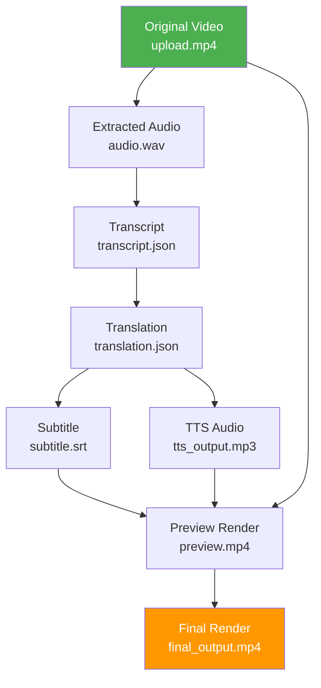
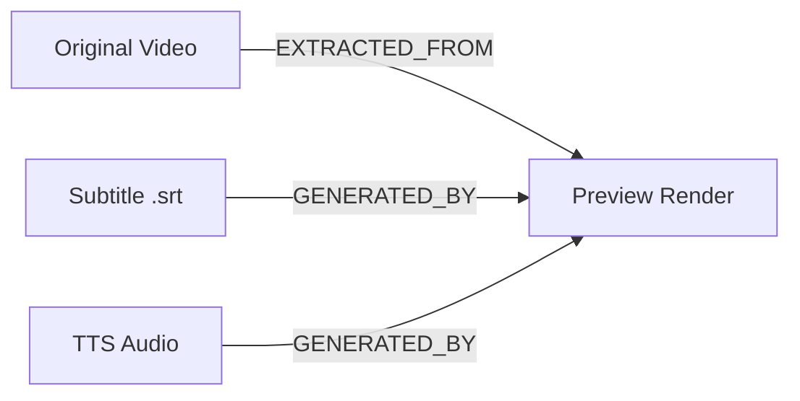
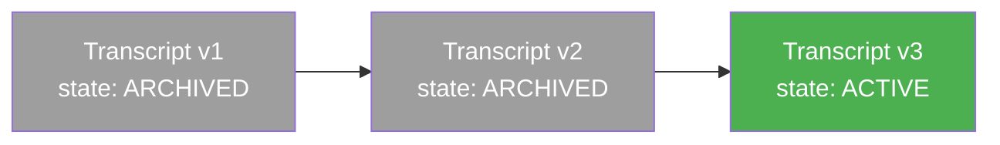
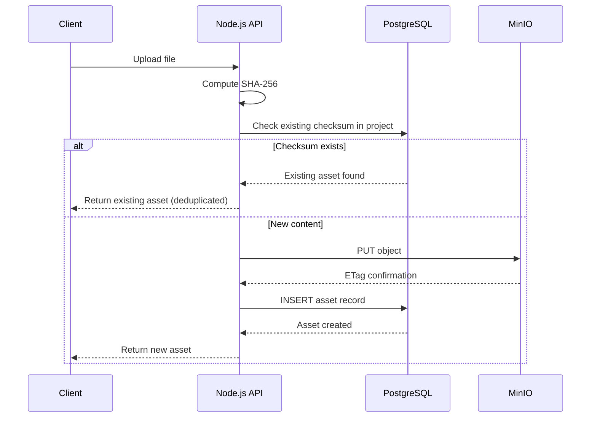
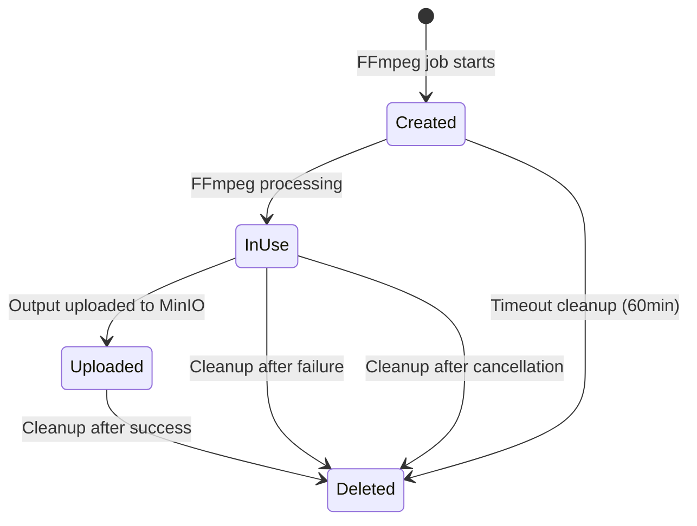
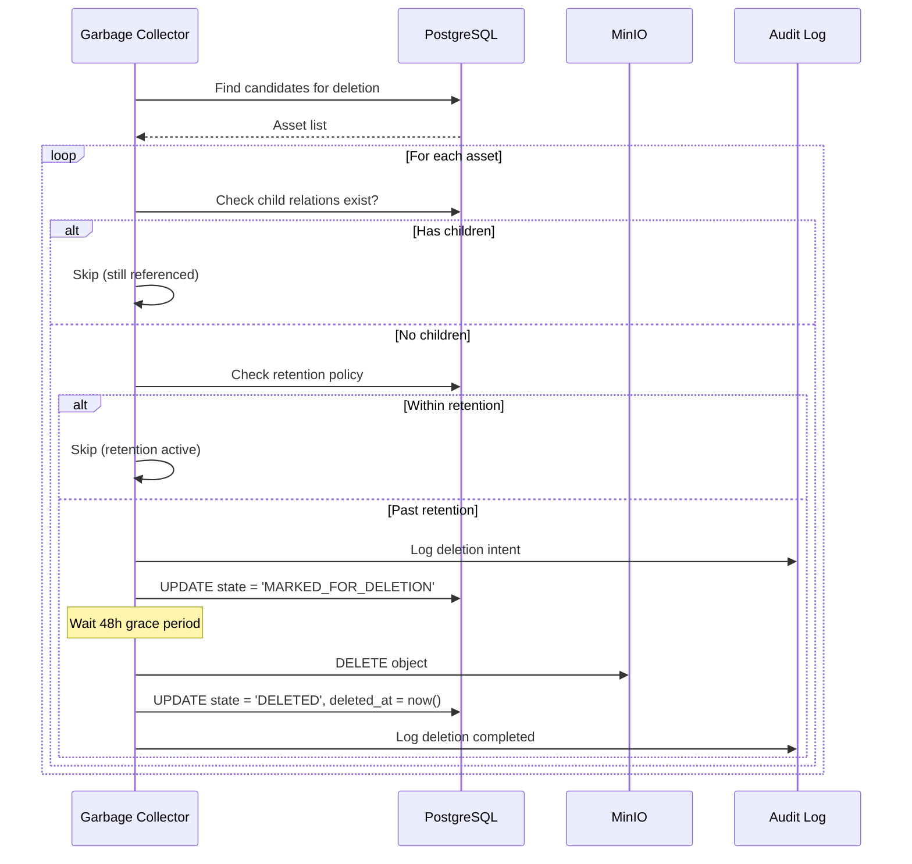
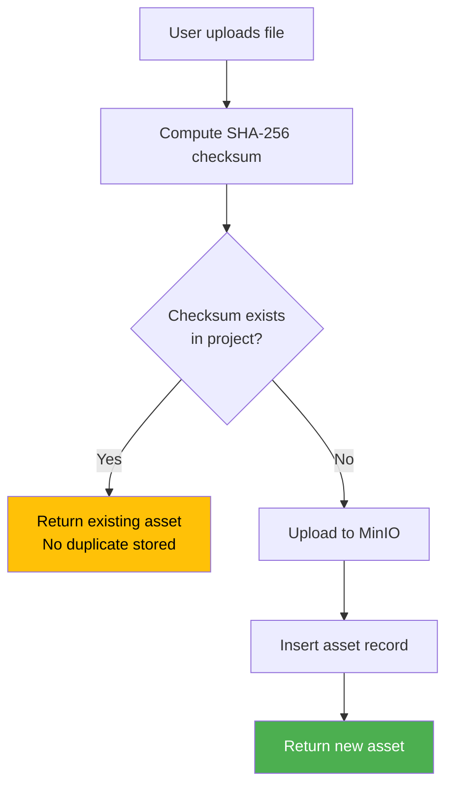
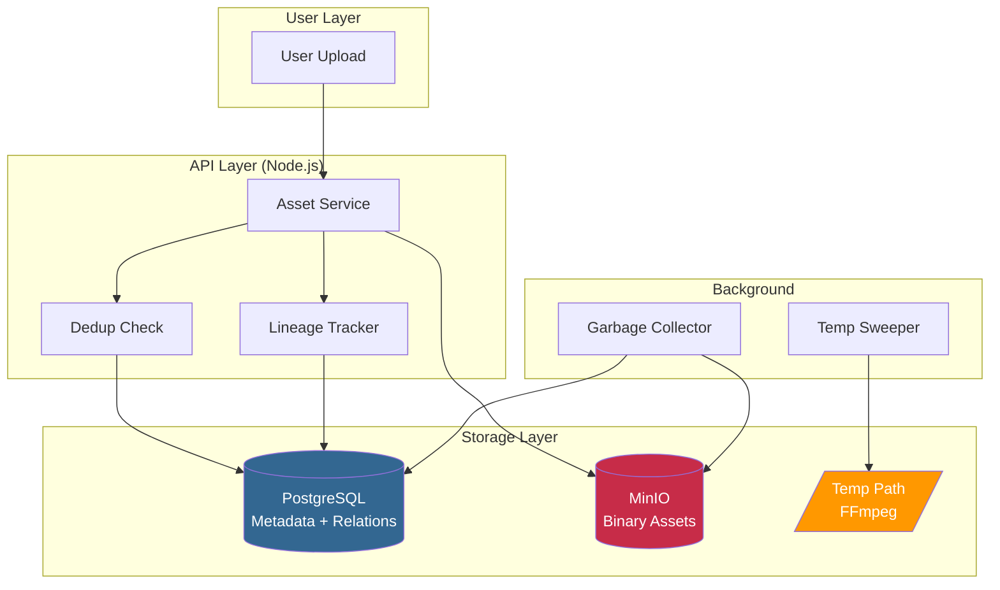

# 07. Asset Lineage Architecture

> **Phiên bản:** 1.0
> **Cập nhật:** 2026-07-23
> **Trạng thái:** Approved
> **Tác giả:** AIĐiLàm Architecture Team

---

## 1. Tổng Quan

Asset Lineage (phả hệ tài nguyên) là kiến trúc theo dõi **nguồn gốc, quan hệ, và vòng đời** của mọi media asset trong hệ thống AIĐiLàm. Mỗi file media — từ video gốc upload lên, đến audio trích xuất, transcript, bản dịch, subtitle, TTS audio, cho đến render cuối cùng — đều được ghi nhận đầy đủ **ai tạo ra nó, từ đâu, khi nào, và bằng cách nào**.

Kiến trúc này đảm bảo:
- Truy vết ngược (backward tracing) từ bất kỳ asset nào về nguồn gốc
- Truy vết xuôi (forward tracing) từ asset gốc đến mọi sản phẩm phái sinh
- Quản lý vòng đời an toàn (retention, deletion, garbage collection)
- Deduplication thông qua checksum

---

## 2. Mười Nguyên Tắc Bắt Buộc (Mandatory Principles)

| # | Nguyên tắc | Mô tả chi tiết |
|---|-----------|-----------------|
| 1 | **Original assets are immutable** | File media gốc sau khi upload KHÔNG BAO GIỜ bị thay đổi nội dung. Mọi chỉnh sửa tạo ra asset mới. |
| 2 | **Every derived asset records lineage** | Mỗi asset phái sinh phải ghi nhận: source asset ID, operation type, job ID tạo ra nó. |
| 3 | **Derived assets reference source** | Quan hệ parent → child được lưu trong bảng `asset_relations` với relation type rõ ràng. |
| 4 | **No binary media in PostgreSQL** | PostgreSQL KHÔNG lưu binary content. Không có cột `BYTEA` chứa media. |
| 5 | **PostgreSQL stores metadata only** | PostgreSQL lưu: metadata, state machine, references (bucket/key), checksums, timestamps. |
| 6 | **MinIO stores all media** | Mọi file media (video, audio, image, subtitle, render) đều nằm trong MinIO buckets. |
| 7 | **FFmpeg temp uses controlled path** | FFmpeg temp files dùng path riêng (`/tmp/aidilam-ffmpeg/`) với size quota. |
| 8 | **Temp cleanup mandatory** | Temp files PHẢI được dọn sau success, failure, hoặc cancellation. Không có orphan temp. |
| 9 | **Checksum for deduplication** | Mỗi asset có SHA-256 checksum. Upload trùng checksum → reuse asset, không tạo duplicate. |
| 10 | **Deletion respects retention & lineage** | Xóa asset phải kiểm tra: retention policy, dependent assets, audit trail requirements. |

---

## 3. Lineage Tree — Ví Dụ Chuỗi Phái Sinh



### Giải thích chuỗi:

| Bước | Asset | Tạo bởi | Relation Type |
|------|-------|---------|---------------|
| 1 | Original Video | User upload | — (root asset) |
| 2 | Extracted Audio | FFmpeg worker | EXTRACTED_FROM |
| 3 | Transcript | Transcription worker (Whisper) | DERIVED_FROM |
| 4 | Translation | Translation worker (LLM) | DERIVED_FROM |
| 5 | Subtitle (.srt) | Subtitle generator | GENERATED_BY |
| 6 | TTS Audio | TTS worker | GENERATED_BY |
| 7 | Preview Render | FFmpeg worker | DERIVED_FROM (multiple sources) |
| 8 | Final Render | FFmpeg worker | DERIVED_FROM |

---

## 4. Asset Relation Types

### 4.1. Định nghĩa các loại quan hệ

```typescript
enum AssetRelationType {
  /** Asset B được trích xuất trực tiếp từ nội dung binary của Asset A.
   *  Ví dụ: audio extracted from video, frame extracted from video */
  EXTRACTED_FROM = 'EXTRACTED_FROM',

  /** Asset B được tạo ra bằng cách xử lý/biến đổi nội dung của Asset A.
   *  Ví dụ: transcript from audio, translation from transcript */
  DERIVED_FROM = 'DERIVED_FROM',

  /** Asset B được sinh ra bởi một AI/algorithm operation dựa trên Asset A.
   *  Ví dụ: TTS audio from text, subtitle from translation */
  GENERATED_BY = 'GENERATED_BY',
}
```

### 4.2. Bảng phân biệt

| Relation Type | Tính chất | Ví dụ | Có thể tái tạo? |
|---------------|-----------|-------|-----------------|
| `EXTRACTED_FROM` | Deterministic, lossless logic | Video → Audio track | Có (cùng FFmpeg params) |
| `DERIVED_FROM` | Có thể deterministic hoặc AI-based | Audio → Transcript | Tùy model version |
| `GENERATED_BY` | AI/algorithm sinh nội dung mới | Text → TTS Audio | Tùy model + params |

### 4.3. Multi-parent Relations

Một asset có thể có **nhiều parent assets**. Ví dụ: Preview Render được tạo từ Original Video + Subtitle + TTS Audio.



Trong trường hợp multi-parent, bảng `asset_relations` sẽ có nhiều rows cho cùng `child_asset_id`.

---

## 5. Database Schema — Asset & Lineage

### 5.1. Bảng `assets`

```sql
CREATE TABLE assets (
    id              UUID PRIMARY KEY DEFAULT gen_random_uuid(),
    project_id      UUID NOT NULL REFERENCES projects(id),
    
    -- Phân loại
    asset_type      TEXT NOT NULL,  -- 'VIDEO', 'AUDIO', 'IMAGE', 'TEXT', 'SUBTITLE', 'RENDER'
    asset_origin    TEXT NOT NULL,  -- 'UPLOADED', 'DERIVED', 'GENERATED'
    
    -- Storage reference (MinIO)
    storage_bucket  TEXT NOT NULL,
    storage_key     TEXT NOT NULL,
    storage_region  TEXT NOT NULL DEFAULT 'us-east-1',
    
    -- Metadata
    filename        TEXT NOT NULL,
    mime_type       TEXT NOT NULL,
    file_size_bytes BIGINT NOT NULL,
    checksum_sha256 TEXT NOT NULL,
    
    -- Media metadata (nullable, tùy loại)
    duration_ms     BIGINT,
    width_px        INTEGER,
    height_px       INTEGER,
    sample_rate_hz  INTEGER,
    codec           TEXT,
    
    -- State machine
    state           TEXT NOT NULL DEFAULT 'ACTIVE',  -- ACTIVE, ARCHIVED, MARKED_FOR_DELETION, DELETED
    
    -- Versioning
    version         INTEGER NOT NULL DEFAULT 1,
    previous_version_id UUID REFERENCES assets(id),
    
    -- Audit
    created_by      UUID NOT NULL REFERENCES users(id),
    created_at      TIMESTAMPTZ NOT NULL DEFAULT now(),
    updated_at      TIMESTAMPTZ NOT NULL DEFAULT now(),
    deleted_at      TIMESTAMPTZ,
    
    -- Constraints
    CONSTRAINT unique_storage UNIQUE (storage_bucket, storage_key),
    CONSTRAINT unique_checksum_per_project UNIQUE (project_id, checksum_sha256)
);

CREATE INDEX idx_assets_project ON assets(project_id);
CREATE INDEX idx_assets_checksum ON assets(checksum_sha256);
CREATE INDEX idx_assets_state ON assets(state);
```

### 5.2. Bảng `asset_relations`

```sql
CREATE TABLE asset_relations (
    id              UUID PRIMARY KEY DEFAULT gen_random_uuid(),
    
    -- Quan hệ
    parent_asset_id UUID NOT NULL REFERENCES assets(id),
    child_asset_id  UUID NOT NULL REFERENCES assets(id),
    relation_type   TEXT NOT NULL,  -- 'EXTRACTED_FROM', 'DERIVED_FROM', 'GENERATED_BY'
    
    -- Context
    job_id          UUID REFERENCES jobs(id),  -- Job nào tạo ra relation này
    operation_type  TEXT NOT NULL,  -- 'AUDIO_EXTRACTION', 'TRANSCRIPTION', 'TRANSLATION', etc.
    parameters      JSONB,         -- Params dùng để tạo child (để có thể reproduce)
    
    -- Audit
    created_at      TIMESTAMPTZ NOT NULL DEFAULT now(),
    
    -- Constraints
    CONSTRAINT no_self_reference CHECK (parent_asset_id != child_asset_id),
    CONSTRAINT unique_relation UNIQUE (parent_asset_id, child_asset_id, relation_type)
);

CREATE INDEX idx_relations_parent ON asset_relations(parent_asset_id);
CREATE INDEX idx_relations_child ON asset_relations(child_asset_id);
CREATE INDEX idx_relations_job ON asset_relations(job_id);
```

---

## 6. Version Tracking

### 6.1. Nguyên tắc versioning

- Mỗi asset có trường `version` (integer, bắt đầu từ 1)
- Khi user "edit" một asset (ví dụ: re-transcribe với params khác), hệ thống tạo **asset mới** với `version = previous.version + 1`
- Asset cũ giữ nguyên (immutable), trường `state` chuyển sang `ARCHIVED`
- `previous_version_id` liên kết version mới → version cũ

### 6.2. Version chain diagram



### 6.3. Query active version

```sql
-- Lấy version mới nhất (active) của một lineage chain
SELECT * FROM assets
WHERE project_id = :project_id
  AND checksum_sha256 != ''  -- has content
  AND state = 'ACTIVE'
  AND asset_type = 'TRANSCRIPT'
  AND id IN (
    SELECT child_asset_id FROM asset_relations
    WHERE parent_asset_id = :source_audio_id
      AND operation_type = 'TRANSCRIPTION'
  )
ORDER BY version DESC
LIMIT 1;
```

---

## 7. Immutability Enforcement

### 7.1. Application-level enforcement

```typescript
class AssetService {
  async updateAsset(assetId: string, newContent: Buffer): Promise<Asset> {
    const existing = await this.assetRepo.findById(assetId);
    
    if (existing.asset_origin === 'UPLOADED') {
      throw new ImmutabilityViolationError(
        'Original uploaded assets cannot be modified. Create a new version instead.'
      );
    }
    
    // Tạo version mới thay vì modify
    return this.createNewVersion(existing, newContent);
  }
}
```

### 7.2. Storage-level enforcement

MinIO bucket policy cho `originals` bucket:

```json
{
  "Version": "2012-10-17",
  "Statement": [
    {
      "Effect": "Deny",
      "Principal": "*",
      "Action": ["s3:PutObject"],
      "Resource": "arn:aws:s3:::aidilam-originals/*",
      "Condition": {
        "StringEquals": {
          "s3:x-amz-copy-source": ""
        }
      }
    }
  ]
}
```

### 7.3. Database-level enforcement

```sql
-- Trigger ngăn chặn update storage_key của asset đã ACTIVE
CREATE OR REPLACE FUNCTION prevent_asset_content_mutation()
RETURNS TRIGGER AS $$
BEGIN
    IF OLD.state = 'ACTIVE' AND OLD.storage_key != NEW.storage_key THEN
        RAISE EXCEPTION 'Cannot mutate storage reference of active asset. Create new version.';
    END IF;
    RETURN NEW;
END;
$$ LANGUAGE plpgsql;

CREATE TRIGGER trg_immutable_asset
    BEFORE UPDATE ON assets
    FOR EACH ROW
    EXECUTE FUNCTION prevent_asset_content_mutation();
```

---

## 8. Storage Architecture — MinIO Buckets

### 8.1. Bucket layout

| Bucket | Mục đích | Retention | Access |
|--------|----------|-----------|--------|
| `aidilam-originals` | Upload gốc từ user | Permanent (until user deletes) | Read-only after write |
| `aidilam-derived` | Assets phái sinh (audio, transcript, etc.) | Project lifecycle | Read/Write by workers |
| `aidilam-renders` | Preview & final renders | Project lifecycle | Read/Write by workers |
| `aidilam-temp` | Temp files chưa finalize | 24h auto-expire | Write by workers |

### 8.2. Object key convention

```
{bucket}/{project_id}/{asset_type}/{asset_id}/{filename}

Ví dụ:
aidilam-originals/proj_abc123/VIDEO/asset_def456/upload.mp4
aidilam-derived/proj_abc123/AUDIO/asset_ghi789/extracted_audio.wav
aidilam-renders/proj_abc123/RENDER/asset_jkl012/final_output.mp4
```

### 8.3. Checksum workflow



---

## 9. FFmpeg Temp Path Management

### 9.1. Cấu hình

```yaml
# config/worker.yaml
ffmpeg:
  temp_path: /tmp/aidilam-ffmpeg
  max_size_gb: 50          # Giới hạn tổng dung lượng temp
  max_file_age_minutes: 60 # File temp > 60 phút bị xóa tự động
  cleanup_interval_minutes: 5
```

### 9.2. Lifecycle



### 9.3. Cleanup implementation

```python
class TempFileManager:
    def __init__(self, config: TempConfig):
        self.base_path = Path(config.temp_path)
        self.max_size_bytes = config.max_size_gb * 1024**3
        
    def allocate(self, job_id: str, estimated_size: int) -> Path:
        """Allocate temp space, raise if quota exceeded."""
        current_usage = self._calculate_usage()
        if current_usage + estimated_size > self.max_size_bytes:
            raise TempQuotaExceededError(
                f"Temp quota exceeded: {current_usage}/{self.max_size_bytes}"
            )
        job_dir = self.base_path / job_id
        job_dir.mkdir(parents=True, exist_ok=True)
        return job_dir
    
    def cleanup(self, job_id: str) -> None:
        """Remove all temp files for a job. Called on success, failure, or cancel."""
        job_dir = self.base_path / job_id
        if job_dir.exists():
            shutil.rmtree(job_dir)
            logger.info(f"Cleaned temp files for job {job_id}")
    
    def sweep_expired(self) -> None:
        """Background task: remove files older than max_file_age."""
        cutoff = time.time() - (self.config.max_file_age_minutes * 60)
        for job_dir in self.base_path.iterdir():
            if job_dir.stat().st_mtime < cutoff:
                shutil.rmtree(job_dir)
                logger.warning(f"Swept expired temp: {job_dir.name}")
```

---

## 10. Garbage Collection & Orphan Detection

### 10.1. Garbage Collection Rules

| Rule | Điều kiện | Hành động |
|------|-----------|-----------|
| Orphan asset | Asset không có relation VÀ không phải root upload VÀ state != ACTIVE | Mark for deletion |
| Expired temp | Asset trong bucket `aidilam-temp` > 24h | Delete trực tiếp |
| Archived version | Version cũ, state = ARCHIVED, > retention period | Mark for deletion |
| Failed job output | Asset tạo bởi job FAILED, không có child relations | Mark for deletion |

### 10.2. Orphan Detection Query

```sql
-- Tìm orphan assets: không phải root, không có parent relation, không active
SELECT a.id, a.filename, a.created_at, a.file_size_bytes
FROM assets a
WHERE a.asset_origin != 'UPLOADED'                    -- Không phải upload gốc
  AND a.state = 'ACTIVE'                             -- Đang active nhưng không ai reference
  AND NOT EXISTS (
    SELECT 1 FROM asset_relations ar
    WHERE ar.child_asset_id = a.id
  )
  AND a.created_at < now() - INTERVAL '7 days'       -- Tạo > 7 ngày (grace period)
ORDER BY a.file_size_bytes DESC;
```

### 10.3. Safe Deletion Protocol



---

## 11. Deletion Rules — Retention & Lineage Respect

### 11.1. Deletion không được phép khi:

1. **Asset có child relations active** — Phải xóa/archive children trước
2. **Asset đang trong retention period** — Chờ hết retention
3. **Asset đang được reference bởi job RUNNING/QUEUED** — Chờ job xong
4. **Asset là evidence trong audit trail chưa archived** — Chờ audit close

### 11.2. Cascade options

```typescript
enum DeletionStrategy {
  /** Chỉ xóa asset này nếu không có children */
  LEAF_ONLY = 'LEAF_ONLY',
  
  /** Xóa asset và tất cả descendants (cascade) */
  CASCADE = 'CASCADE',
  
  /** Archive asset (soft delete), giữ children intact */
  ARCHIVE = 'ARCHIVE',
}
```

### 11.3. User-initiated deletion flow

```typescript
async function requestAssetDeletion(
  assetId: string, 
  strategy: DeletionStrategy,
  userId: string
): Promise<DeletionResult> {
  const asset = await assetRepo.findById(assetId);
  const children = await relationRepo.findChildren(assetId);
  const activeJobs = await jobRepo.findActiveByAsset(assetId);
  
  // Validation
  if (activeJobs.length > 0) {
    throw new DeletionBlockedError('Asset is referenced by active jobs');
  }
  
  if (strategy === 'LEAF_ONLY' && children.length > 0) {
    throw new DeletionBlockedError(
      `Asset has ${children.length} dependent assets. Use CASCADE or delete children first.`
    );
  }
  
  // Execute
  if (strategy === 'CASCADE') {
    await deleteCascade(assetId, userId);
  } else if (strategy === 'ARCHIVE') {
    await archiveAsset(assetId, userId);
  } else {
    await markForDeletion(assetId, userId);
  }
  
  return { status: 'MARKED_FOR_DELETION', grace_period_hours: 48 };
}
```

---

## 12. Lineage Query API

### 12.1. Trace backward (ancestors)

```sql
-- Recursive CTE: tìm tất cả ancestors của một asset
WITH RECURSIVE ancestors AS (
    -- Base case: direct parents
    SELECT ar.parent_asset_id, ar.relation_type, ar.operation_type, 1 as depth
    FROM asset_relations ar
    WHERE ar.child_asset_id = :asset_id
    
    UNION ALL
    
    -- Recursive: parents of parents
    SELECT ar.parent_asset_id, ar.relation_type, ar.operation_type, anc.depth + 1
    FROM asset_relations ar
    JOIN ancestors anc ON ar.child_asset_id = anc.parent_asset_id
    WHERE anc.depth < 10  -- Safety limit
)
SELECT a.*, anc.relation_type, anc.operation_type, anc.depth
FROM ancestors anc
JOIN assets a ON a.id = anc.parent_asset_id
ORDER BY anc.depth ASC;
```

### 12.2. Trace forward (descendants)

```sql
-- Recursive CTE: tìm tất cả descendants của một asset
WITH RECURSIVE descendants AS (
    SELECT ar.child_asset_id, ar.relation_type, ar.operation_type, 1 as depth
    FROM asset_relations ar
    WHERE ar.parent_asset_id = :asset_id
    
    UNION ALL
    
    SELECT ar.child_asset_id, ar.relation_type, ar.operation_type, desc_t.depth + 1
    FROM asset_relations ar
    JOIN descendants desc_t ON ar.parent_asset_id = desc_t.child_asset_id
    WHERE desc_t.depth < 10
)
SELECT a.*, d.relation_type, d.operation_type, d.depth
FROM descendants d
JOIN assets a ON a.id = d.child_asset_id
ORDER BY d.depth ASC;
```

---

## 13. Deduplication Flow

### 13.1. Upload deduplication



### 13.2. Cross-project deduplication

Deduplication chỉ áp dụng **trong cùng một project** (constraint `unique_checksum_per_project`). Lý do:
- Isolation giữa projects (multi-tenant safety)
- Xóa project không ảnh hưởng project khác
- Billing per-project chính xác

---

## 14. Monitoring & Alerts

| Metric | Threshold | Alert |
|--------|-----------|-------|
| Orphan assets count | > 100 | WARNING |
| Temp disk usage | > 80% quota | WARNING |
| Temp disk usage | > 95% quota | CRITICAL |
| Failed GC runs | > 3 consecutive | CRITICAL |
| Assets stuck in MARKED_FOR_DELETION > 7 days | > 0 | WARNING |
| Lineage depth | > 8 levels | INFO (review pipeline) |

---

## 15. Tóm Tắt Kiến Trúc



---

## 16. Checklist Tuân Thủ

- [ ] Mọi asset upload phải có SHA-256 checksum trước khi lưu
- [ ] Không có cột BYTEA trong schema PostgreSQL
- [ ] Mọi derived asset phải có ít nhất 1 row trong `asset_relations`
- [ ] FFmpeg workers phải gọi `cleanup()` trong finally block
- [ ] Deletion API phải check children trước khi cho phép xóa
- [ ] Bucket `aidilam-originals` có policy deny overwrite
- [ ] GC job chạy daily, có alert khi fail
- [ ] Temp sweeper chạy mỗi 5 phút
- [ ] Audit log ghi nhận mọi deletion event
- [ ] Lineage depth monitoring active

---

*Document ID: ARCH-07 | Classification: Internal | Review cycle: Quarterly*
