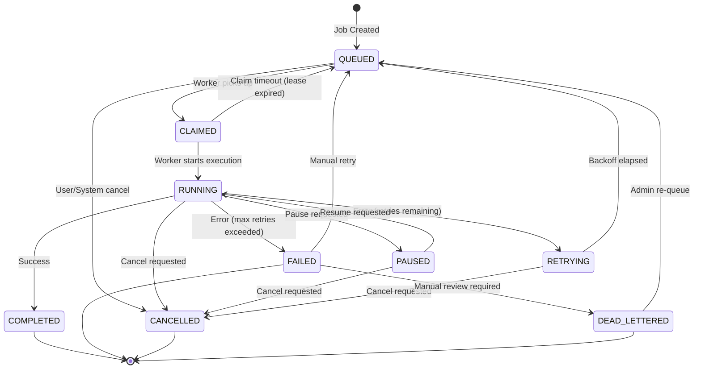
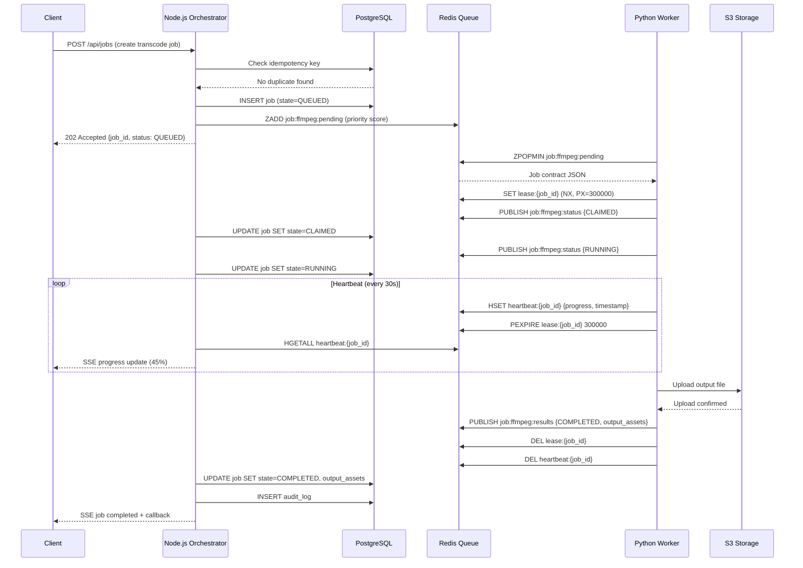

# Chương 8: Job và Worker Architecture

## Tổng quan

Hệ thống Aidilam sử dụng kiến trúc **durable async job** để xử lý các tác vụ nặng như transcoding video, transcription, OCR, download, translation và TTS. Kiến trúc này đảm bảo:

- **Durability**: Job không bị mất khi worker crash
- **Observability**: Theo dõi trạng thái job theo thời gian thực
- **Scalability**: Thay đổi concurrency mà không cần sửa source code
- **Reliability**: Tự động retry với exponential backoff
- **Idempotency**: Đảm bảo kết quả nhất quán khi retry

## Phân chia trách nhiệm

| Layer | Technology | Vai trò |
|-------|-----------|---------|
| Orchestrator | Node.js | Tạo job, monitor progress, handle callback |
| Queue | Redis (Bull/BullMQ) | Message broker, job persistence |
| Workers | Python | Xử lý tác vụ nặng (FFmpeg, AI models) |
| Storage | PostgreSQL | Job metadata, audit trail, configuration |

> **Quan trọng**: Python workers giao tiếp qua Redis queue + job contracts. Workers KHÔNG expose FastAPI endpoint. Node.js orchestrator là điểm duy nhất tạo và quản lý job.

---

## Job States

Mỗi job đi qua các trạng thái sau trong lifecycle:

| State | Mô tả |
|-------|--------|
| `QUEUED` | Job được tạo và chờ worker nhận |
| `CLAIMED` | Worker đã nhận job, chuẩn bị xử lý |
| `RUNNING` | Worker đang thực thi job |
| `PAUSED` | Job tạm dừng (do user hoặc system) |
| `RETRYING` | Job thất bại và đang chờ retry |
| `COMPLETED` | Job hoàn thành thành công |
| `FAILED` | Job thất bại sau khi hết retry attempts |
| `CANCELLED` | Job bị hủy bởi user hoặc system |
| `DEAD_LETTERED` | Job không thể xử lý, chuyển vào dead letter queue |

### State Machine Diagram



---

## Các khái niệm cốt lõi

### Idempotency Key

Mỗi job có một `idempotency_key` unique để đảm bảo:
- Không tạo duplicate job cho cùng một request
- Retry an toàn mà không gây side effects
- Format: `{job_type}:{resource_id}:{operation_hash}`

```
Ví dụ: ffmpeg:video_abc123:transcode_720p_h264
```

### Attempt Number

- Mỗi lần thực thi job tăng `attempt_number`
- Worker nhận biết đây là lần thử thứ mấy để điều chỉnh hành vi
- Metadata của mỗi attempt được lưu riêng cho audit

### Retry Policy

```json
{
  "max_attempts": 3,
  "backoff_type": "exponential",
  "base_delay_ms": 1000,
  "max_delay_ms": 60000,
  "multiplier": 2,
  "jitter": true,
  "retryable_errors": ["TIMEOUT", "TRANSIENT_ERROR", "RESOURCE_UNAVAILABLE"]
}
```

### Timeout

- **Execution timeout**: Thời gian tối đa worker được phép xử lý job
- **Claim timeout (Lease)**: Thời gian worker phải bắt đầu xử lý sau khi claim
- **Heartbeat timeout**: Khoảng thời gian tối đa giữa hai heartbeat

### Heartbeat

Worker gửi heartbeat định kỳ để chứng minh vẫn đang hoạt động:
- Interval mặc định: 30 giây
- Nếu miss 3 heartbeat liên tiếp → job được coi là orphaned
- Heartbeat kèm theo progress percentage

### Lease

- Khi worker claim job, một lease được cấp với thời hạn cụ thể
- Worker phải renew lease trước khi hết hạn
- Lease expired → job quay lại QUEUED để worker khác nhận

### Progress

- Worker báo cáo progress (0-100%) qua heartbeat
- Orchestrator forward progress tới client qua WebSocket/SSE
- Progress được persist để resume sau restart

### Cancellation

- User hoặc system gửi cancel request
- Worker kiểm tra cancellation flag tại các checkpoint
- Graceful shutdown: worker cleanup resources trước khi dừng

### Dependency Graph

Job có thể phụ thuộc vào job khác:
- `depends_on`: Danh sách job_id phải hoàn thành trước
- Job chỉ chuyển sang QUEUED khi tất cả dependencies COMPLETED
- Circular dependency được detect tại thời điểm tạo job

### Input/Output Asset References

```json
{
  "input_assets": [
    {"type": "video", "uri": "s3://bucket/raw/video_abc.mp4", "checksum": "sha256:..."}
  ],
  "output_assets": [
    {"type": "video", "uri": "s3://bucket/processed/video_abc_720p.mp4", "checksum": null}
  ]
}
```

### Sanitized Error

- Error messages được sanitize trước khi trả về client
- Internal stack traces chỉ lưu trong audit log
- Client nhận error code + user-friendly message

### Worker Capability

Mỗi worker đăng ký capabilities khi start:
- Loại job có thể xử lý
- Resource availability (GPU, RAM, disk)
- Version của tools (FFmpeg version, model version)

### Resource Class

Job được assign resource class để routing tới worker phù hợp:
- `gpu-heavy`: Transcoding, AI inference
- `cpu-intensive`: OCR, audio processing
- `io-bound`: Download, upload
- `memory-intensive`: Large file processing

### Priority

- Priority levels: `critical` (0), `high` (1), `normal` (2), `low` (3)
- Higher priority jobs được dequeue trước
- Priority có thể thay đổi runtime (priority boost/demotion)

### Audit Trail

Mọi state transition được ghi lại:
```json
{
  "job_id": "job_xyz789",
  "timestamp": "2026-07-23T13:00:00Z",
  "from_state": "RUNNING",
  "to_state": "COMPLETED",
  "actor": "worker:ffmpeg-01",
  "metadata": {"duration_ms": 45230, "output_size_bytes": 15728640}
}
```

---

## Worker Types và Concurrency Configuration

### Worker Registry

Các worker types và concurrency được quản lý qua **configuration** (database/environment), KHÔNG hardcode trong source:

| Worker Type | Default Concurrency | Resource Class | Mô tả |
|-------------|-------------------|----------------|--------|
| `ffmpeg` | 1 | gpu-heavy | Video/audio transcoding |
| `transcription` | 1 | gpu-heavy | Speech-to-text (Whisper) |
| `ocr` | 1 | cpu-intensive | Optical character recognition |
| `download` | 2 | io-bound | File download từ external sources |
| `translation` | 2 | cpu-intensive | Text translation (AI models) |
| `tts` | 2 | gpu-heavy | Text-to-speech synthesis |

### Configuration Schema (PostgreSQL)

```sql
CREATE TABLE worker_config (
    worker_type VARCHAR(50) PRIMARY KEY,
    max_concurrency INTEGER NOT NULL DEFAULT 1,
    resource_class VARCHAR(50) NOT NULL,
    heartbeat_interval_ms INTEGER NOT NULL DEFAULT 30000,
    lease_duration_ms INTEGER NOT NULL DEFAULT 300000,
    max_retry_attempts INTEGER NOT NULL DEFAULT 3,
    timeout_ms BIGINT NOT NULL DEFAULT 3600000,
    enabled BOOLEAN NOT NULL DEFAULT true,
    updated_at TIMESTAMP WITH TIME ZONE DEFAULT NOW(),
    updated_by VARCHAR(100)
);

-- Default values
INSERT INTO worker_config (worker_type, max_concurrency, resource_class) VALUES
('ffmpeg', 1, 'gpu-heavy'),
('transcription', 1, 'gpu-heavy'),
('ocr', 1, 'cpu-intensive'),
('download', 2, 'io-bound'),
('translation', 2, 'cpu-intensive'),
('tts', 2, 'gpu-heavy');
```

### Thay đổi Concurrency không cần sửa Source Code

Concurrency được điều chỉnh qua 3 cách (không cần redeploy):

**1. Database Update:**
```sql
-- Tăng concurrency cho download worker lên 4
UPDATE worker_config SET max_concurrency = 4 WHERE worker_type = 'download';
```

**2. Environment Variable Override:**
```bash
# Override cho deployment cụ thể
WORKER_FFMPEG_CONCURRENCY=2
WORKER_DOWNLOAD_CONCURRENCY=5
```

**3. Redis Config (hot reload):**
```bash
# Worker poll config mỗi 60s, apply ngay không cần restart
redis-cli SET "config:worker:ffmpeg:concurrency" "2"
redis-cli PUBLISH "config:reload" "worker:ffmpeg"
```

Worker tự động detect config change và scale up/down:
```python
# Worker pseudo-code cho hot reload
class WorkerManager:
    def __init__(self, worker_type: str):
        self.worker_type = worker_type
        self.config_poll_interval = 60  # seconds

    async def poll_config(self):
        """Poll config changes mỗi 60s"""
        while True:
            new_config = await self.fetch_config()
            if new_config.max_concurrency != self.current_concurrency:
                await self.scale_workers(new_config.max_concurrency)
            await asyncio.sleep(self.config_poll_interval)

    async def scale_workers(self, target: int):
        current = len(self.active_workers)
        if target > current:
            # Spawn thêm worker coroutines
            for _ in range(target - current):
                self.active_workers.append(asyncio.create_task(self.worker_loop()))
        elif target < current:
            # Gracefully stop excess workers (finish current job first)
            for _ in range(current - target):
                worker = self.active_workers.pop()
                worker.cancel()
```

---

## Communication Architecture

### Python Workers ↔ Redis Queue

Workers KHÔNG sử dụng FastAPI hay bất kỳ HTTP framework nào. Giao tiếp hoàn toàn qua Redis:

```
┌─────────────────┐     Redis Streams/Lists     ┌──────────────────┐
│  Node.js        │ ──── job:ffmpeg:pending ────▶│  Python Worker   │
│  Orchestrator   │ ◀─── job:ffmpeg:results ─────│  (FFmpeg)        │
│                 │ ◀─── job:ffmpeg:heartbeat ───│                  │
│                 │ ──── job:ffmpeg:cancel ──────▶│                  │
└─────────────────┘                              └──────────────────┘
```

### Redis Queue Naming Convention

```
job:{worker_type}:pending      # Jobs chờ xử lý (sorted set by priority)
job:{worker_type}:processing   # Jobs đang được xử lý
job:{worker_type}:results      # Kết quả từ worker
job:{worker_type}:heartbeat    # Heartbeat stream
job:{worker_type}:cancel       # Cancellation signals
job:{worker_type}:dead_letter  # Dead letter queue
```

### Node.js Orchestrator Responsibilities

```typescript
// Orchestrator tạo job
async function createJob(params: CreateJobParams): Promise<Job> {
  // 1. Check idempotency
  const existing = await checkIdempotencyKey(params.idempotencyKey);
  if (existing) return existing;

  // 2. Validate dependencies
  if (params.dependsOn?.length) {
    await validateNoCyclicDeps(params.dependsOn);
  }

  // 3. Persist job metadata
  const job = await db.jobs.create({
    id: generateId(),
    type: params.type,
    state: 'QUEUED',
    priority: params.priority ?? 2,
    idempotencyKey: params.idempotencyKey,
    inputAssets: params.inputAssets,
    retryPolicy: params.retryPolicy ?? getDefaultRetryPolicy(params.type),
    dependsOn: params.dependsOn ?? [],
    createdAt: new Date(),
  });

  // 4. Enqueue to Redis (only if no pending dependencies)
  if (!params.dependsOn?.length) {
    await redis.zadd(`job:${params.type}:pending`, job.priority, JSON.stringify(job.contract));
  }

  // 5. Audit trail
  await auditLog(job.id, null, 'QUEUED', 'orchestrator', params.metadata);

  return job;
}
```

---

## Job Contract Schema

Job contract là cấu trúc dữ liệu được truyền từ orchestrator tới worker qua Redis:

```json
{
  "job_id": "job_2026072313_abc123",
  "idempotency_key": "ffmpeg:video_xyz:transcode_720p",
  "type": "ffmpeg",
  "priority": 1,
  "attempt_number": 1,
  "max_attempts": 3,
  "created_at": "2026-07-23T13:00:00Z",
  "timeout_ms": 3600000,
  "heartbeat_interval_ms": 30000,
  "lease_duration_ms": 300000,

  "input_assets": [
    {
      "key": "source_video",
      "type": "video",
      "uri": "s3://aidilam-raw/uploads/video_xyz.mp4",
      "size_bytes": 524288000,
      "checksum": "sha256:a1b2c3d4..."
    }
  ],

  "output_assets": [
    {
      "key": "transcoded_video",
      "type": "video",
      "uri": "s3://aidilam-processed/videos/video_xyz_720p.mp4"
    }
  ],

  "params": {
    "resolution": "1280x720",
    "codec": "h264",
    "bitrate": "2500k",
    "audio_codec": "aac",
    "preset": "medium"
  },

  "retry_policy": {
    "max_attempts": 3,
    "backoff_type": "exponential",
    "base_delay_ms": 2000,
    "max_delay_ms": 120000,
    "multiplier": 2,
    "jitter": true
  },

  "depends_on": [],

  "metadata": {
    "user_id": "user_456",
    "project_id": "proj_789",
    "callback_url": null,
    "tags": ["batch-2026-07-23", "priority-high"]
  }
}
```

### Contract Validation

Worker validate contract trước khi xử lý:
```python
from pydantic import BaseModel, validator
from typing import List, Optional
from datetime import datetime

class AssetReference(BaseModel):
    key: str
    type: str  # video, audio, text, image
    uri: str
    size_bytes: Optional[int] = None
    checksum: Optional[str] = None

class RetryPolicy(BaseModel):
    max_attempts: int = 3
    backoff_type: str = "exponential"
    base_delay_ms: int = 1000
    max_delay_ms: int = 60000
    multiplier: float = 2.0
    jitter: bool = True

class JobContract(BaseModel):
    job_id: str
    idempotency_key: str
    type: str
    priority: int
    attempt_number: int
    max_attempts: int
    created_at: datetime
    timeout_ms: int
    heartbeat_interval_ms: int
    lease_duration_ms: int
    input_assets: List[AssetReference]
    output_assets: List[AssetReference]
    params: dict
    retry_policy: RetryPolicy
    depends_on: List[str] = []
    metadata: dict = {}

    @validator('priority')
    def validate_priority(cls, v):
        if v < 0 or v > 3:
            raise ValueError('Priority must be 0-3')
        return v
```

---

## Heartbeat Protocol

### Cơ chế hoạt động

```
Worker                          Redis                       Orchestrator
  │                               │                              │
  │─── HSET heartbeat:{job_id} ──▶│                              │
  │    {progress, timestamp,      │                              │
  │     worker_id, status}        │                              │
  │                               │◀── Poll heartbeat keys ──────│
  │                               │                              │
  │                               │─── Check last_heartbeat ────▶│
  │                               │    If stale > 3 intervals    │
  │                               │    → Mark job as orphaned    │
  │                               │                              │
```

### Heartbeat Payload

```json
{
  "job_id": "job_2026072313_abc123",
  "worker_id": "worker:ffmpeg-01:pid-12345",
  "timestamp": "2026-07-23T13:05:30Z",
  "progress_percent": 45,
  "progress_message": "Encoding frame 2700/6000",
  "memory_usage_mb": 1024,
  "cpu_percent": 85.5,
  "estimated_remaining_ms": 180000
}
```

### Worker Heartbeat Implementation

```python
import asyncio
import time
import redis.asyncio as redis

class HeartbeatManager:
    def __init__(self, redis_client: redis.Redis, job_id: str, worker_id: str, interval_ms: int):
        self.redis = redis_client
        self.job_id = job_id
        self.worker_id = worker_id
        self.interval = interval_ms / 1000.0
        self._task: Optional[asyncio.Task] = None
        self._progress = 0
        self._message = ""

    async def start(self):
        self._task = asyncio.create_task(self._heartbeat_loop())

    async def stop(self):
        if self._task:
            self._task.cancel()
            await asyncio.gather(self._task, return_exceptions=True)

    def update_progress(self, percent: int, message: str = ""):
        self._progress = percent
        self._message = message

    async def _heartbeat_loop(self):
        while True:
            payload = {
                "job_id": self.job_id,
                "worker_id": self.worker_id,
                "timestamp": time.time(),
                "progress_percent": self._progress,
                "progress_message": self._message,
            }
            await self.redis.hset(f"heartbeat:{self.job_id}", mapping=payload)
            await self.redis.expire(f"heartbeat:{self.job_id}", int(self.interval * 4))
            await asyncio.sleep(self.interval)
```

---

## Lease Renewal và Expiry

### Lease Mechanism

Lease đảm bảo chỉ một worker xử lý một job tại một thời điểm:

```python
class LeaseManager:
    def __init__(self, redis_client: redis.Redis, job_id: str, worker_id: str, duration_ms: int):
        self.redis = redis_client
        self.job_id = job_id
        self.worker_id = worker_id
        self.duration_ms = duration_ms
        self.lease_key = f"lease:{job_id}"

    async def acquire(self) -> bool:
        """Acquire lease với atomic SET NX EX"""
        result = await self.redis.set(
            self.lease_key,
            self.worker_id,
            nx=True,  # Only set if not exists
            px=self.duration_ms  # Expiry in milliseconds
        )
        return result is not None

    async def renew(self) -> bool:
        """Renew lease - chỉ thành công nếu worker vẫn own lease"""
        # Lua script đảm bảo atomicity
        lua_script = """
        if redis.call('get', KEYS[1]) == ARGV[1] then
            redis.call('pexpire', KEYS[1], ARGV[2])
            return 1
        end
        return 0
        """
        result = await self.redis.eval(lua_script, 1, self.lease_key, self.worker_id, self.duration_ms)
        return result == 1

    async def release(self) -> bool:
        """Release lease khi job hoàn thành"""
        lua_script = """
        if redis.call('get', KEYS[1]) == ARGV[1] then
            redis.call('del', KEYS[1])
            return 1
        end
        return 0
        """
        result = await self.redis.eval(lua_script, 1, self.lease_key, self.worker_id)
        return result == 1
```

### Lease Expiry Detection (Orchestrator)

```typescript
// Node.js orchestrator kiểm tra lease expired mỗi 10s
async function checkExpiredLeases(): Promise<void> {
  const processingJobs = await db.jobs.findMany({
    where: { state: { in: ['CLAIMED', 'RUNNING'] } }
  });

  for (const job of processingJobs) {
    const leaseExists = await redis.exists(`lease:${job.id}`);
    if (!leaseExists) {
      // Lease expired - worker có thể đã crash
      await transitionJob(job.id, job.state, 'QUEUED', 'system:lease-monitor', {
        reason: 'Lease expired, re-queuing job'
      });
    }
  }
}
```

---

## Dead Letter Handling

### Khi nào job vào Dead Letter Queue

Job được chuyển vào dead letter khi:
1. Vượt quá `max_attempts` và vẫn fail
2. Error không thuộc danh sách retryable
3. Job contract không hợp lệ (schema validation failed)
4. Worker báo "permanent failure" (e.g., file corrupted)
5. Job stuck quá lâu mà không có progress

### Dead Letter Queue Structure

```json
{
  "job_id": "job_2026072313_abc123",
  "original_queue": "job:ffmpeg:pending",
  "dead_lettered_at": "2026-07-23T14:30:00Z",
  "reason": "MAX_RETRIES_EXCEEDED",
  "total_attempts": 3,
  "last_error": {
    "code": "TRANSCODE_FAILED",
    "message": "Output file validation failed: duration mismatch",
    "sanitized_message": "Video processing failed. Please try again or contact support.",
    "stack_trace": "[internal - only visible in admin panel]"
  },
  "resolution_options": ["RETRY", "MODIFY_AND_RETRY", "DISCARD", "MANUAL_PROCESS"]
}
```

### Admin Operations trên Dead Letter

```typescript
// Re-queue job từ dead letter (với optional param override)
async function reprocessDeadLetter(jobId: string, overrides?: Partial<JobParams>): Promise<void> {
  const dlJob = await redis.hgetall(`dead_letter:${jobId}`);

  // Reset attempt counter, apply overrides
  const updatedContract = {
    ...JSON.parse(dlJob.contract),
    attempt_number: 0,
    ...(overrides?.params && { params: { ...JSON.parse(dlJob.contract).params, ...overrides.params } })
  };

  await db.jobs.update({ where: { id: jobId }, data: { state: 'QUEUED', attempts: 0 } });
  await redis.zrem(`job:${dlJob.type}:dead_letter`, jobId);
  await redis.zadd(`job:${dlJob.type}:pending`, updatedContract.priority, JSON.stringify(updatedContract));
  await auditLog(jobId, 'DEAD_LETTERED', 'QUEUED', 'admin', { action: 'reprocess' });
}
```

---

## Retry với Exponential Backoff

### Công thức tính delay

```
delay = min(base_delay * multiplier^(attempt - 1), max_delay)
if jitter:
    delay = delay * random(0.5, 1.5)
```

### Ví dụ với default config

| Attempt | Base Delay | Calculated | With Jitter (range) |
|---------|-----------|------------|---------------------|
| 1 | 1000ms | 1000ms | 500-1500ms |
| 2 | 1000ms | 2000ms | 1000-3000ms |
| 3 | 1000ms | 4000ms | 2000-6000ms |
| 4 | 1000ms | 8000ms | 4000-12000ms |
| 5 | 1000ms | 16000ms | 8000-24000ms |

### Implementation

```python
import random
import asyncio

class RetryScheduler:
    def __init__(self, policy: RetryPolicy):
        self.policy = policy

    def calculate_delay(self, attempt: int) -> float:
        """Tính delay cho attempt tiếp theo (milliseconds)"""
        delay = self.policy.base_delay_ms * (self.policy.multiplier ** (attempt - 1))
        delay = min(delay, self.policy.max_delay_ms)

        if self.policy.jitter:
            jitter_factor = random.uniform(0.5, 1.5)
            delay *= jitter_factor

        return delay

    async def schedule_retry(self, job_id: str, attempt: int, redis_client):
        """Schedule retry sau delay period"""
        delay_ms = self.calculate_delay(attempt)
        retry_at = time.time() + (delay_ms / 1000.0)

        # Dùng Redis sorted set với score = retry_at timestamp
        await redis_client.zadd("job:retry:scheduled", {job_id: retry_at})
```

---

## Job Lifecycle Sequence Diagram



---

## Error Handling và Sanitization

### Error Flow

```python
class WorkerErrorHandler:
    # Error codes có thể retry
    RETRYABLE_ERRORS = {
        "TIMEOUT", "TRANSIENT_ERROR", "RESOURCE_UNAVAILABLE",
        "NETWORK_ERROR", "RATE_LIMITED", "STORAGE_TEMPORARY_ERROR"
    }

    # Error codes permanent (đưa vào dead letter)
    PERMANENT_ERRORS = {
        "INVALID_INPUT", "CORRUPTED_FILE", "UNSUPPORTED_FORMAT",
        "PERMISSION_DENIED", "CONTRACT_VALIDATION_FAILED"
    }

    async def handle_error(self, job_id: str, error: Exception, attempt: int, max_attempts: int):
        error_code = self.classify_error(error)
        sanitized_msg = self.sanitize_error_message(error)

        if error_code in self.PERMANENT_ERRORS:
            await self.report_failure(job_id, error_code, sanitized_msg, permanent=True)
        elif attempt >= max_attempts:
            await self.report_failure(job_id, error_code, sanitized_msg, permanent=False)
        elif error_code in self.RETRYABLE_ERRORS:
            await self.report_retry(job_id, error_code, sanitized_msg, attempt)
        else:
            await self.report_failure(job_id, error_code, sanitized_msg, permanent=True)

    def sanitize_error_message(self, error: Exception) -> str:
        """Loại bỏ thông tin nhạy cảm khỏi error message"""
        msg = str(error)
        # Remove file paths, IPs, credentials
        msg = re.sub(r'/[\w/]+\.[\w]+', '[FILE_PATH]', msg)
        msg = re.sub(r'\d+\.\d+\.\d+\.\d+', '[IP_ADDRESS]', msg)
        msg = re.sub(r'(key|token|password|secret)=\S+', r'\1=[REDACTED]', msg, flags=re.I)
        return msg[:500]  # Truncate to 500 chars max
```

---

## Monitoring và Observability

### Metrics được thu thập

| Metric | Type | Mô tả |
|--------|------|--------|
| `job_total` | Counter | Tổng số job theo type và state |
| `job_duration_seconds` | Histogram | Thời gian xử lý job |
| `job_retry_count` | Counter | Số lần retry |
| `job_dead_letter_total` | Counter | Số job vào dead letter |
| `worker_heartbeat_age_seconds` | Gauge | Tuổi heartbeat gần nhất |
| `worker_active_count` | Gauge | Số worker đang hoạt động |
| `queue_depth` | Gauge | Số job trong queue theo type |

### Health Check

```python
async def worker_health_check() -> dict:
    return {
        "worker_id": WORKER_ID,
        "worker_type": WORKER_TYPE,
        "status": "healthy",
        "active_jobs": len(active_jobs),
        "uptime_seconds": time.time() - start_time,
        "redis_connected": await redis.ping(),
        "last_job_completed_at": last_completion_time,
        "config_version": current_config_version,
    }
```

---

## Tóm tắt Architectural Decisions

| Decision | Rationale |
|----------|-----------|
| Redis queue (không HTTP) | Low latency, native pub/sub, atomic operations |
| Node.js orchestrator | Event-driven, excellent for I/O coordination |
| Python workers | Rich ML/media processing ecosystem |
| Config-driven concurrency | Scale without deploy, adapt to load |
| Lease-based claiming | Prevent duplicate processing after crash |
| Heartbeat protocol | Detect orphaned jobs proactively |
| Idempotency keys | Safe retry without side effects |
| Sanitized errors | Security - no internal details leaked to client |
| Dead letter queue | No job silently disappears |
| Audit trail | Full traceability for debugging and compliance |
