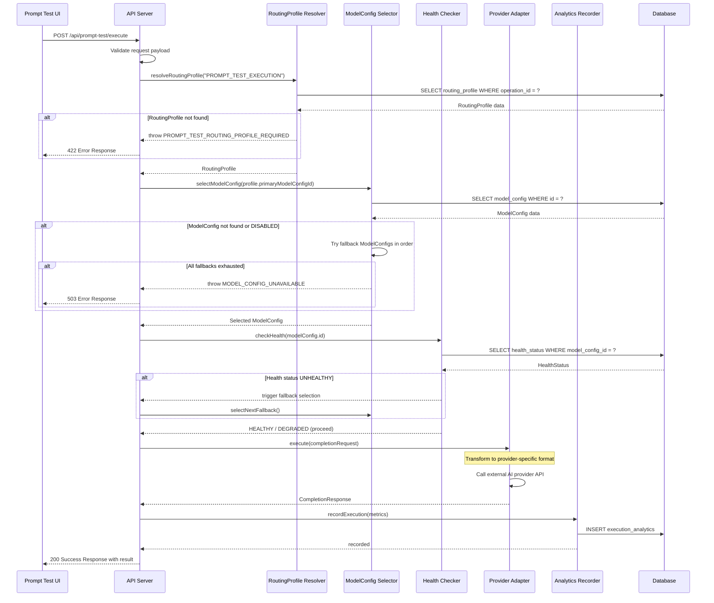

# Chương 9: AI Runtime Architecture

> **Phiên bản:** 1.0
> **Cập nhật lần cuối:** 2026-07-23
> **Tác giả:** Architecture Team

---

## Mục Lục

1. [Tổng Quan](#tổng-quan)
2. [Nguyên Tắc Thiết Kế](#nguyên-tắc-thiết-kế)
3. [Ba Sub-System Chính](#ba-sub-system-chính)
4. [Model Governance](#model-governance)
5. [Prompt Governance](#prompt-governance)
6. [AI Routing](#ai-routing)
7. [Provider-Neutral Design](#provider-neutral-design)
8. [Operation-Based Routing](#operation-based-routing)
9. [Sequence Diagram: PROMPT_TEST_EXECUTION](#sequence-diagram-prompt_test_execution)
10. [Interface Definitions](#interface-definitions)
11. [Error Codes](#error-codes)
12. [Cache Invalidation Strategy](#cache-invalidation-strategy)
13. [Kết Luận](#kết-luận)

---

## Tổng Quan

AI Runtime Architecture là tầng trung gian (middleware layer) chịu trách nhiệm quản lý toàn bộ
vòng đời tương tác với các AI provider bên ngoài. Tầng này đảm bảo rằng application code
không bao giờ phụ thuộc trực tiếp vào bất kỳ provider SDK cụ thể nào.

Kiến trúc được thiết kế theo nguyên tắc **provider-neutral**: mọi model, provider, và configuration
đều được resolve từ database tại runtime — không có bất kỳ giá trị nào được hardcode trong source code.

### Vị Trí Trong Hệ Thống

```
┌─────────────────────────────────────────────┐
│           Application Layer                  │
│  (Prompt Test, Content Gen, Analysis...)     │
├─────────────────────────────────────────────┤
│           AI Runtime Layer                   │  ← Chương này
│  ┌───────────┬──────────────┬────────────┐  │
│  │  Model    │   Prompt     │    AI      │  │
│  │Governance │  Governance  │  Routing   │  │
│  └───────────┴──────────────┴────────────┘  │
├─────────────────────────────────────────────┤
│        Provider Adapters                     │
│  (OpenAI, Anthropic, Google, Azure...)       │
├─────────────────────────────────────────────┤
│        External AI Services                  │
└─────────────────────────────────────────────┘
```

---

## Nguyên Tắc Thiết Kế

### 1. Provider-Neutral (Trung Lập Với Provider)

Application code chỉ tương tác với abstract interfaces. Không import trực tiếp SDK
của bất kỳ provider nào trong business logic layer.

### 2. Database-Driven Configuration

Mọi model configuration, routing profile, và provider settings đều được lưu trữ
trong database và resolve tại runtime. Điều này cho phép thay đổi provider/model
mà không cần deploy lại ứng dụng.

### 3. Fail-Closed

Khi thiếu configuration hoặc routing profile — hệ thống trả về error rõ ràng,
**không bao giờ** silent fallback sang một model/provider không được cấu hình.

### 4. Adapter Pattern

Mỗi provider được implement thông qua một adapter riêng biệt, tuân thủ
interface chung. Thêm provider mới = thêm adapter mới, không ảnh hưởng
đến application code.

### 5. Observability

Mọi AI operation đều được ghi nhận analytics: latency, token usage, cost,
success/failure rate.

---

## Ba Sub-System Chính

AI Runtime Layer bao gồm ba sub-system hoạt động phối hợp:

| Sub-System | Trách Nhiệm | Dữ Liệu Chính |
|---|---|---|
| **Model Governance** | Quản lý provider registry, model config, health check | `ModelConfig`, `ProviderRegistry` |
| **Prompt Governance** | Quản lý templates, versions, checksums | `PromptTemplate`, `PromptVersion` |
| **AI Routing** | Điều phối routing dựa trên operation, profiles | `RoutingProfile`, `ModelRouter` |

---

## Model Governance

### Provider Registry

Provider Registry là bảng đăng ký tập trung cho tất cả AI provider được hệ thống hỗ trợ.
Mỗi provider entry bao gồm:

- **Provider ID**: Định danh duy nhất (e.g., `openai`, `anthropic`, `google`)
- **Display Name**: Tên hiển thị cho admin UI
- **Base URL**: Endpoint chính của provider API
- **Auth Strategy**: Phương thức xác thực (API key, OAuth, etc.)
- **Rate Limits**: Giới hạn request theo provider plan
- **Status**: `ACTIVE`, `DEGRADED`, `DISABLED`

### ModelConfig

ModelConfig là đơn vị cấu hình cốt lõi, đại diện cho một model cụ thể
từ một provider cụ thể với các parameter đã được định nghĩa:

```typescript
interface ModelConfig {
  id: string;                    // UUID
  providerId: string;            // Reference to ProviderRegistry
  modelIdentifier: string;       // e.g., "gpt-4o", "claude-sonnet-4-20250514"
  displayName: string;
  version: string;
  parameters: ModelParameters;
  costPerInputToken: number;
  costPerOutputToken: number;
  maxContextWindow: number;
  status: ModelStatus;           // ACTIVE | DEPRECATED | DISABLED
  healthCheck: HealthConfig;
  createdAt: DateTime;
  updatedAt: DateTime;
}

interface ModelParameters {
  temperature: number;
  maxTokens: number;
  topP: number;
  frequencyPenalty?: number;
  presencePenalty?: number;
  stopSequences?: string[];
}

type ModelStatus = 'ACTIVE' | 'DEPRECATED' | 'DISABLED';
```

### Health Check

Hệ thống health check giám sát liên tục trạng thái của mỗi ModelConfig:

- **Periodic Ping**: Gửi lightweight request định kỳ (mỗi 60 giây)
- **Response Time Tracking**: Theo dõi p50, p95, p99 latency
- **Error Rate Monitoring**: Tính toán error rate trong sliding window (5 phút)
- **Circuit Breaker**: Tự động đánh dấu model là `DEGRADED` khi error rate > threshold

```typescript
interface HealthConfig {
  enabled: boolean;
  intervalSeconds: number;
  timeoutMs: number;
  degradedThreshold: number;     // Error rate % to mark DEGRADED
  disabledThreshold: number;     // Error rate % to mark DISABLED
  consecutiveFailures: number;   // Failures before circuit opens
}

interface HealthStatus {
  modelConfigId: string;
  status: 'HEALTHY' | 'DEGRADED' | 'UNHEALTHY';
  lastCheckAt: DateTime;
  latencyP50Ms: number;
  latencyP95Ms: number;
  errorRatePercent: number;
  consecutiveFailures: number;
}
```

---

## Prompt Governance

### Tổng Quan

Prompt Governance quản lý vòng đời của prompt templates — từ creation, versioning,
cho đến deployment. Mỗi prompt template được version-control với checksum integrity
để đảm bảo không có unauthorized modification.

### Prompt Template

```typescript
interface PromptTemplate {
  id: string;                    // UUID
  operationId: string;           // AI operation this prompt belongs to
  name: string;
  description: string;
  category: PromptCategory;
  status: PromptStatus;
  currentVersionId: string;      // Reference to active PromptVersion
  createdBy: string;
  createdAt: DateTime;
  updatedAt: DateTime;
}

type PromptCategory = 'SYSTEM' | 'USER' | 'COMPOSITE';
type PromptStatus = 'DRAFT' | 'ACTIVE' | 'ARCHIVED';
```

### Prompt Version

Mỗi thay đổi nội dung prompt tạo ra một version mới. Version cũ được giữ lại
để hỗ trợ rollback và audit trail.

```typescript
interface PromptVersion {
  id: string;                    // UUID
  templateId: string;            // Reference to PromptTemplate
  versionNumber: number;         // Auto-increment per template
  content: string;               // Actual prompt content with variables
  variables: PromptVariable[];   // Declared variables in template
  checksum: string;              // SHA-256 hash of content
  changelog: string;             // Mô tả thay đổi
  publishedAt: DateTime | null;
  createdBy: string;
  createdAt: DateTime;
}

interface PromptVariable {
  name: string;                  // Variable name (e.g., "userInput")
  type: 'string' | 'number' | 'boolean' | 'object';
  required: boolean;
  defaultValue?: unknown;
  description: string;
}
```

### Checksum Integrity

Mỗi PromptVersion lưu trữ checksum (SHA-256) của nội dung prompt. Tại runtime,
trước khi sử dụng prompt, hệ thống verify checksum để đảm bảo:

1. Prompt content không bị modify ngoài quy trình chuẩn
2. Cache không bị stale hoặc corrupted
3. Audit trail chính xác

```typescript
function verifyPromptIntegrity(version: PromptVersion): boolean {
  const computedChecksum = sha256(version.content);
  if (computedChecksum !== version.checksum) {
    throw new PromptIntegrityError(
      `Checksum mismatch for prompt version ${version.id}. ` +
      `Expected: ${version.checksum}, Got: ${computedChecksum}`
    );
  }
  return true;
}
```

### Version Resolution

Khi một AI operation cần prompt, hệ thống resolve theo thứ tự:

1. Tìm `PromptTemplate` theo `operationId`
2. Lấy `currentVersionId` từ template
3. Load `PromptVersion` tương ứng
4. Verify checksum integrity
5. Render template với runtime variables


---

## AI Routing

### Operation-Based Routing

Mỗi AI operation trong hệ thống (e.g., `PROMPT_TEST_EXECUTION`, `CONTENT_GENERATION`,
`SENTIMENT_ANALYSIS`) được map đến một **RoutingProfile**. RoutingProfile định nghĩa
chiến lược routing cho operation đó.

### RoutingProfile

```typescript
interface RoutingProfile {
  id: string;                        // UUID
  operationId: string;               // Unique operation identifier
  name: string;
  description: string;
  primaryModelConfigId: string;      // Primary model to use
  fallbackModelConfigIds: string[];  // Ordered list of fallback models
  routingStrategy: RoutingStrategy;
  maxRetries: number;
  timeoutMs: number;
  failurePolicy: FailurePolicy;
  metadata: Record<string, unknown>;
  isActive: boolean;
  createdAt: DateTime;
  updatedAt: DateTime;
}

type RoutingStrategy = 'PRIMARY_WITH_FALLBACK' | 'ROUND_ROBIN' | 'COST_OPTIMIZED' | 'LATENCY_OPTIMIZED';
type FailurePolicy = 'FAIL_CLOSED' | 'DEGRADE_GRACEFULLY';
```

### Luồng Routing

```
AI Operation Request
       │
       ▼
┌──────────────────┐
│ Resolve Routing  │ ← Tìm RoutingProfile theo operationId
│     Profile      │
└───────┬──────────┘
        │
        ▼
┌──────────────────┐
│ Select Primary   │ ← Lấy primaryModelConfigId
│   ModelConfig    │
└───────┬──────────┘
        │
        ▼
┌──────────────────┐
│  Check Health    │ ← Kiểm tra HealthStatus
│    Status        │
└───────┬──────────┘
        │
   ┌────┴────┐
   │HEALTHY? │
   └────┬────┘
    Yes │    No
        │     └──► Try fallback ModelConfigs (theo thứ tự)
        ▼
┌──────────────────┐
│ Execute via      │ ← Gọi provider adapter tương ứng
│ Provider Adapter │
└───────┬──────────┘
        │
        ▼
┌──────────────────┐
│ Record Analytics │ ← Log metrics, token usage, cost
└───────┬──────────┘
        │
        ▼
    Return Result
```

### Fail-Closed Policy

**Nguyên tắc quan trọng nhất**: Khi không tìm thấy RoutingProfile hoặc ModelConfig,
hệ thống **PHẢI** trả về error rõ ràng. Không bao giờ:

- Silent fallback sang model mặc định
- Sử dụng hardcoded provider
- Bỏ qua lỗi và trả về kết quả rỗng

```typescript
function resolveRoutingProfile(operationId: string): RoutingProfile {
  const profile = routingProfileRepository.findByOperationId(operationId);

  if (!profile) {
    throw new RoutingError({
      code: 'ROUTING_PROFILE_NOT_FOUND',
      message: `No routing profile configured for operation: ${operationId}`,
      operationId,
      severity: 'CRITICAL'
    });
  }

  if (!profile.isActive) {
    throw new RoutingError({
      code: 'ROUTING_PROFILE_INACTIVE',
      message: `Routing profile for operation ${operationId} is inactive`,
      operationId,
      severity: 'ERROR'
    });
  }

  return profile;
}
```

---

## Provider-Neutral Design

### Abstract Interface Layer

Application code chỉ phụ thuộc vào abstract interfaces. Điều này đạt được
thông qua Adapter Pattern:

```typescript
// Abstract interface — application code depends on THIS only
interface AIProviderAdapter {
  readonly providerId: string;
  readonly providerName: string;

  complete(request: CompletionRequest): Promise<CompletionResponse>;
  stream(request: CompletionRequest): AsyncGenerator<StreamChunk>;
  checkHealth(): Promise<HealthCheckResult>;
  estimateCost(request: CompletionRequest): CostEstimate;
}

interface CompletionRequest {
  modelIdentifier: string;
  messages: Message[];
  parameters: ModelParameters;
  metadata: RequestMetadata;
}

interface CompletionResponse {
  id: string;
  content: string;
  usage: TokenUsage;
  finishReason: FinishReason;
  latencyMs: number;
  metadata: ResponseMetadata;
}

interface TokenUsage {
  promptTokens: number;
  completionTokens: number;
  totalTokens: number;
}

type FinishReason = 'COMPLETE' | 'MAX_TOKENS' | 'STOP_SEQUENCE' | 'ERROR';
```

### Adapter Registry

```typescript
interface AdapterRegistry {
  register(providerId: string, adapter: AIProviderAdapter): void;
  resolve(providerId: string): AIProviderAdapter;
  listRegistered(): string[];
  isRegistered(providerId: string): boolean;
}

// Concrete implementation example
class OpenAIAdapter implements AIProviderAdapter {
  readonly providerId = 'openai';
  readonly providerName = 'OpenAI';

  constructor(private config: OpenAIProviderConfig) {}

  async complete(request: CompletionRequest): Promise<CompletionResponse> {
    // Transform abstract request → OpenAI-specific API call
    // Transform OpenAI response → abstract CompletionResponse
  }

  async *stream(request: CompletionRequest): AsyncGenerator<StreamChunk> {
    // OpenAI streaming implementation
  }

  async checkHealth(): Promise<HealthCheckResult> {
    // Lightweight health check ping
  }

  estimateCost(request: CompletionRequest): CostEstimate {
    // Calculate based on model pricing
  }
}
```

### Lợi Ích Của Provider-Neutral Design

| Lợi ích | Mô tả |
|---------|--------|
| **Swap provider** | Thay đổi provider chỉ cần update database, không cần code change |
| **Multi-provider** | Sử dụng nhiều provider đồng thời cho các operation khác nhau |
| **Testing** | Dễ dàng mock adapter cho unit testing |
| **Cost optimization** | Chuyển traffic giữa providers dựa trên cost/performance |
| **Vendor lock-in** | Loại bỏ hoàn toàn vendor lock-in |


---

## Sequence Diagram: PROMPT_TEST_EXECUTION

Dưới đây là luồng hoàn chỉnh khi user thực hiện Prompt Test từ UI:



### Giải Thích Luồng

1. **Request Validation**: Server validate payload (prompt content, variables, etc.)
2. **Routing Resolution**: Tìm RoutingProfile cho operation `PROMPT_TEST_EXECUTION`
3. **Model Selection**: Chọn primary ModelConfig, fallback nếu primary unavailable
4. **Health Verification**: Kiểm tra model có healthy trước khi gọi
5. **Execution**: Gọi provider adapter với request đã được transform
6. **Analytics**: Ghi nhận toàn bộ metrics (latency, tokens, cost, status)
7. **Response**: Trả kết quả về UI

---

## Interface Definitions

### Model Router

```typescript
interface ModelRouter {
  route(request: RoutingRequest): Promise<RoutingDecision>;
  getActiveProfiles(): Promise<RoutingProfile[]>;
  invalidateCache(operationId?: string): void;
}

interface RoutingRequest {
  operationId: string;
  priority?: 'LOW' | 'NORMAL' | 'HIGH' | 'CRITICAL';
  constraints?: RoutingConstraints;
}

interface RoutingConstraints {
  maxLatencyMs?: number;
  maxCostPerRequest?: number;
  requiredCapabilities?: string[];   // e.g., ['vision', 'function_calling']
  excludeProviders?: string[];
}

interface RoutingDecision {
  selectedModelConfig: ModelConfig;
  routingProfile: RoutingProfile;
  reason: string;                    // Why this model was selected
  fallbacksAvailable: number;
  estimatedCost: CostEstimate;
}
```

### Execution Service

```typescript
interface AIExecutionService {
  execute(request: ExecutionRequest): Promise<ExecutionResult>;
  executeWithRetry(request: ExecutionRequest, maxRetries: number): Promise<ExecutionResult>;
  estimateCost(request: ExecutionRequest): Promise<CostEstimate>;
}

interface ExecutionRequest {
  operationId: string;
  promptVersionId: string;
  variables: Record<string, unknown>;
  overrides?: Partial<ModelParameters>;
  metadata: ExecutionMetadata;
}

interface ExecutionResult {
  id: string;                        // Execution trace ID
  content: string;
  modelConfigId: string;
  providerId: string;
  usage: TokenUsage;
  cost: CostBreakdown;
  latencyMs: number;
  attempts: number;                  // How many attempts (including retries)
  routingDecision: RoutingDecision;
}

interface CostBreakdown {
  inputCost: number;
  outputCost: number;
  totalCost: number;
  currency: 'USD';
}
```

### Analytics Interface

```typescript
interface ExecutionAnalytics {
  executionId: string;
  operationId: string;
  modelConfigId: string;
  providerId: string;
  promptVersionId: string;
  status: 'SUCCESS' | 'FAILURE' | 'TIMEOUT' | 'RATE_LIMITED';
  latencyMs: number;
  tokenUsage: TokenUsage;
  cost: CostBreakdown;
  errorCode?: string;
  errorMessage?: string;
  timestamp: DateTime;
  traceId: string;
}
```

---

## Error Codes

Hệ thống sử dụng error codes có cấu trúc rõ ràng để hỗ trợ debugging và monitoring:

### Routing Errors

| Error Code | HTTP Status | Mô Tả |
|---|---|---|
| `PROMPT_TEST_ROUTING_PROFILE_REQUIRED` | 422 | Không tìm thấy RoutingProfile cho operation PROMPT_TEST_EXECUTION |
| `ROUTING_PROFILE_NOT_FOUND` | 422 | RoutingProfile không tồn tại cho operationId được chỉ định |
| `ROUTING_PROFILE_INACTIVE` | 422 | RoutingProfile tồn tại nhưng đang inactive |
| `MODEL_CONFIG_UNAVAILABLE` | 503 | Tất cả ModelConfig (primary + fallbacks) đều unavailable |
| `MODEL_CONFIG_NOT_FOUND` | 404 | ModelConfig ID được reference không tồn tại trong database |
| `PROVIDER_ADAPTER_NOT_REGISTERED` | 500 | Không tìm thấy adapter cho provider ID trong registry |

### Health Errors

| Error Code | HTTP Status | Mô Tả |
|---|---|---|
| `MODEL_HEALTH_UNHEALTHY` | 503 | Model đang trong trạng thái UNHEALTHY |
| `MODEL_HEALTH_CHECK_TIMEOUT` | 504 | Health check không phản hồi trong thời gian cho phép |
| `ALL_MODELS_DEGRADED` | 503 | Tất cả models trong routing profile đang degraded |

### Prompt Errors

| Error Code | HTTP Status | Mô Tả |
|---|---|---|
| `PROMPT_TEMPLATE_NOT_FOUND` | 404 | Không tìm thấy PromptTemplate cho operation |
| `PROMPT_VERSION_NOT_FOUND` | 404 | PromptVersion không tồn tại |
| `PROMPT_CHECKSUM_MISMATCH` | 500 | Nội dung prompt bị corrupt hoặc bị thay đổi ngoài hệ thống |
| `PROMPT_VARIABLE_MISSING` | 400 | Thiếu required variable khi render prompt |
| `PROMPT_VARIABLE_TYPE_MISMATCH` | 400 | Variable type không khớp với declaration |

### Execution Errors

| Error Code | HTTP Status | Mô Tả |
|---|---|---|
| `EXECUTION_TIMEOUT` | 504 | Request vượt quá timeoutMs trong RoutingProfile |
| `EXECUTION_RATE_LIMITED` | 429 | Provider trả về rate limit error |
| `EXECUTION_MAX_RETRIES_EXCEEDED` | 503 | Đã hết số lần retry cho phép |
| `EXECUTION_CONTENT_FILTERED` | 400 | Provider từ chối content do safety filter |

### Error Response Format

```typescript
interface AIRuntimeError {
  code: string;                      // Error code from tables above
  message: string;                   // Human-readable message
  operationId: string;               // Which operation failed
  severity: 'WARNING' | 'ERROR' | 'CRITICAL';
  timestamp: DateTime;
  traceId: string;                   // For correlation with logs
  context?: Record<string, unknown>; // Additional debug info
  retryable: boolean;                // Client có thể retry không
  retryAfterMs?: number;             // Nếu retryable, đợi bao lâu
}
```

---

## Cache Invalidation Strategy

### Tổng Quan Cache

Để tối ưu performance, AI Runtime Layer cache các dữ liệu ít thay đổi:

| Loại Cache | TTL | Key Pattern | Dữ Liệu |
|---|---|---|---|
| RoutingProfile | 5 phút | `routing:profile:{operationId}` | RoutingProfile object |
| ModelConfig | 5 phút | `model:config:{id}` | ModelConfig object |
| HealthStatus | 30 giây | `health:{modelConfigId}` | HealthStatus object |
| PromptVersion | 10 phút | `prompt:version:{id}` | PromptVersion object |
| ProviderRegistry | 15 phút | `provider:{providerId}` | Provider metadata |

### Chiến Lược Invalidation

#### 1. TTL-Based Expiration (Passive)

Mỗi cache entry có TTL cố định. Khi hết hạn, request tiếp theo sẽ
fetch dữ liệu mới từ database.

#### 2. Event-Driven Invalidation (Active)

Khi admin thay đổi configuration qua Admin UI, hệ thống phát event
để invalidate cache ngay lập tức:

```typescript
interface CacheInvalidationEvent {
  type: 'ROUTING_PROFILE_UPDATED'
      | 'MODEL_CONFIG_UPDATED'
      | 'PROMPT_VERSION_PUBLISHED'
      | 'PROVIDER_STATUS_CHANGED'
      | 'HEALTH_STATUS_CHANGED';
  entityId: string;
  operationId?: string;
  timestamp: DateTime;
  triggeredBy: string;              // Admin user ID
}

// Cache invalidation handler
class AICacheManager {
  private cache: CacheStore;

  async handleInvalidationEvent(event: CacheInvalidationEvent): Promise<void> {
    switch (event.type) {
      case 'ROUTING_PROFILE_UPDATED':
        await this.cache.delete(`routing:profile:${event.operationId}`);
        break;

      case 'MODEL_CONFIG_UPDATED':
        await this.cache.delete(`model:config:${event.entityId}`);
        // Also invalidate any routing profile referencing this model
        await this.invalidateRelatedProfiles(event.entityId);
        break;

      case 'PROMPT_VERSION_PUBLISHED':
        await this.cache.delete(`prompt:version:${event.entityId}`);
        break;

      case 'PROVIDER_STATUS_CHANGED':
        await this.cache.delete(`provider:${event.entityId}`);
        // Invalidate all model configs for this provider
        await this.invalidateProviderModels(event.entityId);
        break;

      case 'HEALTH_STATUS_CHANGED':
        await this.cache.delete(`health:${event.entityId}`);
        break;
    }
  }

  private async invalidateRelatedProfiles(modelConfigId: string): Promise<void> {
    const affectedProfiles = await this.findProfilesUsingModel(modelConfigId);
    for (const profile of affectedProfiles) {
      await this.cache.delete(`routing:profile:${profile.operationId}`);
    }
  }

  private async invalidateProviderModels(providerId: string): Promise<void> {
    const models = await this.findModelsByProvider(providerId);
    for (const model of models) {
      await this.cache.delete(`model:config:${model.id}`);
    }
  }
}
```

#### 3. Cascade Invalidation

Khi một entity thay đổi, tất cả entities phụ thuộc cũng cần được invalidate:

```
Provider Status Changed
    └── All ModelConfigs of provider → invalidate
        └── All RoutingProfiles referencing those models → invalidate

ModelConfig Updated
    └── All RoutingProfiles referencing this model → invalidate
    └── HealthStatus of this model → invalidate

PromptVersion Published
    └── PromptTemplate's currentVersionId → update reference
    └── Old cached version → invalidate
```

#### 4. Cache Warming

Sau khi invalidate, hệ thống có thể proactively warm cache cho
critical operations:

```typescript
async function warmCriticalCaches(): Promise<void> {
  const criticalOperations = [
    'PROMPT_TEST_EXECUTION',
    'CONTENT_GENERATION',
    'REAL_TIME_ANALYSIS'
  ];

  for (const opId of criticalOperations) {
    const profile = await routingProfileRepo.findByOperationId(opId);
    if (profile) {
      await cache.set(`routing:profile:${opId}`, profile, TTL_5_MINUTES);

      const modelConfig = await modelConfigRepo.findById(profile.primaryModelConfigId);
      if (modelConfig) {
        await cache.set(`model:config:${modelConfig.id}`, modelConfig, TTL_5_MINUTES);
      }
    }
  }
}
```

### Consistency Guarantees

- **Eventual Consistency**: Cache có thể stale tối đa bằng TTL
- **Strong Consistency cho Admin Actions**: Event-driven invalidation đảm bảo
  admin changes reflect trong vài giây
- **Health Data**: TTL ngắn (30s) đảm bảo routing decisions dựa trên near-realtime data

---

## Kết Luận

AI Runtime Architecture cung cấp nền tảng vững chắc cho mọi AI operation trong hệ thống:

1. **Model Governance** đảm bảo quản lý chặt chẽ provider và model configuration
   với health monitoring liên tục.

2. **Prompt Governance** bảo vệ tính toàn vẹn của prompt templates thông qua
   versioning và checksum verification.

3. **AI Routing** cung cấp cơ chế routing linh hoạt, operation-based với
   fail-closed policy nghiêm ngặt.

Thiết kế provider-neutral với Adapter Pattern cho phép hệ thống mở rộng
sang bất kỳ AI provider nào mà không ảnh hưởng đến application code.
Mọi configuration được resolve từ database, cho phép thay đổi runtime behavior
mà không cần redeploy.

---

> **Tài liệu liên quan:**
> - Chương 8: Database Architecture
> - Chương 10: Security & Authentication
> - Chương 11: Observability & Monitoring
