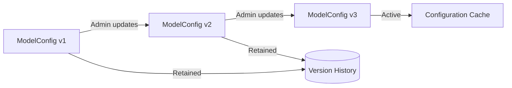
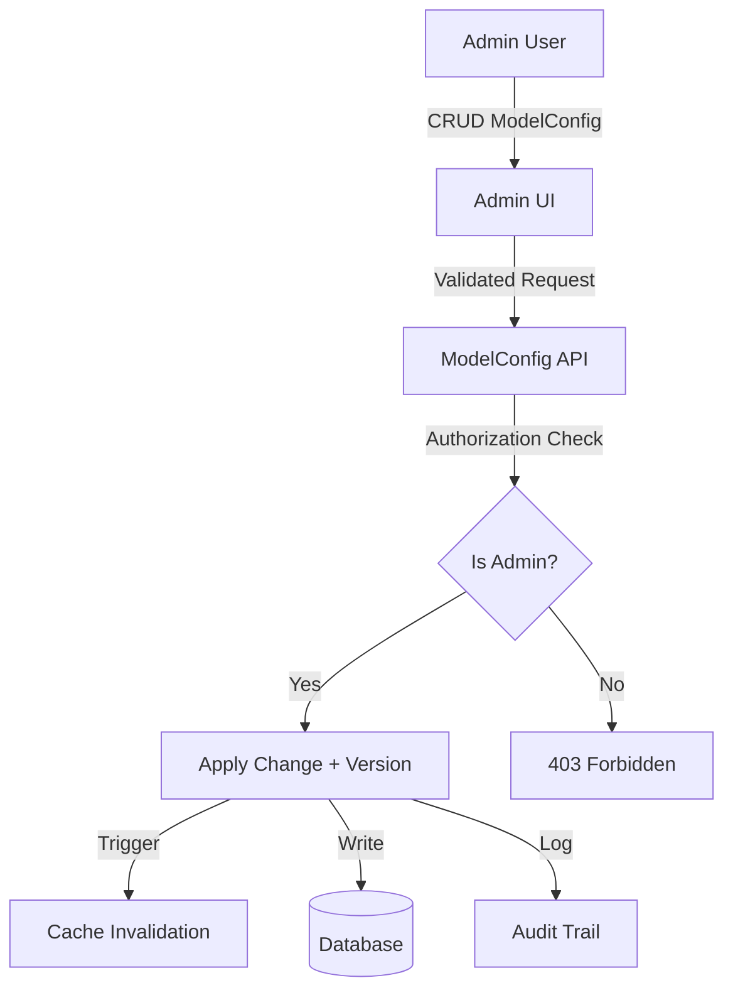
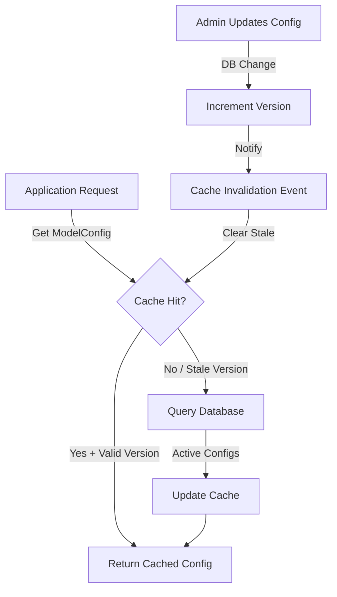
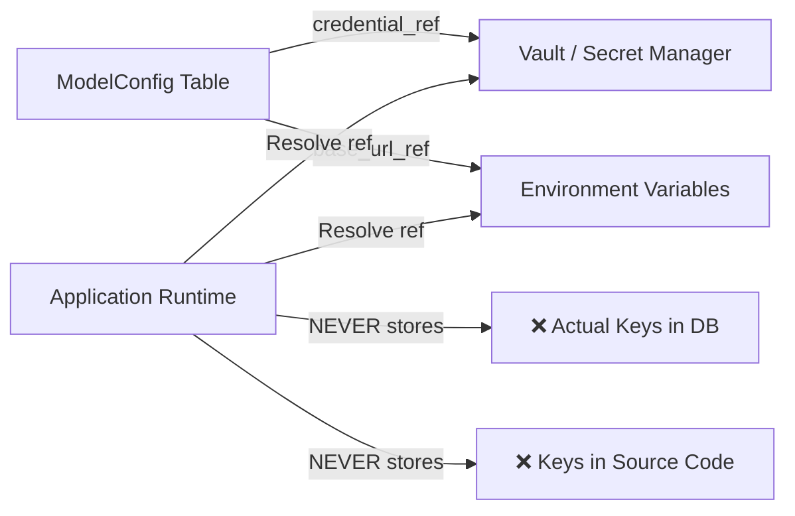
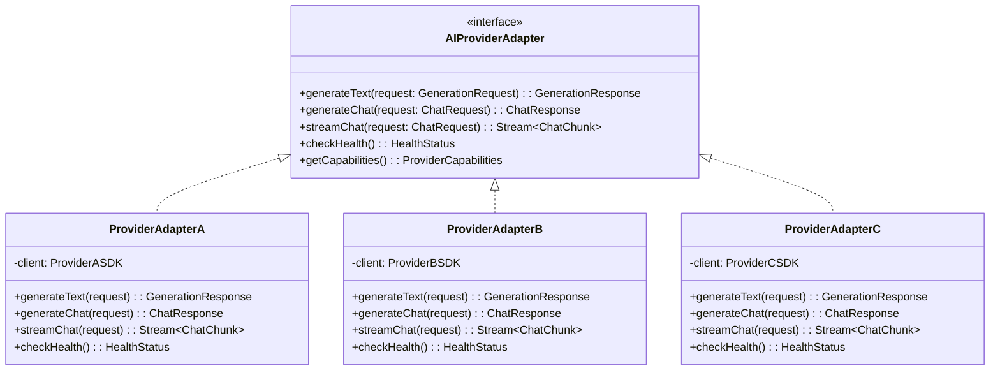
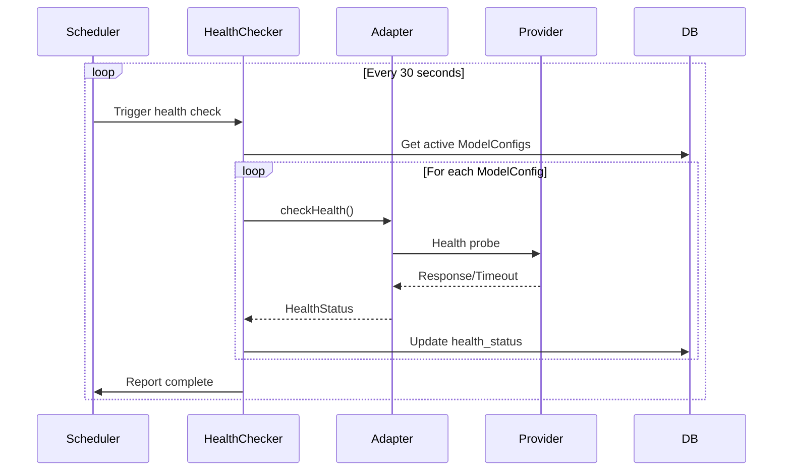
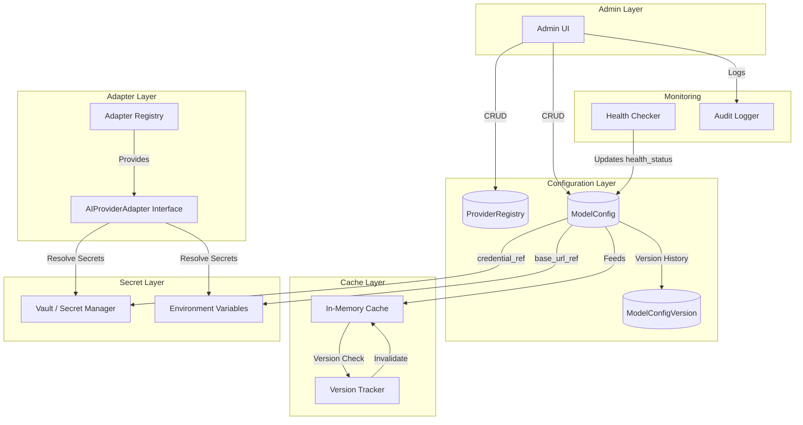

# 10. Model Governance Architecture

## Tổng quan

Model Governance là kiến trúc quản trị toàn bộ vòng đời của AI model configurations trong hệ thống AIĐiLàm. Kiến trúc này đảm bảo rằng **không có model name, provider endpoint, hay API key nào được hardcode trong source code**. Mọi cấu hình model đều được quản lý thông qua database, Admin UI, và hệ thống cache có khả năng invalidation tự động.

### Nguyên tắc cốt lõi

| # | Nguyên tắc | Mô tả |
|---|-----------|--------|
| 1 | **Zero Hardcode** | Không hardcode model names, provider endpoints, API keys trong source code |
| 2 | **Database-Driven** | Mọi cấu hình model là database entity, thay đổi qua Admin UI |
| 3 | **Secret Isolation** | Chỉ lưu credential references, secrets thực tế nằm trong vault/env |
| 4 | **Versioned Config** | Mọi thay đổi tạo version mới, versions cũ được giữ lại |
| 5 | **Adapter Pattern** | Provider SDKs đứng sau neutral adapter interfaces |
| 6 | **Cache with Invalidation** | In-memory cache với version-aware invalidation |
| 7 | **Health Monitoring** | Kiểm tra sức khỏe định kỳ trên configured models |

---

## Provider Registry

Provider Registry là bảng đăng ký các AI providers được hệ thống hỗ trợ. Registry lưu trữ metadata về capabilities và credential references — **KHÔNG BAO GIỜ lưu actual API keys**.

### Provider Registry Schema

```
┌─────────────────────────────────────────────────────┐
│                   ProviderRegistry                    │
├─────────────────────────────────────────────────────┤
│ id              : UUID (PK)                          │
│ provider_code   : VARCHAR(50) UNIQUE                 │
│ display_name    : VARCHAR(255)                       │
│ base_url_ref    : VARCHAR(255) → env/vault key       │
│ credential_ref  : VARCHAR(255) → vault secret path   │
│ capabilities    : JSONB (supported features)         │
│ sdk_adapter_class: VARCHAR(255) → adapter impl       │
│ is_active       : BOOLEAN                            │
│ health_endpoint : VARCHAR(500) → env/vault ref       │
│ rate_limits     : JSONB                              │
│ created_at      : TIMESTAMP                          │
│ updated_at      : TIMESTAMP                          │
└─────────────────────────────────────────────────────┘
```

### Capabilities JSONB Structure

```json
{
  "text_generation": true,
  "chat_completion": true,
  "embedding": true,
  "image_generation": false,
  "function_calling": true,
  "streaming": true,
  "vision": true,
  "max_models_supported": null
}
```

### Credential References (NOT Actual Keys)

| Field | Mô tả | Ví dụ giá trị |
|-------|--------|----------------|
| `base_url_ref` | Tham chiếu đến biến môi trường hoặc vault path chứa base URL | `vault://ai-providers/provider-a/base-url` |
| `credential_ref` | Tham chiếu đến vault secret chứa API key | `vault://ai-providers/provider-a/api-key` |
| `health_endpoint` | Tham chiếu đến health check URL | `env://PROVIDER_A_HEALTH_URL` |

> ⚠️ **NGHIÊM CẤM**: Lưu trữ actual API keys, tokens, passwords trong bảng ProviderRegistry hoặc bất kỳ bảng nào khác trong database.

---

## ModelConfig Entity

ModelConfig là database entity đại diện cho một specific model deployment. Đây là đơn vị cấu hình trung tâm mà hệ thống routing sử dụng để xác định model nào sẽ xử lý request.

### ModelConfig Schema

| Field | Type | Mô tả |
|-------|------|--------|
| `id` | UUID (PK) | Định danh duy nhất |
| `provider_id` | UUID (FK → ProviderRegistry) | Tham chiếu provider |
| `model_identifier` | VARCHAR(255) | Identifier của model tại provider (ví dụ: tên model từ provider API) |
| `display_name` | VARCHAR(255) | Tên hiển thị thân thiện cho Admin UI |
| `capabilities` | JSONB | Khả năng cụ thể của model này |
| `context_window` | INTEGER | Kích thước context window (tokens) |
| `max_output_tokens` | INTEGER | Số token output tối đa |
| `default_temperature` | DECIMAL(3,2) | Temperature mặc định |
| `default_max_tokens` | INTEGER | Max tokens mặc định cho generation |
| `cost_per_input_token` | DECIMAL(12,10) | Chi phí mỗi input token |
| `cost_per_output_token` | DECIMAL(12,10) | Chi phí mỗi output token |
| `data_classification_level` | VARCHAR(50) | Mức phân loại dữ liệu (PUBLIC/INTERNAL/CONFIDENTIAL) |
| `health_status` | VARCHAR(20) | Trạng thái sức khỏe (HEALTHY/DEGRADED/UNHEALTHY/UNKNOWN) |
| `is_active` | BOOLEAN | Có đang active không |
| `version` | INTEGER | Version number, tăng mỗi khi có thay đổi |
| `created_at` | TIMESTAMP | Thời điểm tạo |
| `updated_at` | TIMESTAMP | Thời điểm cập nhật cuối |

### Ví dụ ModelConfig Record

```json
{
  "id": "mc-uuid-001",
  "provider_id": "pr-uuid-001",
  "model_identifier": "configured-via-admin-ui",
  "display_name": "Primary Text Generation Model",
  "capabilities": {
    "text_generation": true,
    "chat_completion": true,
    "function_calling": true,
    "streaming": true
  },
  "context_window": 128000,
  "max_output_tokens": 4096,
  "default_temperature": 0.7,
  "default_max_tokens": 2048,
  "cost_per_input_token": 0.000003,
  "cost_per_output_token": 0.000015,
  "data_classification_level": "INTERNAL",
  "health_status": "HEALTHY",
  "is_active": true,
  "version": 3,
  "created_at": "2026-01-15T10:00:00Z",
  "updated_at": "2026-07-20T14:30:00Z"
}
```

---

## ModelConfig Versioning

Mỗi thay đổi trên ModelConfig tạo ra version mới. Versions cũ được giữ lại để đảm bảo audit trail và khả năng rollback.



### ModelConfigVersion Schema

```
┌─────────────────────────────────────────────────────┐
│               ModelConfigVersion                      │
├─────────────────────────────────────────────────────┤
│ id              : UUID (PK)                          │
│ model_config_id : UUID (FK → ModelConfig)            │
│ version         : INTEGER                            │
│ snapshot        : JSONB (full config at this version)│
│ changed_by      : UUID (FK → User, Admin only)      │
│ change_reason   : TEXT                               │
│ created_at      : TIMESTAMP                          │
└─────────────────────────────────────────────────────┘
```

### Quy trình Versioning

1. Admin thay đổi ModelConfig qua Admin UI
2. Hệ thống tạo snapshot của config hiện tại → lưu vào `ModelConfigVersion`
3. Áp dụng thay đổi lên `ModelConfig`, tăng `version` field
4. Trigger cache invalidation
5. Ghi audit log

---

## Admin UI Ownership

**Chỉ có Admin** mới có quyền tạo, sửa, xóa (soft delete) ModelConfig. Không có API endpoint nào cho phép non-Admin thay đổi model configurations.



### Permission Matrix

| Action | Admin | Editor | Viewer |
|--------|-------|--------|--------|
| View ModelConfig list | ✅ | ✅ | ✅ |
| View ModelConfig details | ✅ | ✅ | ❌ |
| Create ModelConfig | ✅ | ❌ | ❌ |
| Update ModelConfig | ✅ | ❌ | ❌ |
| Deactivate ModelConfig | ✅ | ❌ | ❌ |
| View Version History | ✅ | ❌ | ❌ |
| Rollback to Version | ✅ | ❌ | ❌ |

---

## Configuration Cache

Hệ thống sử dụng in-memory cache để giảm database load. Cache chứa **chỉ active ModelConfigs** và được invalidate khi có thay đổi trong database.



### Cache Strategy

| Aspect | Implementation |
|--------|---------------|
| Cache Type | In-memory (application-level) |
| Cache Key | `model_config:{id}` và `model_configs:active:list` |
| TTL | Configurable, default 60 seconds max |
| Invalidation | Version-aware + event-driven |
| Consistency | Eventually consistent (bounded staleness) |
| Warm-up | On application start, load all active configs |

### Cache Invalidation Mechanisms

#### Option A: Database Trigger + Notification

```
DB Change → PostgreSQL NOTIFY → Application Listener → Invalidate Cache
```

#### Option B: Polling with Version Comparison

```
Polling Loop (every N seconds):
  1. Query: SELECT MAX(version) FROM model_config WHERE is_active = true
  2. Compare with cached_max_version
  3. If different → reload affected configs
  4. Update cached_max_version
```

#### Version-Aware Invalidation Logic

```
function getModelConfig(id):
  cached = cache.get(id)
  if cached AND cached.version == db.getVersion(id):
    return cached
  else:
    fresh = db.getModelConfig(id)
    cache.set(id, fresh)
    return fresh
```

---

## Secret Isolation

Kiến trúc tách biệt hoàn toàn giữa configuration data và secrets. ModelConfig table **KHÔNG BAO GIỜ** chứa actual credentials.



### Secret Resolution Flow

| Step | Action | Mô tả |
|------|--------|--------|
| 1 | Load ModelConfig | Đọc config từ DB/cache (chỉ có references) |
| 2 | Resolve credential_ref | Gọi vault/secret manager để lấy actual secret |
| 3 | Resolve base_url_ref | Đọc từ environment variable hoặc vault |
| 4 | Inject to Adapter | Truyền secrets vào adapter instance (runtime only) |
| 5 | Execute Request | Adapter sử dụng secrets để gọi provider API |
| 6 | Discard Secrets | Secrets không được cache hoặc log |

### Supported Secret Backends

| Backend | Reference Format | Ví dụ |
|---------|-----------------|-------|
| HashiCorp Vault | `vault://path/to/secret` | `vault://ai-providers/provider-a/api-key` |
| AWS Secrets Manager | `aws-sm://secret-name` | `aws-sm://aidilam/provider-a-key` |
| Environment Variable | `env://VARIABLE_NAME` | `env://AI_PROVIDER_A_API_KEY` |
| Azure Key Vault | `azure-kv://vault/secret` | `azure-kv://aidilam-vault/provider-a` |

---

## Provider SDKs Behind Adapters

Mọi provider SDK được wrap bởi `AIProviderAdapter` interface. Application code **CHỈ** interact với neutral interface, không bao giờ trực tiếp với provider-specific SDK.



### GenerationRequest (Neutral)

```json
{
  "prompt": "string",
  "max_tokens": 2048,
  "temperature": 0.7,
  "stop_sequences": [],
  "metadata": {
    "operation": "PROMPT_TEST_EXECUTION",
    "actor_id": "user-uuid",
    "trace_id": "trace-uuid"
  }
}
```

### Adapter Registry

Adapters được đăng ký dynamically dựa trên `sdk_adapter_class` trong ProviderRegistry:

```
Application Start:
  1. Load active ProviderRegistry entries from DB
  2. For each entry, instantiate adapter class from sdk_adapter_class field
  3. Resolve credentials via credential_ref
  4. Register adapter instance in AdapterRegistry
  5. AdapterRegistry provides adapter lookup by provider_id
```

---

## Health Monitoring

Hệ thống thực hiện periodic health checks trên tất cả configured models để detect degradation sớm.



### Health Status Values

| Status | Mô tả | Routing Impact |
|--------|--------|----------------|
| `HEALTHY` | Model phản hồi bình thường, latency trong ngưỡng | Eligible for routing |
| `DEGRADED` | Model phản hồi nhưng chậm hoặc có lỗi intermittent | Lower priority, still eligible |
| `UNHEALTHY` | Model không phản hồi hoặc trả lỗi liên tục | Excluded from routing |
| `UNKNOWN` | Chưa check hoặc health check failed | Treated as DEGRADED |

### Health Check Configuration

| Parameter | Default | Mô tả |
|-----------|---------|--------|
| `check_interval_seconds` | 30 | Khoảng cách giữa các lần check |
| `timeout_ms` | 5000 | Timeout cho mỗi health probe |
| `unhealthy_threshold` | 3 | Số lần fail liên tiếp để đánh dấu UNHEALTHY |
| `recovery_threshold` | 2 | Số lần success liên tiếp để recovery từ UNHEALTHY |
| `degraded_latency_ms` | 3000 | Latency threshold để đánh dấu DEGRADED |

---

## Forbidden Practices

Các hành vi sau đây **BỊ CẤM TUYỆT ĐỐI** trong codebase:

### ❌ Hardcoding Model Names

```typescript
// ❌ NGHIÊM CẤM - KHÔNG BAO GIỜ LÀM ĐIỀU NÀY
const model = "gpt-4o";
const model = "claude-3-sonnet";
const model = "gemini-pro";
```

### ❌ Hardcoding Provider Endpoints

```typescript
// ❌ NGHIÊM CẤM
const endpoint = "https://api.openai.com/v1";
const endpoint = "https://api.anthropic.com";
```

### ❌ Hardcoding API Keys

```typescript
// ❌ NGHIÊM CẤM
const apiKey = "sk-...";
const apiKey = process.env.OPENAI_API_KEY; // Trực tiếp trong business logic
```

### ✅ Cách đúng

```typescript
// ✅ ĐÚNG - Resolve từ database config + vault
const modelConfig = await modelConfigCache.getActive(modelConfigId);
const adapter = adapterRegistry.getAdapter(modelConfig.provider_id);
const credentials = await secretResolver.resolve(modelConfig.credential_ref);
const response = await adapter.generateText(request, credentials);
```

---

## Kiến trúc tổng thể



---

## Seed Defaults

Seed defaults (giá trị mặc định khởi tạo) **CHỈ** tồn tại dưới dạng editable DB config:

| Quy tắc | Mô tả |
|----------|--------|
| Clearly Marked | Seed defaults phải được đánh dấu rõ ràng là "seed/initial" |
| Editable via Admin UI | Mọi seed default có thể thay đổi qua Admin UI |
| Never Unconditional Fallback | Seed default KHÔNG BAO GIỜ là unconditional runtime fallback |
| Replaceable | Admin có thể thay thế bằng config khác bất kỳ lúc nào |
| No App Restart | Thay đổi seed default không yêu cầu restart application |

### Final Controls

```
runtimeModelHardcodeCount = 0
runtimeProviderHardcodeCount = 0
uiModelHardcodeCount = 0
uiProviderHardcodeCount = 0
```

> Mọi static analysis check phải confirm zero hardcoded model/provider references trong runtime code và UI code.

---

## Tóm tắt

Model Governance architecture đảm bảo:
1. **Mọi model config là database entity** — không hardcode
2. **Secrets tách biệt** — chỉ references trong DB
3. **Versioning đầy đủ** — audit trail cho mọi thay đổi
4. **Cache hiệu quả** — version-aware invalidation
5. **Adapter pattern** — neutral interface, pluggable providers
6. **Health monitoring** — tự động detect và exclude unhealthy models
7. **Admin-only control** — chỉ Admin quản lý configurations
