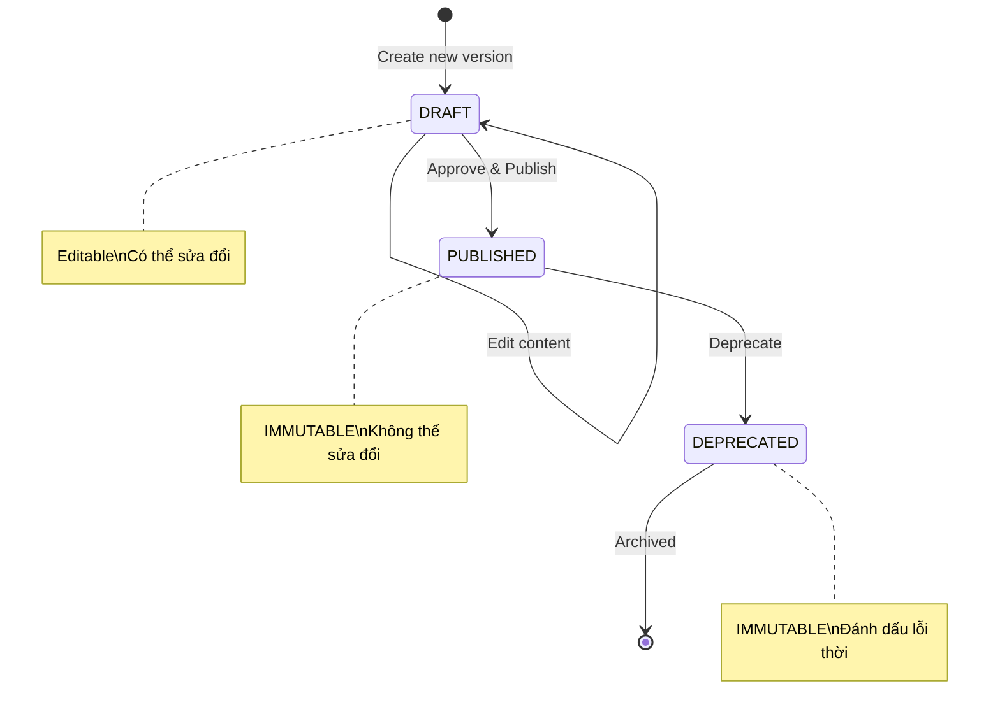
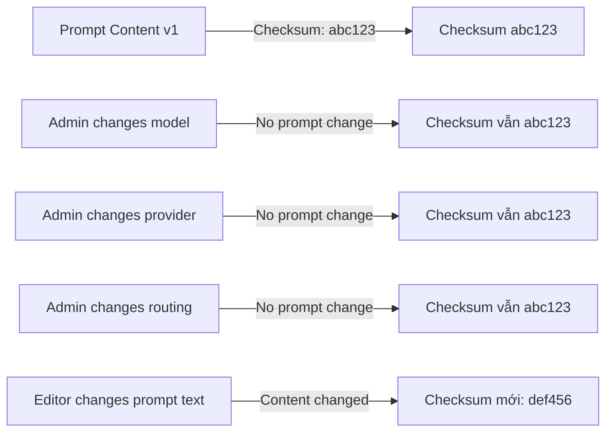
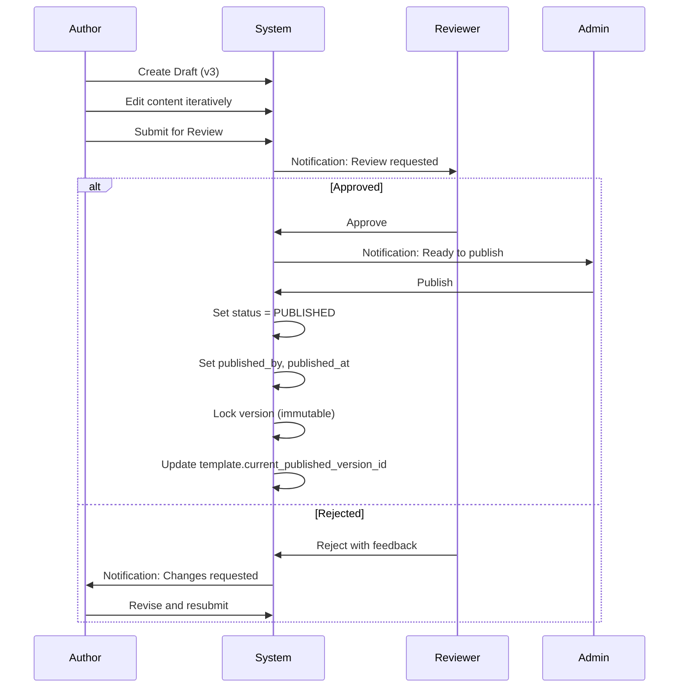
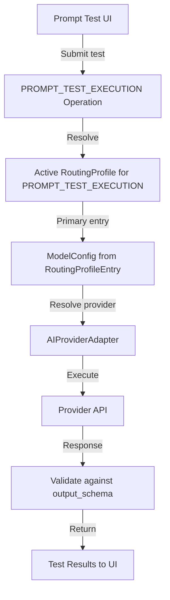
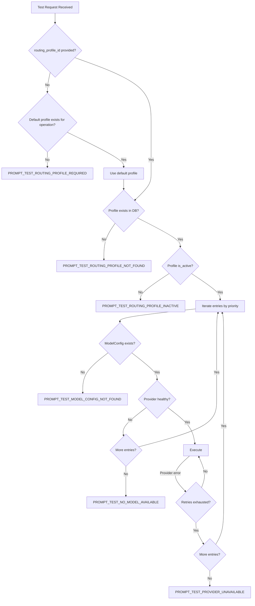
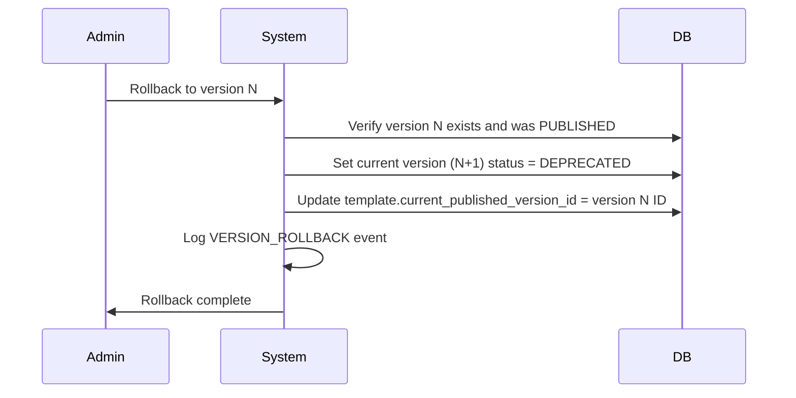
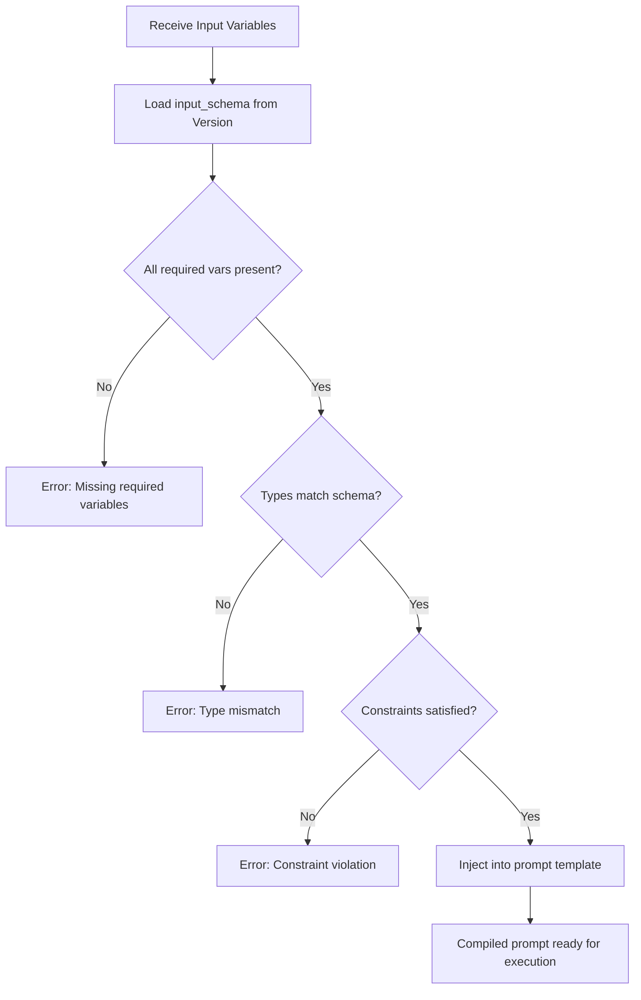
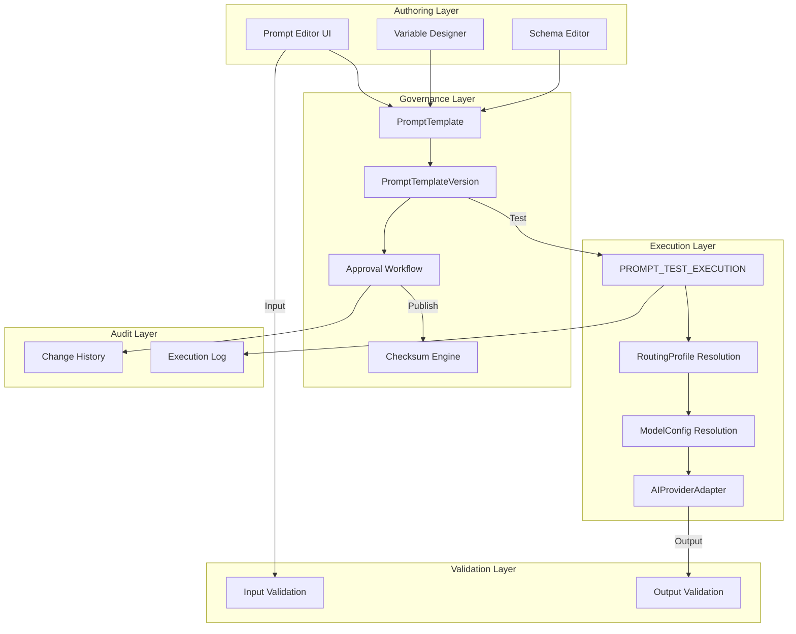

# 11. Prompt Governance Architecture

## Tổng quan

Prompt Governance quản lý toàn bộ vòng đời của prompt templates trong AIĐiLàm. Kiến trúc này đảm bảo prompt content được versioned, immutable sau khi publish, có audit trail đầy đủ, và **hoàn toàn tách biệt khỏi model/provider configuration**.

### Nguyên tắc cốt lõi

| # | Nguyên tắc | Mô tả |
|---|-----------|--------|
| 1 | **Immutable After Publish** | PromptTemplateVersion không thể sửa đổi sau khi Published |
| 2 | **Checksum Integrity** | Checksum tính ONLY từ prompt instructions + schemas |
| 3 | **Model Independence** | Prompt không chứa/phụ thuộc model name hay provider |
| 4 | **Version Everything** | Mọi thay đổi tạo version mới với full history |
| 5 | **Approval Workflow** | Publish yêu cầu review và approval |
| 6 | **Routing via Operation** | Test execution thông qua RoutingProfile, KHÔNG trực tiếp chỉ định model |
| 7 | **Typed Variables** | Variables được validate theo input_schema |

---

## PromptTemplate Entity

PromptTemplate là named container cho các versions của một prompt cụ thể.

### PromptTemplate Schema

| Field | Type | Mô tả |
|-------|------|--------|
| `id` | UUID (PK) | Định danh duy nhất |
| `name` | VARCHAR(255) UNIQUE | Tên template (machine-readable) |
| `display_name` | VARCHAR(500) | Tên hiển thị thân thiện |
| `purpose` | TEXT | Mô tả mục đích sử dụng |
| `category` | VARCHAR(100) | Danh mục (SEO, Translation, Summary, etc.) |
| `input_schema` | JSONB | Schema cho input variables |
| `output_schema` | JSONB | Schema cho expected output |
| `variables` | JSONB | Danh sách biến với type definitions |
| `owner_id` | UUID (FK → User) | Người tạo/sở hữu template |
| `is_active` | BOOLEAN | Template có đang active không |
| `current_published_version_id` | UUID (FK → PromptTemplateVersion) | Version đang active |
| `created_at` | TIMESTAMP | Thời điểm tạo |
| `updated_at` | TIMESTAMP | Thời điểm cập nhật cuối |

### Ví dụ PromptTemplate

```json
{
  "id": "pt-uuid-001",
  "name": "seo_meta_description_generator",
  "display_name": "SEO Meta Description Generator",
  "purpose": "Generate SEO-optimized meta descriptions for blog posts",
  "category": "SEO",
  "input_schema": {
    "type": "object",
    "properties": {
      "title": { "type": "string", "maxLength": 200 },
      "content_summary": { "type": "string", "maxLength": 1000 },
      "target_keywords": { "type": "array", "items": { "type": "string" } },
      "language": { "type": "string", "enum": ["vi", "en", "ja"] }
    },
    "required": ["title", "content_summary", "target_keywords"]
  },
  "output_schema": {
    "type": "object",
    "properties": {
      "meta_description": { "type": "string", "maxLength": 160 },
      "confidence_score": { "type": "number", "minimum": 0, "maximum": 1 }
    },
    "required": ["meta_description"]
  },
  "variables": [
    { "name": "title", "type": "string", "required": true },
    { "name": "content_summary", "type": "string", "required": true },
    { "name": "target_keywords", "type": "array", "required": true },
    { "name": "language", "type": "string", "required": false, "default": "vi" }
  ]
}
```

---

## PromptTemplateVersion Entity

PromptTemplateVersion là immutable snapshot của prompt content tại một thời điểm cụ thể. **Một khi Published, KHÔNG THỂ sửa đổi.**

### PromptTemplateVersion Schema

| Field | Type | Mô tả |
|-------|------|--------|
| `id` | UUID (PK) | Định danh duy nhất |
| `template_id` | UUID (FK → PromptTemplate) | Template cha |
| `version_number` | INTEGER | Số version, tăng dần |
| `status` | ENUM | `DRAFT` / `PUBLISHED` / `DEPRECATED` |
| `content` | TEXT | Prompt instructions (nội dung prompt chính) |
| `input_schema` | JSONB | Schema cho input tại version này |
| `output_schema` | JSONB | Schema cho output tại version này |
| `variables` | JSONB | Biến được sử dụng trong version này |
| `checksum` | VARCHAR(64) | SHA-256 checksum của canonical content |
| `created_by` | UUID (FK → User) | Người tạo draft |
| `published_by` | UUID (FK → User) | Người approve và publish |
| `published_at` | TIMESTAMP | Thời điểm publish |
| `deprecated_at` | TIMESTAMP | Thời điểm deprecate |
| `deprecated_by` | UUID (FK → User) | Người deprecate |
| `change_notes` | TEXT | Ghi chú thay đổi |
| `created_at` | TIMESTAMP | Thời điểm tạo |

### Status Lifecycle



---

## Checksum Calculation

Checksum là cơ chế đảm bảo tính toàn vẹn của prompt content. Checksum được tính **CHỈ** từ canonical prompt instructions và schemas.

### Included in Checksum (✅)

| Component | Mô tả |
|-----------|--------|
| `content` | Canonical prompt instructions |
| `input_schema` | Normalized input schema JSON |
| `output_schema` | Normalized output schema JSON |
| `variables` | Variable definitions |

### Excluded from Checksum (❌)

| Component | Lý do loại trừ |
|-----------|----------------|
| ModelConfig | Model có thể thay đổi mà không ảnh hưởng prompt logic |
| Provider | Provider là runtime concern, không phải prompt concern |
| Model name/identifier | Prompt logic không phụ thuộc model cụ thể |
| RoutingProfile | Routing là runtime resolution |
| Generation parameters | Temperature, max_tokens là tuning params |
| Credentials | Security concern, không liên quan prompt content |
| Runtime metadata | Timestamps, actor info, execution context |

### Checksum Algorithm

```
function calculateChecksum(version):
  canonical = normalize({
    content: version.content,
    input_schema: sortKeys(version.input_schema),
    output_schema: sortKeys(version.output_schema),
    variables: sortByName(version.variables)
  })
  return SHA256(JSON.stringify(canonical))
```

### Tại sao Checksum KHÔNG bao gồm Model/Provider?



> **Nguyên tắc**: Thay đổi model/provider/routing KHÔNG BAO GIỜ thay đổi prompt checksum. Chỉ thay đổi actual prompt content mới tạo checksum mới.

---

## Draft vs Published Lifecycle

### Draft Phase

| Aspect | Behavior |
|--------|----------|
| Editability | Có thể sửa `content`, `input_schema`, `output_schema`, `variables` |
| Testing | Có thể test execution thông qua PROMPT_TEST_EXECUTION |
| Visibility | Chỉ creator và reviewers thấy |
| Checksum | Tính lại mỗi khi save |
| Impact | Không ảnh hưởng production |

### Published Phase

| Aspect | Behavior |
|--------|----------|
| Editability | **IMMUTABLE** — không thể sửa bất kỳ field nào |
| Usage | Có thể được sử dụng bởi production operations |
| Visibility | Toàn bộ team thấy |
| Checksum | Cố định vĩnh viễn |
| Deprecation | Chỉ có thể deprecate, không thể xóa |

### Deprecation

Khi một published version bị deprecate:
1. Đánh dấu `status = DEPRECATED`, ghi `deprecated_at`, `deprecated_by`
2. Nếu đang là `current_published_version` → cập nhật template trỏ sang version published khác (hoặc null)
3. Các RoutingAnalytics lịch sử vẫn giữ reference đến version đã deprecate
4. Version KHÔNG bị xóa

---

## Approval Workflow

Publish một PromptTemplateVersion yêu cầu approval process:



### Approval Rules

| Rule | Mô tả |
|------|--------|
| Self-review prohibited | Author không thể tự approve |
| Minimum reviewers | Ít nhất 1 reviewer phải approve |
| Admin publish | Chỉ Admin có quyền publish final |
| Automatic checksum | Checksum được tính tự động khi publish |
| No post-publish edit | Sau publish, mọi edit attempts bị reject |

---

## Test Execution Flow

Test execution sử dụng operation `PROMPT_TEST_EXECUTION` và đi qua hệ thống routing để resolve model.



### Test Execution KHÔNG bao gồm

- ❌ Trực tiếp chỉ định model name
- ❌ Trực tiếp chỉ định provider
- ❌ Hardcoded fallback model
- ❌ Bypass routing system

### Test Execution Request

```json
{
  "template_id": "pt-uuid-001",
  "version_id": "ptv-uuid-003",
  "operation": "PROMPT_TEST_EXECUTION",
  "routing_profile_id": "rp-uuid-001",
  "input_variables": {
    "title": "10 Tips for Vietnamese SEO",
    "content_summary": "Article about SEO best practices...",
    "target_keywords": ["SEO", "Vietnamese", "tips"],
    "language": "vi"
  },
  "generation_params_override": {
    "temperature": 0.5,
    "max_tokens": 500
  }
}
```

---

## Required Errors for Prompt Test

Hệ thống phải trả về các error codes sau khi test execution gặp vấn đề:

### Error Definitions

| Error Code | HTTP Status | Mô tả | Khi nào xảy ra |
|------------|-------------|--------|-----------------|
| `PROMPT_TEST_ROUTING_PROFILE_REQUIRED` | 400 | Không có RoutingProfile nào được chỉ định hoặc default | Request không có routing_profile_id VÀ không có default profile cho operation |
| `PROMPT_TEST_ROUTING_PROFILE_NOT_FOUND` | 404 | RoutingProfile ID không tồn tại | routing_profile_id không match record nào trong DB |
| `PROMPT_TEST_ROUTING_PROFILE_INACTIVE` | 422 | RoutingProfile tồn tại nhưng không active | Profile có `is_active = false` |
| `PROMPT_TEST_MODEL_CONFIG_NOT_FOUND` | 404 | ModelConfig referenced bởi profile không tồn tại | model_config_id trong RoutingProfileEntry không match |
| `PROMPT_TEST_PROVIDER_UNAVAILABLE` | 503 | Provider không khả dụng | Provider health check failed hoặc timeout |
| `PROMPT_TEST_NO_MODEL_AVAILABLE` | 503 | Không có model nào available sau khi thử hết fallback chain | Tất cả entries trong profile đều fail |

### Error Response Format

```json
{
  "error": {
    "code": "PROMPT_TEST_ROUTING_PROFILE_INACTIVE",
    "message": "The specified RoutingProfile is inactive and cannot be used for execution",
    "details": {
      "routing_profile_id": "rp-uuid-001",
      "profile_name": "Test Profile A",
      "is_active": false,
      "deactivated_at": "2026-07-20T10:00:00Z"
    },
    "suggestion": "Select an active RoutingProfile or contact Admin to reactivate"
  }
}
```

### Error Resolution Chain



---

## Change History & Audit Trail

Mọi thay đổi trên PromptTemplate và versions đều được ghi lại đầy đủ.

### Audit Events

| Event | Logged Data |
|-------|-------------|
| `TEMPLATE_CREATED` | template_id, creator, initial schema |
| `VERSION_DRAFT_CREATED` | version_id, template_id, creator |
| `VERSION_CONTENT_UPDATED` | version_id, diff summary, editor |
| `VERSION_SUBMITTED_FOR_REVIEW` | version_id, submitter |
| `VERSION_REVIEW_APPROVED` | version_id, reviewer |
| `VERSION_REVIEW_REJECTED` | version_id, reviewer, feedback |
| `VERSION_PUBLISHED` | version_id, publisher, checksum |
| `VERSION_DEPRECATED` | version_id, deprecator, reason |
| `TEMPLATE_DEACTIVATED` | template_id, actor, reason |
| `VERSION_ROLLBACK` | from_version, to_version, actor |

### Change History Query

```json
{
  "template_id": "pt-uuid-001",
  "history": [
    {
      "event": "VERSION_PUBLISHED",
      "version_id": "ptv-uuid-003",
      "version_number": 3,
      "actor": "admin-uuid",
      "checksum": "sha256:abc123...",
      "timestamp": "2026-07-20T14:00:00Z"
    },
    {
      "event": "VERSION_DRAFT_CREATED",
      "version_id": "ptv-uuid-003",
      "version_number": 3,
      "actor": "editor-uuid",
      "timestamp": "2026-07-18T09:00:00Z"
    }
  ]
}
```

---

## Rollback

Rollback cho phép kích hoạt lại một published version trước đó.

### Rollback Process



### Rollback Rules

| Rule | Mô tả |
|------|--------|
| Target must be PUBLISHED | Chỉ rollback đến version đã từng Published |
| Current version deprecated | Version hiện tại bị đánh dấu DEPRECATED |
| No content modification | Rollback KHÔNG sửa đổi content của version target |
| Audit logged | Mọi rollback được ghi audit |
| Checksum preserved | Version cũ giữ nguyên checksum gốc |

---

## Variables System

Variables là typed placeholders trong prompt content, được validate theo input_schema.

### Variable Definition

```json
{
  "variables": [
    {
      "name": "title",
      "type": "string",
      "required": true,
      "description": "Title of the content",
      "max_length": 200,
      "validation_regex": null
    },
    {
      "name": "target_keywords",
      "type": "array",
      "required": true,
      "description": "List of target SEO keywords",
      "items_type": "string",
      "min_items": 1,
      "max_items": 10
    },
    {
      "name": "tone",
      "type": "enum",
      "required": false,
      "description": "Desired writing tone",
      "allowed_values": ["professional", "casual", "friendly"],
      "default": "professional"
    }
  ]
}
```

### Variable Validation Flow



---

## Output Validation

Response từ AI model được validate against output_schema:

### Validation Process

| Step | Action | On Failure |
|------|--------|------------|
| 1 | Parse response as JSON (if schema expects JSON) | Return raw with warning |
| 2 | Validate against output_schema | Return with validation errors |
| 3 | Check required fields present | Flag missing fields |
| 4 | Check type constraints | Flag type mismatches |
| 5 | Check value constraints (min/max/enum) | Flag violations |

### Output Validation Response

```json
{
  "execution_result": {
    "raw_output": "...",
    "parsed_output": { "meta_description": "...", "confidence_score": 0.85 },
    "validation": {
      "is_valid": true,
      "errors": [],
      "warnings": []
    }
  }
}
```

---

## Kiến trúc tổng thể



---

## Tóm tắt

Prompt Governance architecture đảm bảo:
1. **Immutability** — Published versions không thể sửa đổi
2. **Checksum integrity** — Chỉ prompt content ảnh hưởng checksum, KHÔNG phải model/provider
3. **Model independence** — Thay đổi model không yêu cầu thay đổi prompt version
4. **Full audit trail** — Mọi thay đổi được ghi lại
5. **Approval workflow** — Publish yêu cầu review
6. **Routing-based execution** — Test thông qua RoutingProfile, không hardcode model
7. **Typed variables** — Input validated theo schema
8. **Output validation** — Response validated theo output_schema
