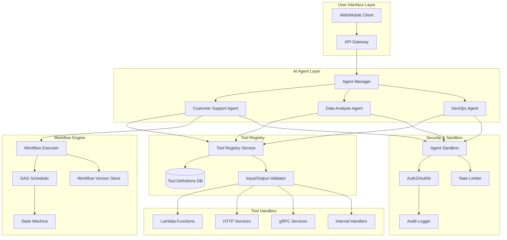
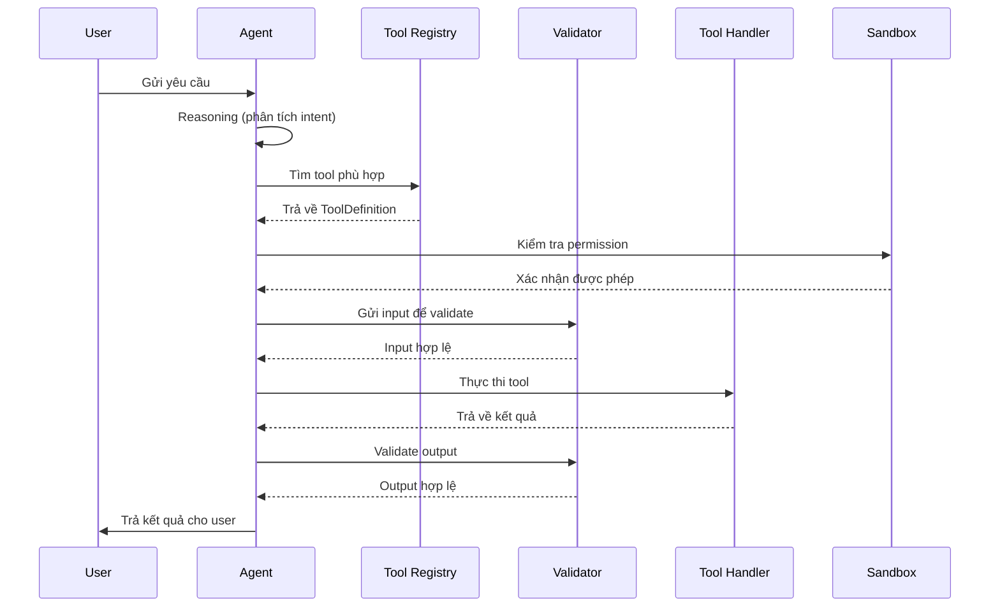

# Chương 13: Kiến Trúc Tool, Workflow và Agent

## 13.1 Tổng Quan

Hệ thống AIDiLam được thiết kế với ba thành phần cốt lõi hoạt động phối hợp chặt chẽ:

- **Tool Registry** — Quản lý và cung cấp các công cụ (tools) mà hệ thống có thể sử dụng
- **Workflow Engine** — Điều phối luồng xử lý phức tạp thông qua DAG (Directed Acyclic Graph)
- **AI Agent** — Tác nhân thông minh ra quyết định và gọi tools theo ngữ cảnh

Ba thành phần này tạo thành một kiến trúc linh hoạt, cho phép mở rộng khả năng của hệ thống mà không cần thay đổi core logic.

---

## 13.2 Tool Registry

### 13.2.1 Khái Niệm

Tool Registry là một central catalog chứa tất cả các tool definitions có sẵn trong hệ thống. Mỗi tool được đăng ký với metadata đầy đủ để các agent và workflow engine có thể khám phá và sử dụng đúng cách.

### 13.2.2 ToolDefinition Schema

```typescript
interface ToolDefinition {
  id: string;                    // UUID duy nhất, ví dụ: "tool_abc123"
  name: string;                  // Tên tool, ví dụ: "send_email"
  description: string;           // Mô tả ngắn gọn chức năng của tool
  input_schema: JSONSchema;      // JSON Schema mô tả input parameters
  output_schema: JSONSchema;     // JSON Schema mô tả output structure
  handler_type: HandlerType;     // Loại handler xử lý: "lambda", "http", "grpc", "internal"
  version: string;               // Semantic version, ví dụ: "1.2.0"
  is_active: boolean;            // Tool có đang hoạt động hay không
  metadata?: ToolMetadata;       // Thông tin bổ sung (tags, owner, category)
  created_at: ISO8601DateTime;   // Thời điểm tạo
  updated_at: ISO8601DateTime;   // Thời điểm cập nhật gần nhất
}
```

### 13.2.3 Các Trường Quan Trọng

| Trường | Mô tả | Ví dụ |
|--------|--------|-------|
| `id` | Định danh duy nhất toàn hệ thống | `"tool_7f3a9b2c"` |
| `name` | Tên ngắn gọn, dùng trong code | `"query_database"` |
| `description` | Mô tả để AI agent hiểu mục đích | `"Thực hiện truy vấn SQL read-only"` |
| `input_schema` | JSON Schema validate input | `{ "type": "object", "properties": {...} }` |
| `output_schema` | JSON Schema mô tả kết quả trả về | `{ "type": "object", "properties": {...} }` |
| `handler_type` | Cơ chế thực thi backend | `"lambda"`, `"http"`, `"grpc"`, `"internal"` |
| `version` | Phiên bản hiện tại | `"2.1.0"` |
| `is_active` | Trạng thái hoạt động | `true` / `false` |

### 13.2.4 Handler Types

Hệ thống hỗ trợ nhiều loại handler khác nhau:

- **`lambda`** — AWS Lambda function, phù hợp cho các tác vụ ngắn, stateless
- **`http`** — REST API endpoint, gọi tới internal hoặc external service
- **`grpc`** — gRPC service call, hiệu suất cao cho internal communication
- **`internal`** — Xử lý trực tiếp trong process, không cần network call

### 13.2.5 Versioning Strategy

Tool Registry sử dụng semantic versioning để đảm bảo backward compatibility:

```
MAJOR.MINOR.PATCH
  │      │     └── Bug fixes, không thay đổi interface
  │      └──────── Thêm tính năng mới, backward compatible
  └─────────────── Breaking changes, cần migration
```

Khi một tool version mới được publish mà có breaking changes, version cũ vẫn được giữ lại với `is_active: true` cho đến khi tất cả consumers đã migrate xong.

### 13.2.6 Tool Discovery

Agent và Workflow Engine tìm kiếm tools thông qua Registry API:

```typescript
// Tìm tool theo tên
const tool = await toolRegistry.findByName("send_email");

// Lọc tools theo category và trạng thái
const activeTools = await toolRegistry.query({
  category: "communication",
  is_active: true,
  handler_type: "lambda"
});

// Lấy schema để validate input trước khi gọi
const schema = await toolRegistry.getInputSchema("tool_7f3a9b2c");
```

---

## 13.3 Workflow Engine

### 13.3.1 Khái Niệm

Workflow Engine chịu trách nhiệm điều phối các bước xử lý phức tạp. Mỗi workflow được định nghĩa dưới dạng **DAG (Directed Acyclic Graph)** — đồ thị có hướng không chu trình — cho phép thực thi song song khi có thể và đảm bảo thứ tự phụ thuộc.

### 13.3.2 WorkflowDefinition

```typescript
interface WorkflowDefinition {
  id: string;                         // UUID của workflow
  name: string;                       // Tên workflow
  description: string;                // Mô tả mục đích
  steps: WorkflowStep[];              // Danh sách các bước
  edges: WorkflowEdge[];              // Quan hệ phụ thuộc giữa các bước (DAG)
  input_schema: JSONSchema;           // Input đầu vào workflow
  output_schema: JSONSchema;          // Output kết quả workflow
  error_handling: ErrorHandlingPolicy; // Chính sách xử lý lỗi
  timeout_ms: number;                 // Timeout tổng thể
  created_by: string;                 // Người tạo
}
```

### 13.3.3 WorkflowVersion — Immutable Published

```typescript
interface WorkflowVersion {
  id: string;                         // UUID của version
  workflow_id: string;                 // Tham chiếu tới WorkflowDefinition
  version_number: number;             // Số version tăng dần (1, 2, 3, ...)
  status: "draft" | "published" | "deprecated";
  definition_snapshot: WorkflowDefinition;  // Bản copy immutable tại thời điểm publish
  published_at: ISO8601DateTime | null;     // Thời điểm publish
  published_by: string | null;              // Người publish
  changelog: string;                        // Mô tả thay đổi
}
```

**Nguyên tắc Immutability:** Khi một WorkflowVersion được publish, nội dung của nó **không bao giờ thay đổi**. Điều này đảm bảo:

- Mọi execution đều có thể trace lại chính xác logic đã chạy
- Rollback về version cũ luôn an toàn
- Audit trail hoàn chỉnh cho compliance

### 13.3.4 Step Types

Workflow hỗ trợ nhiều loại step khác nhau:

```typescript
type WorkflowStep =
  | ToolInvocationStep      // Gọi một tool từ Registry
  | AgentDecisionStep       // Nhờ AI Agent ra quyết định
  | ConditionalStep         // Rẽ nhánh theo điều kiện
  | ParallelStep            // Thực thi nhiều bước song song
  | WaitStep                // Chờ event hoặc timeout
  | TransformStep           // Biến đổi dữ liệu giữa các bước
  | SubWorkflowStep;        // Gọi workflow con (composition)

interface ToolInvocationStep {
  type: "tool_invocation";
  step_id: string;
  tool_id: string;              // Tham chiếu tool trong Registry
  input_mapping: InputMapping;  // Map data từ context vào tool input
  output_key: string;           // Key lưu kết quả vào workflow context
  retry_policy?: RetryPolicy;
}

interface AgentDecisionStep {
  type: "agent_decision";
  step_id: string;
  agent_id: string;             // Agent nào sẽ ra quyết định
  prompt_template: string;      // Template prompt với variables
  expected_output: JSONSchema;  // Schema kỳ vọng của output
  max_tokens: number;
}

interface ConditionalStep {
  type: "conditional";
  step_id: string;
  condition: Expression;        // Biểu thức điều kiện
  if_true: string;              // step_id nếu đúng
  if_false: string;             // step_id nếu sai
}

interface ParallelStep {
  type: "parallel";
  step_id: string;
  branches: string[];           // Danh sách step_ids chạy song song
  join_strategy: "all" | "any" | "majority";
}
```

### 13.3.5 DAG Execution Model

Workflow Engine thực thi DAG theo thuật toán topological sort:

1. Xác định các node không có dependency (root nodes)
2. Thực thi đồng thời các root nodes
3. Khi một node hoàn thành, kiểm tra downstream nodes
4. Node downstream được kích hoạt khi tất cả upstream dependencies hoàn thành
5. Lặp lại cho đến khi tất cả nodes hoàn thành hoặc gặp lỗi

---

## 13.4 AI Agent Architecture

### 13.4.1 AgentDefinition

```typescript
interface AgentDefinition {
  id: string;                          // UUID của agent
  name: string;                        // Tên agent, ví dụ: "customer_support_agent"
  system_prompt: string;               // System prompt định hướng hành vi
  allowed_tools: string[];             // Danh sách tool_ids mà agent được phép sử dụng
  constraints: AgentConstraints;       // Các ràng buộc an toàn
  model_config: ModelConfig;           // Cấu hình LLM (model, temperature, etc.)
  memory_config: MemoryConfig;         // Cấu hình bộ nhớ ngữ cảnh
  max_iterations: number;              // Số vòng lặp tối đa (tránh infinite loop)
  fallback_behavior: FallbackBehavior; // Hành vi khi gặp lỗi hoặc uncertainty
}

interface AgentConstraints {
  max_tokens_per_turn: number;         // Giới hạn token mỗi lượt
  max_tool_calls_per_turn: number;     // Giới hạn số lần gọi tool mỗi lượt
  forbidden_actions: string[];         // Các hành động bị cấm
  required_confirmations: string[];    // Hành động cần xác nhận từ user
  data_access_scope: DataScope;        // Phạm vi dữ liệu được truy cập
  rate_limits: RateLimitConfig;        // Giới hạn tần suất
}
```

### 13.4.2 Agent Execution Loop

Agent hoạt động theo vòng lặp ReAct (Reasoning + Acting):

1. **Observe** — Nhận input từ user hoặc workflow context
2. **Reason** — Phân tích tình huống, xác định bước tiếp theo
3. **Act** — Gọi tool hoặc trả lời trực tiếp
4. **Reflect** — Đánh giá kết quả, quyết định tiếp tục hay dừng

### 13.4.3 Tool Selection Logic

Agent lựa chọn tool dựa trên:

- **Relevance** — Tool description khớp với intent của user
- **Permission** — Tool nằm trong `allowed_tools` list
- **Availability** — Tool có `is_active: true`
- **Cost** — Ưu tiên tool có chi phí thấp hơn khi nhiều tool phù hợp

---

## 13.5 Mermaid Diagram — Kiến Trúc Tổng Thể



### 13.5.1 Luồng Xử Lý Chi Tiết



---

## 13.6 Security Architecture

### 13.6.1 Tool Input Validation

Mọi input đều phải qua validation trước khi tool được thực thi:

```typescript
class ToolInputValidator {
  async validate(toolId: string, input: unknown): Promise<ValidationResult> {
    const tool = await this.registry.getById(toolId);
    
    // 1. Schema validation — kiểm tra cấu trúc dữ liệu
    const schemaResult = this.jsonSchemaValidator.validate(
      input, 
      tool.input_schema
    );
    if (!schemaResult.valid) {
      return { valid: false, errors: schemaResult.errors };
    }

    // 2. Sanitization — loại bỏ nội dung nguy hiểm
    const sanitized = this.sanitizer.clean(input, tool.sanitization_rules);

    // 3. Business rules — kiểm tra logic nghiệp vụ
    const businessResult = await this.businessValidator.check(
      toolId, 
      sanitized
    );

    return businessResult;
  }
}
```

### 13.6.2 Agent Sandboxing

Mỗi agent chạy trong một sandbox environment riêng biệt:

- **Resource Isolation** — Giới hạn CPU, memory, và thời gian thực thi
- **Network Isolation** — Chỉ cho phép truy cập các endpoint được whitelist
- **Data Isolation** — Agent chỉ thấy dữ liệu trong `data_access_scope`
- **Permission Boundary** — Không thể vượt quá `allowed_tools` và `constraints`
- **Execution Timeout** — Tự động terminate nếu vượt `max_iterations`

### 13.6.3 Defense-in-Depth Strategy

| Layer | Cơ Chế | Mục Đích |
|-------|--------|----------|
| Input | JSON Schema Validation | Ngăn malformed data |
| Input | Sanitization | Ngăn injection attacks |
| Permission | RBAC + ABAC | Kiểm soát quyền truy cập |
| Execution | Sandbox | Cách ly môi trường thực thi |
| Output | Output Validation | Đảm bảo kết quả đúng format |
| Audit | Immutable Logs | Truy vết mọi hành động |
| Rate Limit | Token Bucket | Ngăn abuse và DoS |

### 13.6.4 Audit Trail

Mọi hành động của agent và tool đều được ghi lại:

```typescript
interface AuditEntry {
  timestamp: ISO8601DateTime;
  agent_id: string;
  action: "tool_call" | "decision" | "data_access" | "error";
  tool_id?: string;
  input_hash: string;          // Hash của input (không lưu raw data nhạy cảm)
  output_summary: string;      // Tóm tắt kết quả
  duration_ms: number;
  status: "success" | "failure" | "timeout";
  sandbox_context: SandboxContext;
}
```

---

## 13.7 Tích Hợp Ba Thành Phần

### 13.7.1 Ví Dụ End-to-End

Khi user yêu cầu: *"Phân tích doanh thu tháng này và gửi báo cáo qua email"*

1. **Agent** nhận request, reasoning xác định cần 2 bước
2. **Agent** tìm trong Tool Registry: `query_database` và `send_email`
3. **Agent** tạo workflow tạm thời hoặc sử dụng workflow có sẵn
4. **Workflow Engine** thực thi:
   - Step 1: `ToolInvocationStep` → gọi `query_database` với SQL query
   - Step 2: `TransformStep` → format kết quả thành báo cáo
   - Step 3: `ToolInvocationStep` → gọi `send_email` với nội dung báo cáo
5. **Agent** trả kết quả cho user

### 13.7.2 Error Recovery

```typescript
interface ErrorHandlingPolicy {
  strategy: "fail_fast" | "retry" | "fallback" | "compensate";
  max_retries: number;
  retry_delay_ms: number;
  backoff_multiplier: number;
  fallback_step_id?: string;
  compensation_workflow_id?: string;  // Workflow bù trừ khi cần rollback
}
```

---

## 13.8 Kết Luận

Kiến trúc Tool-Workflow-Agent mang lại các lợi ích:

- **Modularity** — Mỗi tool là một đơn vị độc lập, dễ phát triển và test
- **Composability** — Workflow cho phép kết hợp tools theo nhiều cách khác nhau
- **Intelligence** — Agent thêm lớp quyết định thông minh dựa trên ngữ cảnh
- **Safety** — Nhiều lớp bảo mật đảm bảo hệ thống an toàn
- **Traceability** — Immutable versions và audit logs cho phép trace mọi hành động
- **Scalability** — Handler types linh hoạt cho phép scale từng thành phần độc lập

Trong chương tiếp theo, chúng ta sẽ đi sâu vào cách triển khai cụ thể trên AWS infrastructure với các patterns cho high availability và disaster recovery.
