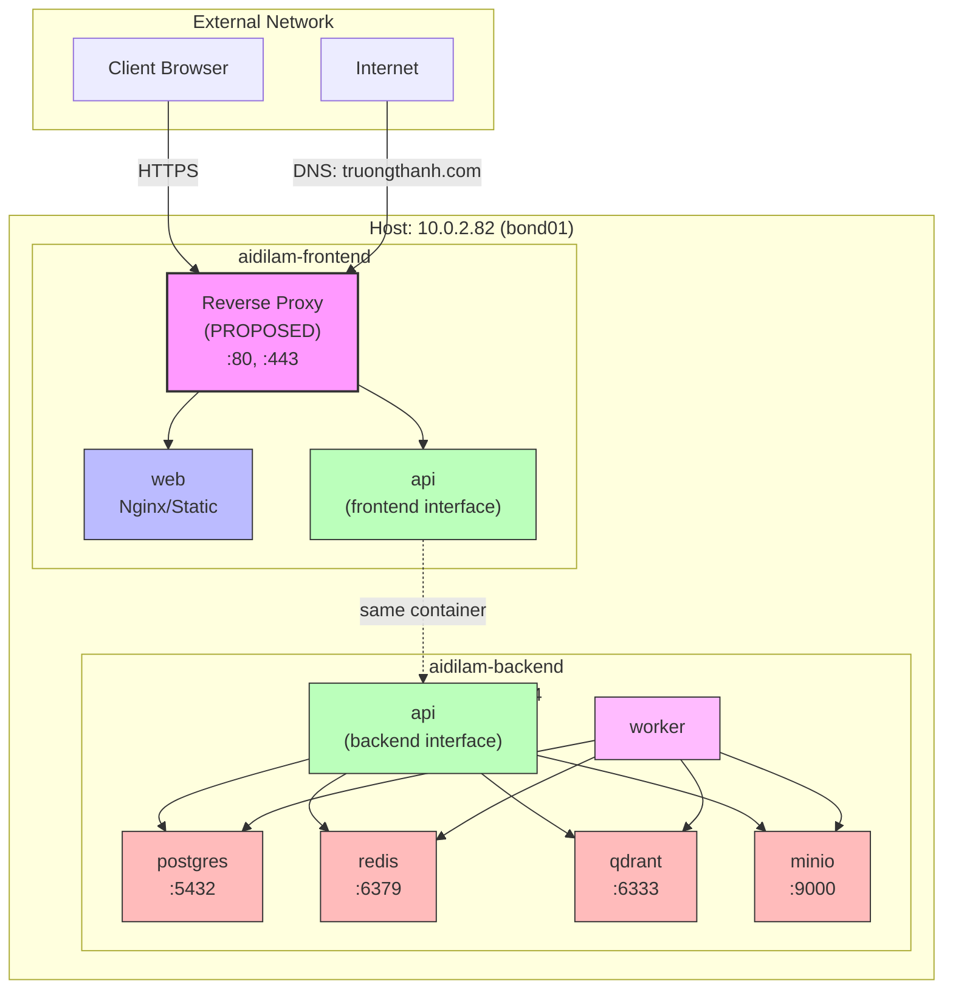

# 16. Network Architecture

## Tổng quan

Tài liệu này mô tả kiến trúc mạng của hệ thống Aidilam, bao gồm cấu hình Docker networks,
phân vùng container, chính sách truy cập giữa các service, và kết nối với host network.

Thiết kế tuân theo nguyên tắc **defense in depth** — tách biệt frontend và backend networks
để giảm thiểu attack surface. Các container chỉ được kết nối vào network mà chúng thực sự
cần để hoạt động.

---

## Host Network

| Thuộc tính | Giá trị |
|---|---|
| IP Address | `10.0.2.82` |
| Interface | `bond01` (bonded interface) |
| DNS | `truongthanh.com` |
| Outbound Internet | ✅ VERIFIED working |
| Firewall | ⚠️ REQUIRES_HOST_VALIDATION |

Host sử dụng bonded interface `bond01` để đảm bảo redundancy ở tầng physical network.
DNS domain `truongthanh.com` được sử dụng cho các public-facing services.

### Outbound Internet

Kết nối internet đã được xác nhận hoạt động bình thường. Các container có thể pull images,
cập nhật packages, và giao tiếp với external APIs khi cần thiết.

### Firewall

> ⚠️ **REQUIRES_HOST_VALIDATION**
>
> Cấu hình firewall trên host cần được kiểm tra và xác nhận. Cần đảm bảo:
> - Chỉ expose các port cần thiết (80, 443) ra external network
> - Block truy cập trực tiếp vào database ports từ bên ngoài
> - Không conflict với Docker iptables rules

---

## Docker Networks

Hệ thống sử dụng hai custom Docker networks với subnet được chỉ định cụ thể:

### aidilam-frontend (172.20.0.0/24)

| Thuộc tính | Giá trị |
|---|---|
| Network Name | `aidilam-frontend` |
| Subnet | `172.20.0.0/24` |
| Gateway | `172.20.0.1` |
| Usable IPs | `172.20.0.2` – `172.20.0.254` |
| Driver | `bridge` |
| Mục đích | Kết nối giữa reverse proxy, web server, và API |

> ⚠️ **REQUIRES_HOST_VALIDATION** — Cần xác nhận subnet này không conflict với
> bất kỳ network nào khác trên host.

### aidilam-backend (172.20.1.0/24)

| Thuộc tính | Giá trị |
|---|---|
| Network Name | `aidilam-backend` |
| Subnet | `172.20.1.0/24` |
| Gateway | `172.20.1.1` |
| Usable IPs | `172.20.1.2` – `172.20.1.254` |
| Driver | `bridge` |
| Mục đích | Kết nối internal giữa API, worker, và data stores |

> ⚠️ **REQUIRES_HOST_VALIDATION** — Cần xác nhận subnet này không conflict với
> bất kỳ network nào khác trên host.

### Không overlap với Docker Bridge mặc định

Docker bridge mặc định sử dụng subnet `172.17.0.0/16`. Hai custom networks của Aidilam
nằm trong dải `172.20.x.x/24`, **không overlap** với bridge mặc định:

- Docker bridge: `172.17.0.0/16` → range `172.17.0.0` – `172.17.255.255`
- aidilam-frontend: `172.20.0.0/24` → range `172.20.0.0` – `172.20.0.255`
- aidilam-backend: `172.20.1.0/24` → range `172.20.1.0` – `172.20.1.255`

Không có sự chồng chéo giữa các dải IP.

---

## Container Network Membership

Mỗi container được gắn vào một hoặc nhiều networks tùy theo vai trò:

| Container | aidilam-frontend | aidilam-backend | Vai trò |
|---|:---:|:---:|---|
| `web` | ✅ | ❌ | Nginx/static files, phục vụ frontend |
| `api` | ✅ | ✅ | API gateway, cầu nối giữa frontend và backend |
| `worker` | ❌ | ✅ | Background job processing |
| `postgres` | ❌ | ✅ | PostgreSQL database |
| `redis` | ❌ | ✅ | Redis cache & message broker |
| `qdrant` | ❌ | ✅ | Qdrant vector database |
| `minio` | ❌ | ✅ | MinIO object storage |

### Nguyên tắc thiết kế

- **Container `api`** là container duy nhất có mặt trên **cả hai networks**. Nó đóng vai trò
  gateway duy nhất giữa frontend và backend.
- **Container `web`** chỉ nằm trên frontend network — nó KHÔNG THỂ truy cập trực tiếp
  vào bất kỳ data store nào.
- Tất cả data stores (`postgres`, `redis`, `qdrant`, `minio`) chỉ nằm trên backend network.

---

## Chính sách truy cập (Access Policy)

### Web KHÔNG THỂ truy cập Data Stores

Đây là quy tắc bảo mật quan trọng nhất trong thiết kế network:

> 🚫 **Container `web` KHÔNG THỂ kết nối đến `postgres`, `redis`, `qdrant`, hoặc `minio`.**

Lý do: Container `web` chỉ nằm trên `aidilam-frontend` network, trong khi tất cả data stores
chỉ nằm trên `aidilam-backend` network. Vì hai networks này tách biệt hoàn toàn và không có
routing giữa chúng, `web` không có đường truyền nào đến các data stores.

### Ma trận kết nối

| Từ \ Đến | web | api | worker | postgres | redis | qdrant | minio |
|---|:---:|:---:|:---:|:---:|:---:|:---:|:---:|
| **web** | — | ✅ | ❌ | ❌ | ❌ | ❌ | ❌ |
| **api** | ✅ | — | ✅ | ✅ | ✅ | ✅ | ✅ |
| **worker** | ❌ | ✅ | — | ✅ | ✅ | ✅ | ✅ |
| **postgres** | ❌ | ✅ | ✅ | — | ❌ | ❌ | ❌ |
| **redis** | ❌ | ✅ | ✅ | ❌ | — | ❌ | ❌ |
| **qdrant** | ❌ | ✅ | ✅ | ❌ | ❌ | — | ❌ |
| **minio** | ❌ | ✅ | ✅ | ❌ | ❌ | ❌ | — |

> Ghi chú: ✅ = có thể kết nối (cùng network), ❌ = không thể kết nối (khác network)

---

## Reverse Proxy

> 📋 **PROPOSED** — Chưa triển khai, đang đề xuất.

### Lựa chọn đề xuất

Hai lựa chọn được cân nhắc cho reverse proxy với automatic TLS:

| Tiêu chí | Caddy | Traefik |
|---|---|---|
| Automatic HTTPS | ✅ Built-in (Let's Encrypt) | ✅ Built-in (Let's Encrypt) |
| Cấu hình | Caddyfile (đơn giản) | Labels hoặc YAML |
| Docker integration | Tốt | Xuất sắc (native labels) |
| Performance | Tốt | Tốt |
| Complexity | Thấp | Trung bình |

### Vai trò của Reverse Proxy

- Terminate TLS cho domain `truongthanh.com`
- Route traffic đến container `web` (static content) và `api` (API requests)
- Nằm trên `aidilam-frontend` network
- Expose ports 80 và 443 ra host network

### Cấu hình mạng khi có Reverse Proxy

Reverse proxy container sẽ được thêm vào `aidilam-frontend` network và là điểm entry duy nhất
từ bên ngoài vào hệ thống.

---

## Network Diagram



---

## Docker Compose Network Configuration

```yaml
networks:
  aidilam-frontend:
    driver: bridge
    ipam:
      config:
        - subnet: 172.20.0.0/24
          gateway: 172.20.0.1

  aidilam-backend:
    driver: bridge
    ipam:
      config:
        - subnet: 172.20.1.0/24
          gateway: 172.20.1.1
```

### Service network assignments

```yaml
services:
  web:
    networks:
      - aidilam-frontend

  api:
    networks:
      - aidilam-frontend
      - aidilam-backend

  worker:
    networks:
      - aidilam-backend

  postgres:
    networks:
      - aidilam-backend

  redis:
    networks:
      - aidilam-backend

  qdrant:
    networks:
      - aidilam-backend

  minio:
    networks:
      - aidilam-backend
```

---

## Validation Checklist

Các mục cần xác nhận trên host trước khi triển khai:

- [ ] Subnet `172.20.0.0/24` không conflict với existing routes trên host
- [ ] Subnet `172.20.1.0/24` không conflict với existing routes trên host
- [ ] Firewall rules cho phép traffic trên ports 80, 443
- [ ] Firewall rules block truy cập trực tiếp vào ports 5432, 6379, 6333, 9000 từ external
- [ ] Docker daemon không sử dụng custom `bip` setting conflict với `172.20.x.x`
- [ ] `ip route` trên host không có routes đến `172.20.0.0/24` hoặc `172.20.1.0/24`
- [ ] Bond interface `bond01` hoạt động ổn định với IP `10.0.2.82`

### Lệnh kiểm tra

```bash
# Kiểm tra routing table
ip route | grep 172.20

# Kiểm tra existing Docker networks
docker network ls
docker network inspect bridge | grep Subnet

# Kiểm tra firewall rules
sudo iptables -L -n | grep -E "(80|443|5432|6379|6333|9000)"

# Kiểm tra bond interface
ip addr show bond01
```

---

## Ghi chú bảo mật

1. **Network isolation** là lớp bảo vệ đầu tiên — nhưng không phải duy nhất. Mỗi service
   vẫn cần authentication riêng (PostgreSQL password, Redis AUTH, MinIO credentials).

2. **Container `api`** có quyền truy cập rộng nhất (cả hai networks). Nếu bị compromise,
   attacker có thể truy cập tất cả data stores. Cần hardening đặc biệt cho container này.

3. **Docker network** không thay thế host firewall. Cần cấu hình cả hai tầng để đảm bảo
   defense in depth.

4. **Inter-container DNS** hoạt động qua Docker embedded DNS (`127.0.0.11`). Containers
   resolve nhau bằng service name, không cần hardcode IP.

---

*Cập nhật lần cuối: 2026-07-23*
*Trạng thái: DRAFT — Pending host validation*
