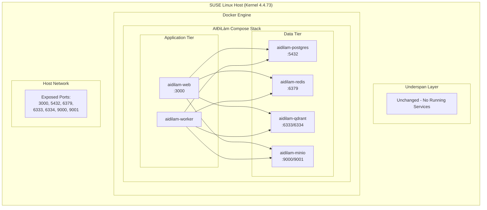
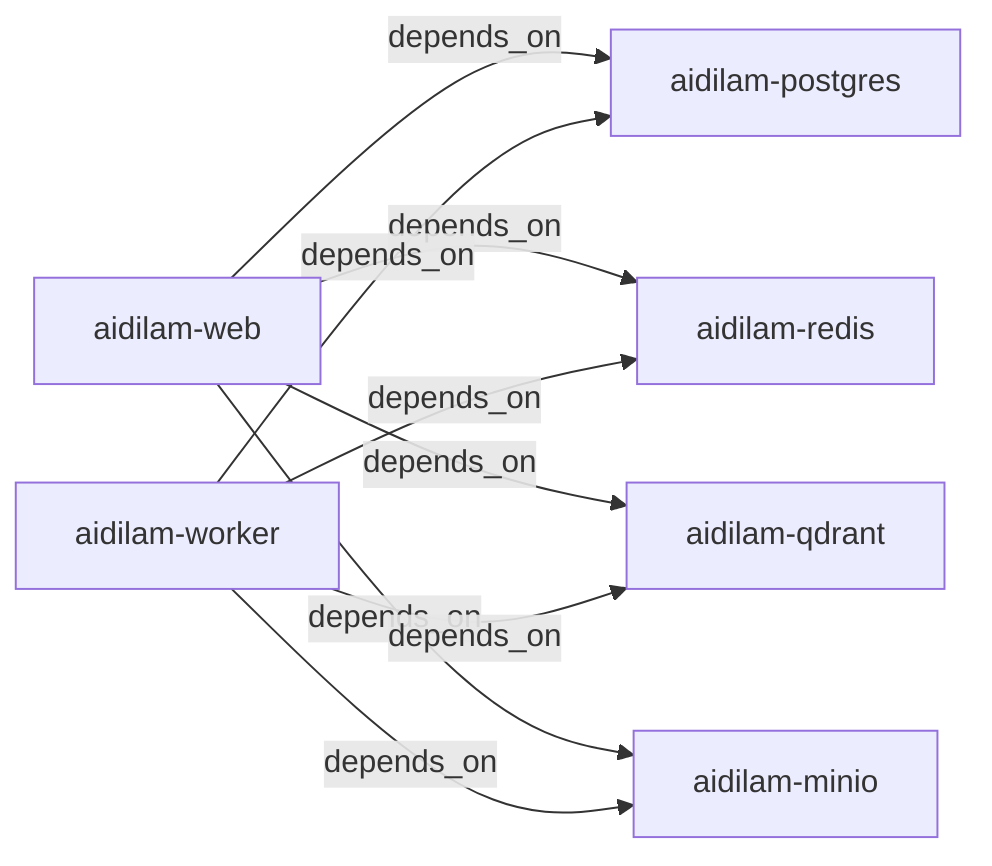

# 17. Deployment Topology

## Tổng quan

Chương này mô tả topology triển khai của hệ thống AIĐiLàm trên SUSE Linux host.
Toàn bộ stack chạy dưới dạng Docker Compose trên một single host, tận dụng
kernel 4.4.73 có sẵn trên hệ điều hành SUSE. Tài liệu bao gồm cấu trúc
container, resource limits, restart policies, và các lưu ý về compatibility.

> **Lưu ý quan trọng**: Cấu trúc Compose trong tài liệu này chỉ mang tính chất
> tham khảo (documentation only, non-executable). File Compose thực tế nằm
> trong repository source code và có thể khác biệt tùy theo environment.

---

## SUSE Host Topology

### Sơ đồ tổng thể



### Mô tả các layer

| Layer | Mô tả | Trạng thái |
|-------|--------|-------------|
| SUSE Host | Hệ điều hành SUSE Linux với kernel 4.4.73 | Active |
| Underspan | Layer hạ tầng cơ bản của host | Unchanged, no running services |
| Docker Engine | Container runtime | Active |
| AIĐiLàm Compose | Application stack | Active |

---

## Underspan Layer

Underspan layer trên SUSE host được giữ nguyên trạng thái ban đầu (**unchanged**).
Không có service nào chạy trực tiếp trên layer này. Toàn bộ workload của AIĐiLàm
được containerized và quản lý thông qua Docker Compose.

Điều này đảm bảo:

- **Isolation**: Ứng dụng không can thiệp vào host OS services
- **Reproducibility**: Môi trường có thể tái tạo hoàn toàn từ Compose definition
- **Rollback**: Có thể rollback toàn bộ stack mà không ảnh hưởng host
- **Security**: Attack surface của host được giữ ở mức tối thiểu

---

## AIĐiLàm Compose Stack

### Danh sách Services

| Service | Container Name | Base Image | Port(s) | Vai trò |
|---------|---------------|------------|----------|---------|
| Web | aidilam-web | Custom (multi-stage) | 3000 | Frontend + API gateway |
| Worker | aidilam-worker | Custom (multi-stage) | — | Background job processing |
| PostgreSQL | aidilam-postgres | postgres:16 | 5432 | Primary database |
| Redis | aidilam-redis | redis:7-alpine | 6379 | Cache & message broker |
| Qdrant | aidilam-qdrant | qdrant/qdrant | 6333, 6334 | Vector search engine |
| MinIO | aidilam-minio | minio/minio | 9000, 9001 | Object storage (S3-compatible) |

### Container Dependencies



---

## Container Images

### Third-party Images

| Image | Version | Lý do chọn |
|-------|---------|-------------|
| `postgres:16` | 16.x (latest patch) | Hỗ trợ JSONB, full-text search, pgvector extension |
| `redis:7-alpine` | 7.x Alpine | Lightweight, đủ feature cho caching và pub/sub |
| `qdrant/qdrant` | Latest stable | Vector database cho semantic search |
| `minio/minio` | Latest stable | S3-compatible object storage, self-hosted |

### Application Images (Multi-stage Builds)

Các image của ứng dụng AIĐiLàm (web và worker) sử dụng **multi-stage builds**
để tối ưu kích thước và bảo mật:

```dockerfile
# === REFERENCE ONLY - DOCUMENTATION PURPOSE ===
# Stage 1: Build dependencies
FROM node:20-alpine AS deps
WORKDIR /app
COPY package*.json ./
RUN npm ci --only=production

# Stage 2: Build application
FROM node:20-alpine AS builder
WORKDIR /app
COPY --from=deps /app/node_modules ./node_modules
COPY . .
RUN npm run build

# Stage 3: Production runtime
FROM node:20-alpine AS runner
WORKDIR /app

# Non-root user
RUN addgroup --system --gid 1001 aidilam && \
    adduser --system --uid 1001 aidilam
USER aidilam

COPY --from=builder --chown=aidilam:aidilam /app/.next ./.next
COPY --from=builder --chown=aidilam:aidilam /app/public ./public
COPY --from=builder --chown=aidilam:aidilam /app/node_modules ./node_modules

HEALTHCHECK --interval=30s --timeout=10s --start-period=40s --retries=3 \
    CMD wget --no-verbose --tries=1 --spider http://localhost:3000/api/health || exit 1

EXPOSE 3000
CMD ["node", "server.js"]
```

### Nguyên tắc build image

| Nguyên tắc | Mô tả |
|-------------|--------|
| Multi-stage builds | Tách build dependencies khỏi runtime image |
| Non-root user | Container chạy với user `aidilam` (UID 1001), không dùng root |
| Healthchecks | Mỗi container có healthcheck endpoint riêng |
| Resource limits | Giới hạn CPU và memory cho từng service |
| Minimal base | Sử dụng Alpine-based images khi có thể |

---

## Kernel 4.4.73 Compatibility

### REQUIRES_HOST_VALIDATION

> ⚠️ **REQUIRES_HOST_VALIDATION**: Hệ thống yêu cầu xác nhận compatibility
> với kernel 4.4.73 trước khi triển khai.

SUSE host chạy kernel version **4.4.73** — một kernel LTS cũ. Điều này ảnh hưởng
đến một số tính năng Docker và cần được validate trước khi deploy:

| Thành phần | Yêu cầu kiểm tra | Ghi chú |
|------------|-------------------|---------|
| cgroups v1 | Xác nhận memory/cpu cgroup mounted | Kernel 4.4.73 chỉ hỗ trợ cgroups v1 |
| Storage driver | overlay2 hoặc devicemapper | Kiểm tra `docker info` |
| Seccomp | Profile compatibility | Một số syscalls mới không có |
| User namespaces | Hỗ trợ hạn chế | Cần test non-root containers |
| Network | Bridge/NAT | Không hỗ trợ một số network features mới |

### Checklist trước khi deploy

```bash
# === HOST VALIDATION COMMANDS ===

# 1. Kiểm tra kernel version
uname -r
# Expected: 4.4.73-*

# 2. Kiểm tra cgroups
cat /proc/cgroups
mount | grep cgroup

# 3. Kiểm tra Docker storage driver
docker info --format '{{.Driver}}'

# 4. Kiểm tra available memory cho resource limits
free -h
cat /proc/meminfo | grep MemTotal

# 5. Kiểm tra CPU count
nproc

# 6. Test container khởi động với non-root user
docker run --rm --user 1001:1001 alpine id
```

### Các hạn chế đã biết với kernel 4.4.73

1. **Không hỗ trợ cgroups v2** — chỉ sử dụng cgroups v1
2. **overlay2 cần kernel >= 4.0** — đã đủ điều kiện
3. **Seccomp profiles** — cần sử dụng profile tương thích kernel cũ
4. **Memory limit notifications** — cgroup memory.oom_control có thể khác behavior
5. **PIDs cgroup** — có thể không available, cần verify

---

## Resource Limits

### Bảng giới hạn tài nguyên

| Service | CPU Limit | Memory Limit | CPU Reservation | Memory Reservation |
|---------|-----------|--------------|-----------------|-------------------|
| aidilam-web | 2 CPU | 2 GB | 0.5 CPU | 512 MB |
| aidilam-api (nếu tách riêng) | 4 CPU | 4 GB | 1 CPU | 1 GB |
| aidilam-worker | 8 CPU | 16 GB | 2 CPU | 4 GB |
| aidilam-postgres | 4 CPU | 8 GB | 1 CPU | 2 GB |
| aidilam-redis | 1 CPU | 2 GB | 0.25 CPU | 256 MB |
| aidilam-qdrant | 2 CPU | 4 GB | 0.5 CPU | 1 GB |
| aidilam-minio | 2 CPU | 4 GB | 0.5 CPU | 1 GB |

### Tổng tài nguyên yêu cầu

| Metric | Tổng Limit | Tổng Reservation |
|--------|-----------|------------------|
| CPU | 19 cores (có api) / 15 cores (không api) | 5.75 cores / 4.75 cores |
| Memory | 36 GB (có api) / 32 GB (không api) | 9.75 GB / 8.75 GB |

> **Lưu ý**: Worker service nhận resource limits cao nhất (8 CPU / 16 GB) vì
> thực hiện các tác vụ nặng như AI inference, document processing, và embedding
> generation.

### Giải thích resource allocation

- **aidilam-web (2 CPU / 2 GB)**: Phục vụ frontend và xử lý HTTP requests.
  Workload chủ yếu I/O bound nên không cần nhiều CPU.
- **aidilam-api (4 CPU / 4 GB)**: Chỉ áp dụng nếu API được tách thành service
  riêng biệt. Xử lý business logic và orchestration.
- **aidilam-worker (8 CPU / 16 GB)**: Xử lý background jobs bao gồm AI model
  inference, vector embedding, document parsing. CPU và memory intensive.
- **aidilam-postgres (4 CPU / 8 GB)**: Database chính, cần đủ memory cho
  shared_buffers và query execution.
- **aidilam-redis (1 CPU / 2 GB)**: In-memory cache, workload nhẹ nhưng cần
  đảm bảo memory cho dataset.
- **aidilam-qdrant (2 CPU / 4 GB)**: Vector search cần memory cho HNSW index.
- **aidilam-minio (2 CPU / 4 GB)**: Object storage, I/O bound, cần buffer memory.

---

## Reference Compose Structure

> ⚠️ **NON-EXECUTABLE**: Cấu trúc bên dưới chỉ mang tính chất tài liệu tham khảo.
> Không sử dụng trực tiếp làm docker-compose.yml cho production.

```yaml
# === REFERENCE COMPOSE STRUCTURE ===
# Documentation only - Non-executable
# Actual compose file resides in source repository

version: "3.8"

services:
  aidilam-web:
    build:
      context: .
      dockerfile: Dockerfile.web
      target: runner
    container_name: aidilam-web
    user: "1001:1001"
    ports:
      - "3000:3000"
    depends_on:
      aidilam-postgres:
        condition: service_healthy
      aidilam-redis:
        condition: service_healthy
      aidilam-qdrant:
        condition: service_healthy
      aidilam-minio:
        condition: service_healthy
    healthcheck:
      test: ["CMD", "wget", "--spider", "-q", "http://localhost:3000/api/health"]
      interval: 30s
      timeout: 10s
      retries: 3
      start_period: 40s
    deploy:
      resources:
        limits:
          cpus: "2.0"
          memory: 2G
        reservations:
          cpus: "0.5"
          memory: 512M
    restart: unless-stopped

  aidilam-worker:
    build:
      context: .
      dockerfile: Dockerfile.worker
      target: runner
    container_name: aidilam-worker
    user: "1001:1001"
    depends_on:
      aidilam-postgres:
        condition: service_healthy
      aidilam-redis:
        condition: service_healthy
      aidilam-qdrant:
        condition: service_healthy
      aidilam-minio:
        condition: service_healthy
    healthcheck:
      test: ["CMD", "node", "healthcheck.js"]
      interval: 30s
      timeout: 10s
      retries: 3
      start_period: 60s
    deploy:
      resources:
        limits:
          cpus: "8.0"
          memory: 16G
        reservations:
          cpus: "2.0"
          memory: 4G
    restart: unless-stopped

  aidilam-postgres:
    image: postgres:16
    container_name: aidilam-postgres
    ports:
      - "5432:5432"
    volumes:
      - postgres_data:/var/lib/postgresql/data
    healthcheck:
      test: ["CMD-SHELL", "pg_isready -U aidilam"]
      interval: 10s
      timeout: 5s
      retries: 5
      start_period: 30s
    deploy:
      resources:
        limits:
          cpus: "4.0"
          memory: 8G
        reservations:
          cpus: "1.0"
          memory: 2G
    restart: unless-stopped

  aidilam-redis:
    image: redis:7-alpine
    container_name: aidilam-redis
    ports:
      - "6379:6379"
    volumes:
      - redis_data:/data
    healthcheck:
      test: ["CMD", "redis-cli", "ping"]
      interval: 10s
      timeout: 5s
      retries: 5
      start_period: 10s
    deploy:
      resources:
        limits:
          cpus: "1.0"
          memory: 2G
        reservations:
          cpus: "0.25"
          memory: 256M
    restart: unless-stopped

  aidilam-qdrant:
    image: qdrant/qdrant
    container_name: aidilam-qdrant
    ports:
      - "6333:6333"
      - "6334:6334"
    volumes:
      - qdrant_data:/qdrant/storage
    healthcheck:
      test: ["CMD", "wget", "--spider", "-q", "http://localhost:6333/readyz"]
      interval: 10s
      timeout: 5s
      retries: 5
      start_period: 20s
    deploy:
      resources:
        limits:
          cpus: "2.0"
          memory: 4G
        reservations:
          cpus: "0.5"
          memory: 1G
    restart: unless-stopped

  aidilam-minio:
    image: minio/minio
    container_name: aidilam-minio
    command: server /data --console-address ":9001"
    ports:
      - "9000:9000"
      - "9001:9001"
    volumes:
      - minio_data:/data
    healthcheck:
      test: ["CMD", "curl", "-f", "http://localhost:9000/minio/health/live"]
      interval: 10s
      timeout: 5s
      retries: 5
      start_period: 15s
    deploy:
      resources:
        limits:
          cpus: "2.0"
          memory: 4G
        reservations:
          cpus: "0.5"
          memory: 1G
    restart: unless-stopped

volumes:
  postgres_data:
  redis_data:
  qdrant_data:
  minio_data:
```

---

## Restart Policies

### Chính sách restart cho từng service

| Service | Restart Policy | Lý do |
|---------|---------------|-------|
| aidilam-web | `unless-stopped` | Tự động restart khi crash, dừng khi manually stopped |
| aidilam-worker | `unless-stopped` | Background jobs cần luôn available |
| aidilam-postgres | `unless-stopped` | Database phải luôn sẵn sàng |
| aidilam-redis | `unless-stopped` | Cache layer cần uptime cao |
| aidilam-qdrant | `unless-stopped` | Vector search cần persistent |
| aidilam-minio | `unless-stopped` | Object storage phải accessible |

### Giải thích các restart policy options

| Policy | Behavior | Khi nào dùng |
|--------|----------|--------------|
| `no` | Không tự restart | Development, one-time tasks |
| `always` | Luôn restart, kể cả khi manually stopped | Critical production services |
| `unless-stopped` | Restart trừ khi bị stop thủ công | **Mặc định cho AIĐiLàm** |
| `on-failure` | Chỉ restart khi exit code != 0 | Services có graceful shutdown |

### Lý do chọn `unless-stopped`

Policy `unless-stopped` được chọn làm mặc định vì:

1. **Auto-recovery**: Services tự khởi động lại sau crash hoặc OOM kill
2. **Manual control**: Operator có thể stop service mà không bị restart loop
3. **Host reboot**: Services tự start lại sau khi host reboot (nếu Docker daemon
   được cấu hình autostart)
4. **Maintenance window**: Cho phép stop services cho maintenance mà không cần
   thay đổi configuration

---

## Healthcheck Configuration

### Tổng hợp healthcheck endpoints

| Service | Healthcheck Method | Endpoint/Command | Interval |
|---------|-------------------|------------------|----------|
| aidilam-web | HTTP GET | `/api/health` | 30s |
| aidilam-worker | Script | `node healthcheck.js` | 30s |
| aidilam-postgres | CLI | `pg_isready -U aidilam` | 10s |
| aidilam-redis | CLI | `redis-cli ping` | 10s |
| aidilam-qdrant | HTTP GET | `/readyz` | 10s |
| aidilam-minio | HTTP GET | `/minio/health/live` | 10s |

### Dependency startup order

Nhờ `depends_on` với `condition: service_healthy`, Docker Compose đảm bảo:

1. Data tier services (postgres, redis, qdrant, minio) khởi động trước
2. Chỉ khi data tier healthy, application tier (web, worker) mới được start
3. Tránh connection errors do services chưa sẵn sàng

---

## Tóm tắt

Deployment topology của AIĐiLàm được thiết kế với các nguyên tắc:

- **Single host**: Toàn bộ stack trên một SUSE Linux host
- **Containerized**: Mọi service chạy trong Docker containers
- **Underspan unchanged**: Không can thiệp vào host OS layer
- **Resource bounded**: Mỗi service có giới hạn CPU và memory rõ ràng
- **Self-healing**: Restart policies và healthchecks đảm bảo availability
- **Kernel aware**: Validate compatibility với kernel 4.4.73 trước khi deploy

---

*Document version: 1.0 — Last updated: 2026-07-23*
